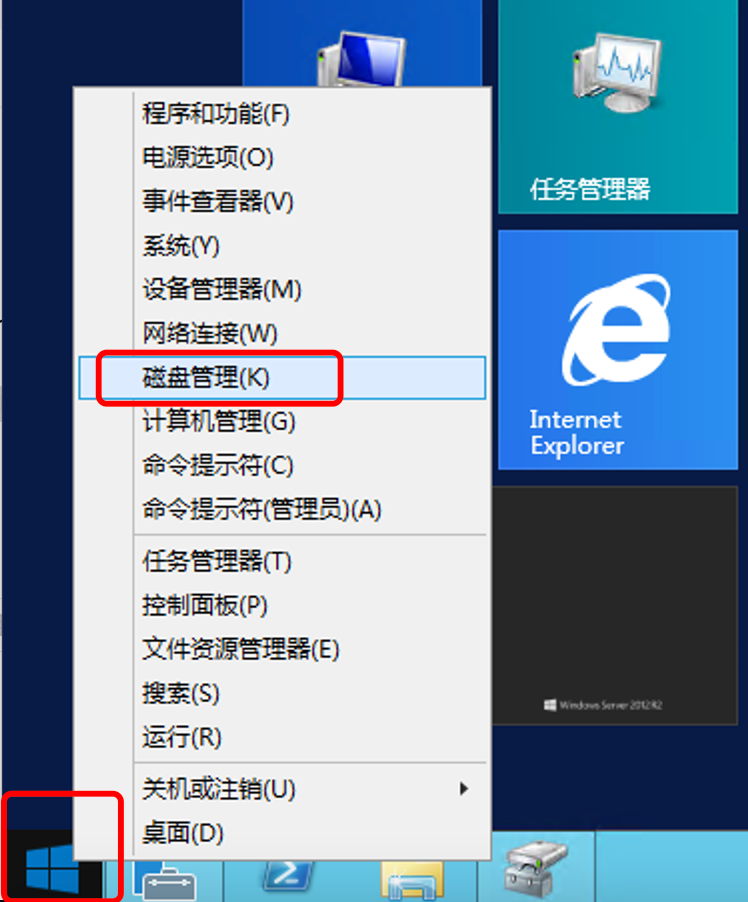
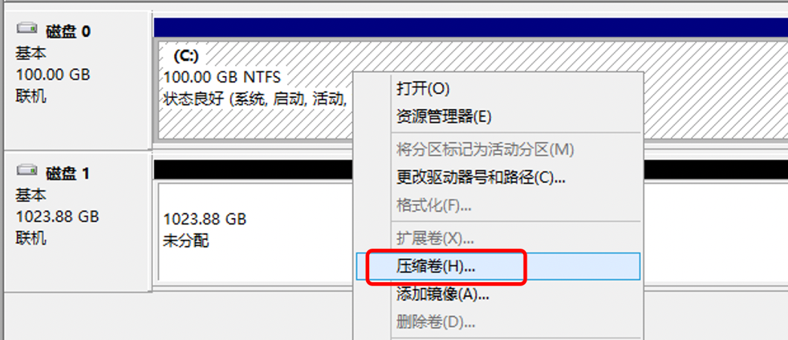
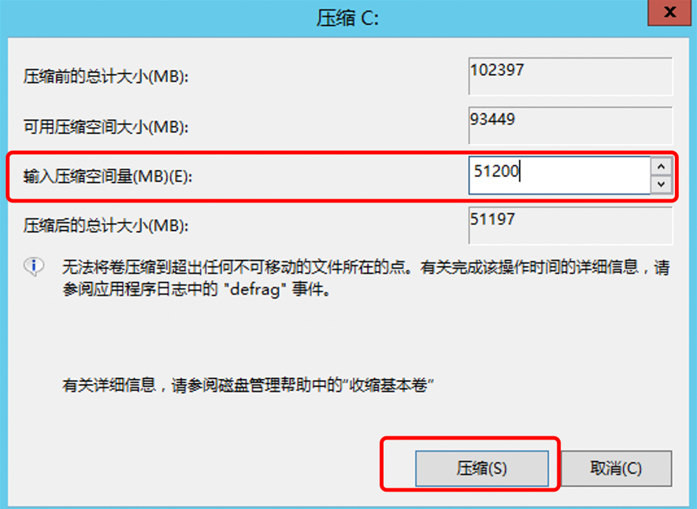
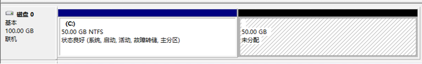
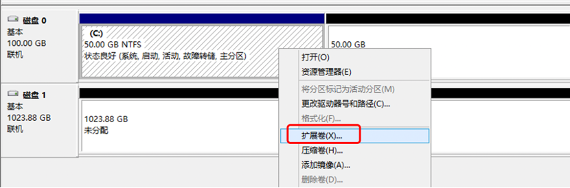
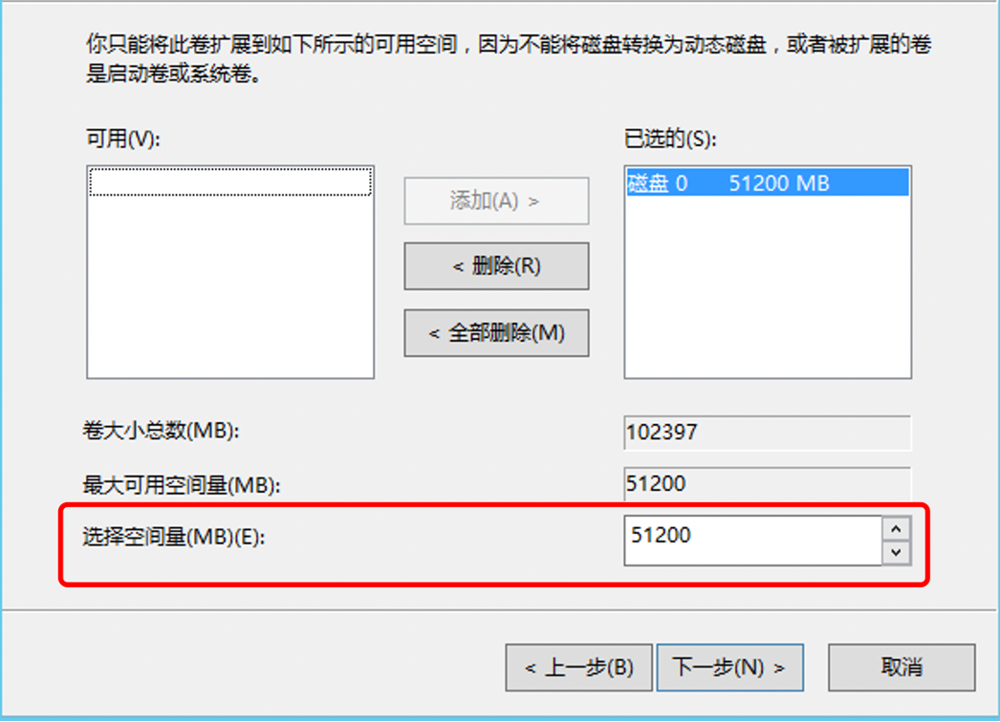
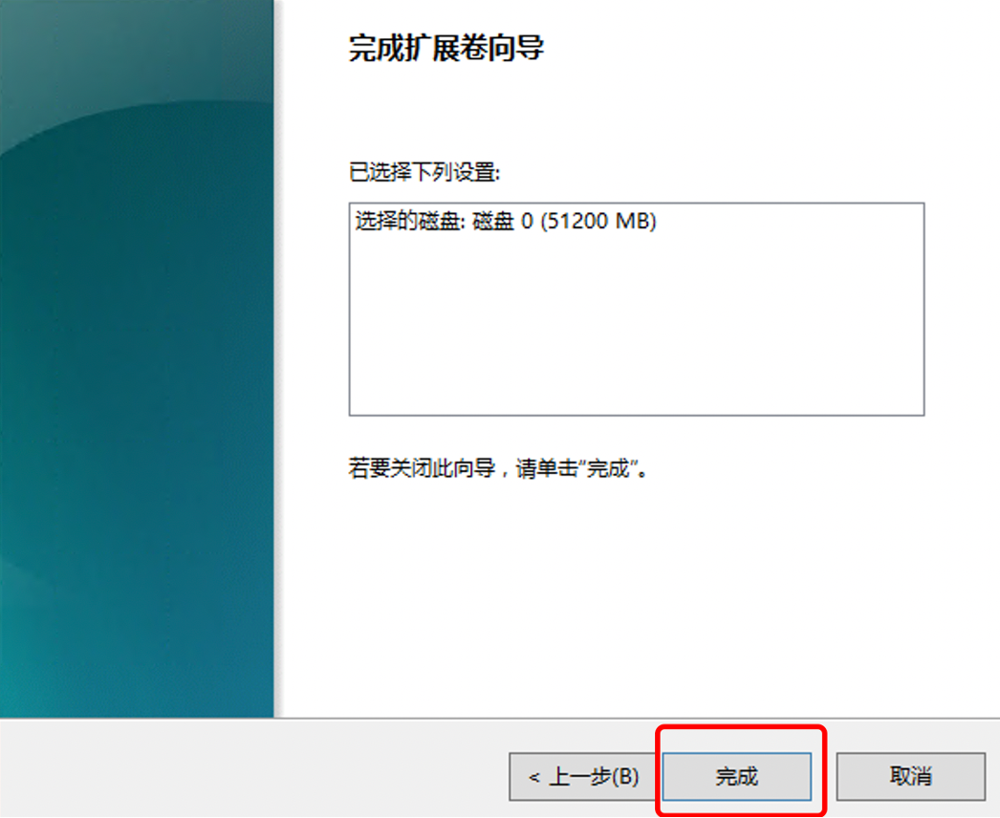
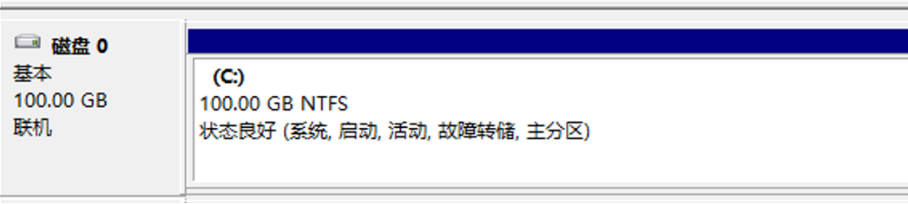

对已分区的磁盘进行压缩时，需注意提前备份好数据，否则数据会丢失

压缩卷

1.在左下角开始菜单右键选择"磁盘管理"

2.选择需要操作的磁盘，右键选择"压缩卷"

 

3.根据需求调整压缩容量的大小，调整后点击"压缩"

 

4.压缩好后，可以看到压缩出来的空间

 

扩展卷

1.针对需要扩展的磁盘空间点击右键选择"扩展卷"

2.点击下一步后，调整需要扩展空间的容量，选择好后点击下一步

3.完成，可以看到扩展后的磁盘空间大小

