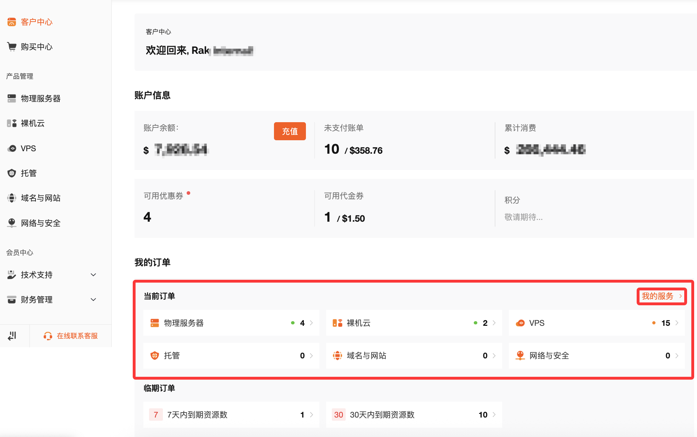
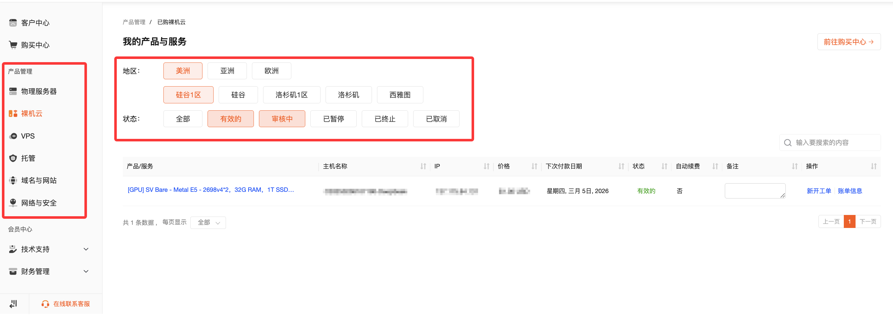

## 一、概述

当您需要管理已购买的云服务器（如物理服务器、裸机云、VPS等），或查看产品状态、续费信息时，可以通过以下**三种方式**在 RakSmart 客户中心快速定位您的产品。

1. **快捷搜索**：通过主机名或主IP直接搜索
2. **首页快捷入口**：通过“我的订单”或“我的服务”快速查看
3. **产品管理导航**：按产品类型、地区、状态筛选查找

下面将为您详细介绍每种方法的具体操作步骤。

---

## 方法一：快捷搜索（最快速）

如果您记得机器的**主机名**或**主IP地址**，可以使用此方法直接定位。

### 操作步骤

1. **登录RakSmart客户后台中心**
2. 在页面**右上角**找到搜索栏（显示“Q 请输入”的输入框）

   
3. 输入您机器的**主IP地址**或**主机名**

   - 例如：输入 `192.168.1.100` 或 `sv-xxxxx`
4. 系统会自动显示匹配的**产品订单**
5. 点击搜索结果中的订单，即可进入该机器的产品页面

### 适用场景

- 您清楚记得机器的IP或主机名
- 需要快速进入特定机器的管理页面

---

## 方法二：通过客户中心首页查找

如果您刚登录后台，可以通过首页的快捷入口查看当前活跃的订单。

### 通过“我的订单 - 当前订单”查看

1. 登录后进入**客户中心首页**

   
2. 在首页找到**“我的订单”**区域
3. 查看**“当前订单”**，即可看到所有**活跃状态**的订单列表
4. 在订单列表中：

   - 点击具体**产品类**（如“物理服务器”），可进入该产品的详情页
   - 或者点击“我的服务”查看所有活跃产品

### 适用场景

- 想快速查看所有活跃产品
- 不记得具体IP或主机名，需要浏览订单列表

---

## 方法三：通过产品管理导航查找（最全面）

如果您需要按**产品类型、地区、状态**等条件筛选查找，可以使用此方法。

### 1. 进入产品管理

在左侧导航栏找到**“产品管理”**，根据您购买的产品类型选择：

- **物理服务器**
- **裸机云**
- **VPS**

  

### 2. 按地区筛选

进入对应产品页面后，您可以看到**地区筛选**选项：

| 地区 | 可用选项 |
| --- | --- |
| **美洲** | 硅谷、洛杉矶、西雅图等 |
| **亚洲** | 新加坡、香港、日本、韩国等 |
| **欧洲** | 法兰克福等 |

选择对应地区，即可查看该区域下的所有机器。

### 3. 按状态筛选

选择地区后，您还需要通过**状态筛选**快速定位特定状态的机器：

| 状态 | 说明 |
| --- | --- |
| **全部** | 显示所有状态的机器 |
| **有效的** | 正常运行中的机器 |
| **审核中** | 新购或操作变更待审核 |
| **已暂停** | 因欠费或其他原因暂停 |
| **已终止** | 已删除或过期 |
| **已取消** | 订单已取消 |

### 4. 查看产品列表

筛选后，页面会显示符合条件的产品列表，包含以下信息：

- **产品/服务**：产品配置信息
- **主机名称**：机器的主机名
- **IP**：机器的IP地址（部分产品显示）
- **价格**：产品价格
- **下次付款日期**：续费日期
- **状态**：当前运行状态
- **自动续费**：是否开启自动续费

点击具体产品，即可进入该机器的管理面板进行重装系统、重启、查看监控等操作。

---

## 各产品类型查找路径汇总

| 产品类型 | 查找路径 |
| --- | --- |
| **物理服务器** | 产品管理 → 物理服务器 → 选择地区/状态筛选 |
| **裸机云** | 产品管理 → 裸机云 → 选择地区/状态筛选 |
| **VPS** | 产品管理 → VPS → 选择地区/状态筛选 |
| **所有活跃产品** | 客户中心首页 → 我的服务 |
| **当前订单** | 客户中心首页 → 我的订单 → 当前订单 |

---

## 常见问题

**Q：为什么我在产品管理里看不到任何机器？**
A：请检查：① 是否选择了正确的产品类型；② 地区筛选是否包含您机器的所在地；③ 状态筛选是否选择了“全部”或“有效的”；④ 确认您登录的账号是否是该产品的所有者。

**Q：搜索栏输入IP后没有显示结果？**
A：请确认：① IP地址输入是否正确；② 该IP是否属于您当前登录的账号。

**Q：我的机器显示“审核中”是什么意思？**
A：表示您新购的机器正在上架安装中，审核通过后状态会变为“有效的”。

**Q：如何区分物理服务器和裸机云？**
A：物理服务器是纯物理机，裸机云是具备云化功能的物理机，两者在产品管理中是分开的菜单，请根据您购买的产品类型选择对应入口
