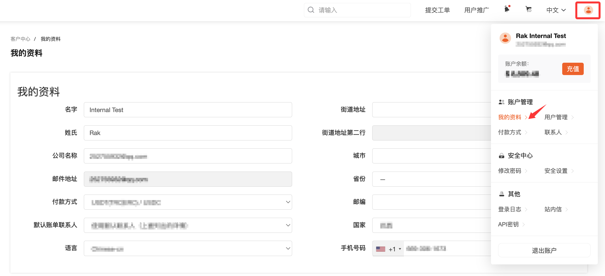
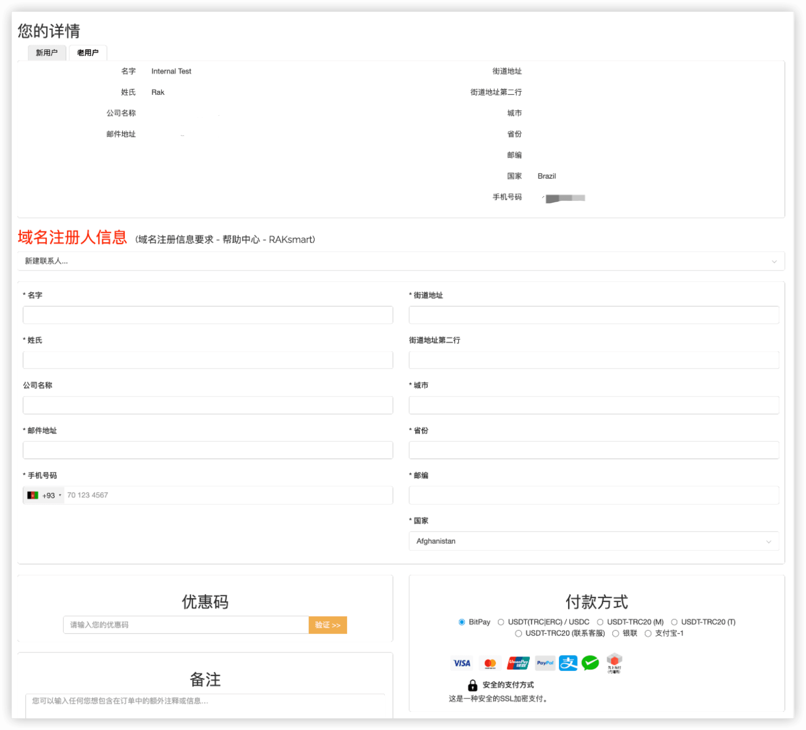

一.注册域名前，请按如下信息修改账户信息，使账户信息符合域名注册信息要求。

1.点击右上角头像

2.点击我的资料

3.名字不能为空，只能使用英文或拼音

4.姓氏不能为空，只能使用英文或拼音

5.公司名称可以为空，如填写，只能用英文或拼音

6.邮件地址必需填写合法有效地址，需要接收验证邮件来激活域名

7.街道地址第一行不能为空，只能用英文，拼音，数字

8.街道地址第二行可以不填，如填写，只能用英文，拼音，数字

9.城市，必填，只能使用英文或拼音，且必需 国家>>省份>>城市 对应

10.省份，必填，只能使用英文或拼音，且必需 国家>>省份 对应

11.国家，必选

12.邮编，必填，只能使用英文或拼音，且必需 国家>>省份>>城市>>邮编 对应

13.手机号码，必填，并确保与所选地区的相关编码规则匹配。

二.注册域名时，如下图，需要新建或选择联系人信息。

1.点击帮助中心，可查看域名信息相关要求

2.新建或选择联系人信息，如果之前没有创建过联系人信息，首次注册域名必需新建一个联系人信息，如果之前有，可以直接点击选择。

3.名字不能为空，只能使用英文或拼音

4.姓氏不能为空，只能使用英文或拼音

5.公司名称可以为空，如填写，只能用英文或拼音

6.邮件地址必需填写合法有效地址，需要接收验证邮件来激活域名

7.街道地址第一行不能为空，只能用英文，拼音，数字

8.街道地址第二行可以不填，如填写，只能用英文，拼音，数字

9.城市，必填，只能使用英文或拼音，且必需 国家>>省份>>城市 对应

10.省份，必填，只能使用英文或拼音，且必需 国家>>省份 对应

11.国家，必选

12.邮编，必填，只能使用英文或拼音，且必需 国家>>省份>>城市>>邮编 对应

13.手机号码，必填，并确保与所选地区的相关编码规则匹配。

三、重要提示

域名注册信息必需符合上述相关要求

国家>>省份>>城市>>邮编 必需对应，否则注册无法通过！
