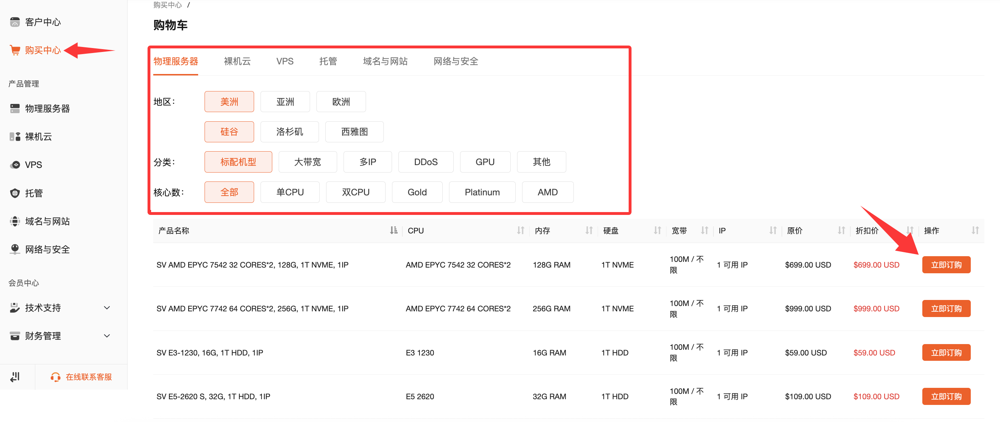
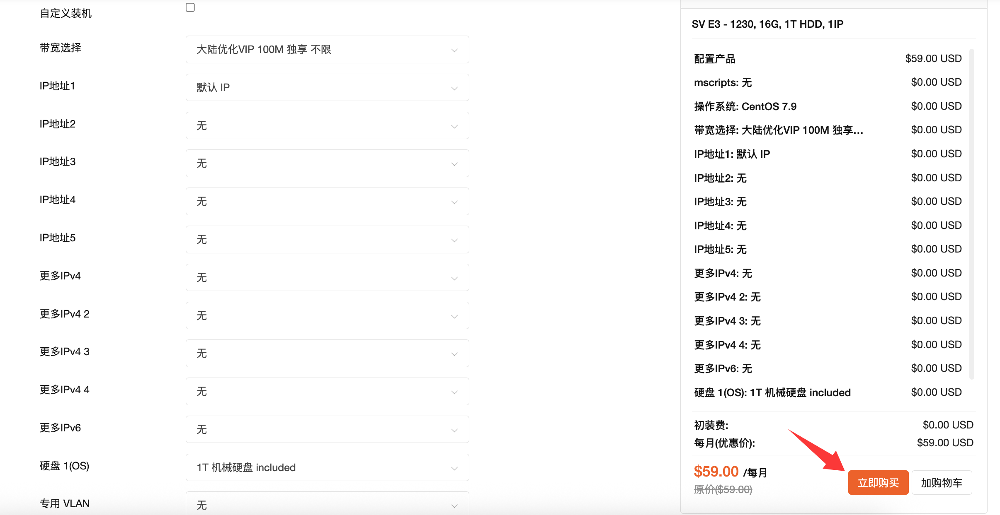
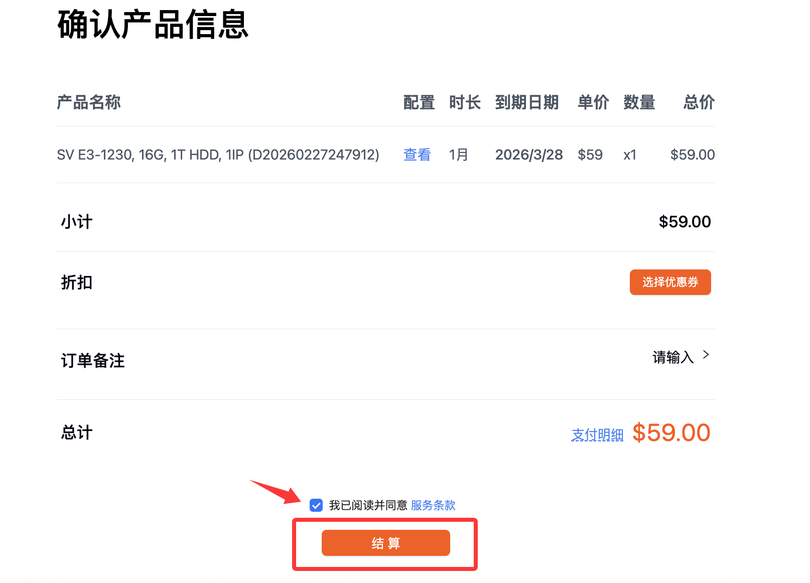
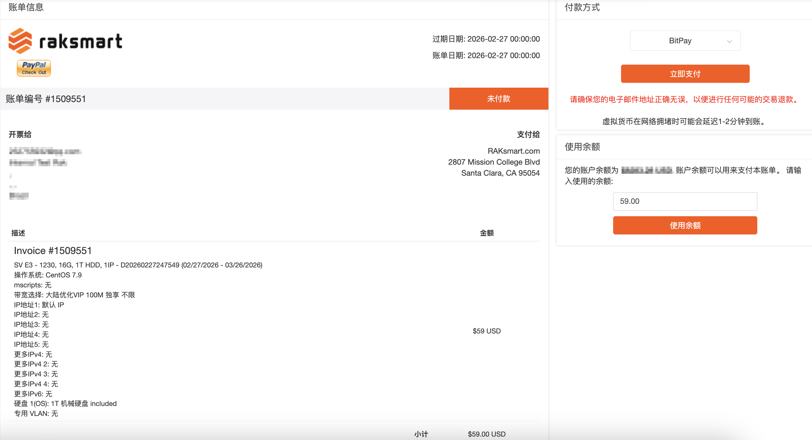

1.登陆到RAKsmart客户后台，点击“购买中心”，选择所您所需要的产品类型。

2.点击立即订购跳转到配置选择界面。

3.配置选择界面配置选择完毕，点击“继续”进行付款。

4.选择结算方式，点击结账，支付账单，账单支付后会进行上架，留意交付邮件

  （1）填写验证码，点击验证生效

  （2）可填写需要备注的特殊要求，如系统分区等

  （3）选择付款方式

  （4）需要勾选同意此服务条款才可付款

  （5）点击结账跳转到付款账单页面

5.选择付款方式，可以选择余额和非余额两种

  （1）可以选择付款方式

  （2）账户内有钱可以使用余额支付

