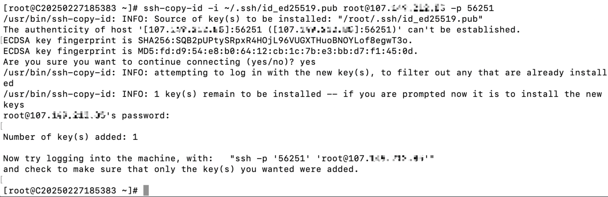

使用密钥进行远程连接的主要目的是提高安全性、简化登录流程，并支持自动化操作。相比于密码认证，密钥认证具有以下优势：

1. 更高的安全性，抵抗暴力破解和中间人攻击。
2. 无需记忆密码，避免密码泄露。
3. 支持自动化任务和批量管理。
4. 提供细粒度的访问控制和权限管理。

因此，密钥认证是远程连接服务器的最佳实践，尤其是在生产环境或需要高安全性的场景中。

本文介绍从生成密钥到如何使用密钥进行远程登录介绍

## 一. 生成 SSH 密钥对

1. 在 **客户端机器**（即你要用来登录远程服务器的机器）上执行以下命令：

#ssh-keygen -t rsa -b 4096

或者，使用 更安全的 Ed25519 算法（推荐）：

#ssh-keygen -t ed25519

2. 在生成密钥时，你会被要求输入一个 **密码短语（passphrase）**。这不是必需的，但建议为密钥添加密码以提高安全性。如果不想每次登录时输入密码短语，可以直接按回车跳过。

示例：

生成密钥后会在用户的 `~/.ssh` 目录下生成两个文件：

- **私钥**：`id_rsa` 或 `id_ed25519`
- **公钥**：`id_rsa.pub` 或 `id_ed25519.pub`
- **私钥（id\_rsa）** 仅存放在本地，**公钥（id\_rsa.pub）** 需要上传到服务器

## 二. 将公钥复制到远程服务器

接下来，你需要将 **公钥** 复制到远程服务器的 `~/.ssh/authorized_keys` 文件中。

### **方法 1：使用** `ssh-copy-id`**（推荐）**

`ssh-copy-id` 是最简便的复制公钥的方法。假设你的远程服务器 IP 地址为 `192.168.1.100`，用户名是 `root`，执行以下命令：

#ssh-copy-id -i ~/.ssh/id\_rsa.pub root@192.168.1.100

或者：

#ssh-copy-id -i ~/.ssh/id\_ed25519.pub root@192.168.1.100

然后输入 **远程服务器的密码**，完成后，公钥会被自动添加到远程服务器的 `~/.ssh/authorized_keys` 文件中。

示例：

### **方法 2：手动复制公钥**

如果 `ssh-copy-id` 命令不可用，可以手动将 **公钥** 复制到远程服务器：

1. 在本地执行以下命令，查看公钥内容：

#cat ~/.ssh/id\_rsa.pub

或

#cat ~/.ssh/id\_ed25519.pub

  2. 登录到远程服务器：

#ssh [root@192.168.1.100](mailto:root@192.168.1.100)

     3. 在远程服务器上，编辑 `~/.ssh/authorized_keys` 文件：

#mkdir -p ~/.ssh

#chmod 700 ~/.ssh

#vi ~/.ssh/authorized\_keys

     4. 将 **本地公钥** 内容粘贴到 `authorized_keys` 文件中，然后保存并退出。

修改权限：

#chmod 600 ~/.ssh/authorized\_keys

[**接下来会从macOS系统、windows系统和不同的远程工具介绍如何通过私钥进行远程登录。**](https://billing.raksmart.com/whmcs/index.php?rp=/knowledgebase/977/%E5%A6%82%E4%BD%95%E4%BD%BF%E7%94%A8%E7%A7%81%E9%92%A5%E8%BF%9B%E8%A1%8C%E8%BF%9C%E7%A8%8B%E7%99%BB%E5%BD%95.html)
