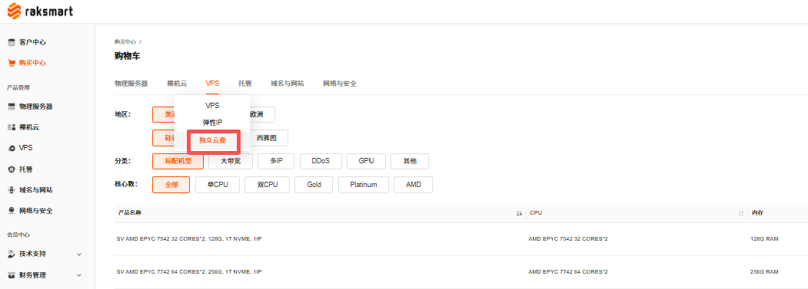
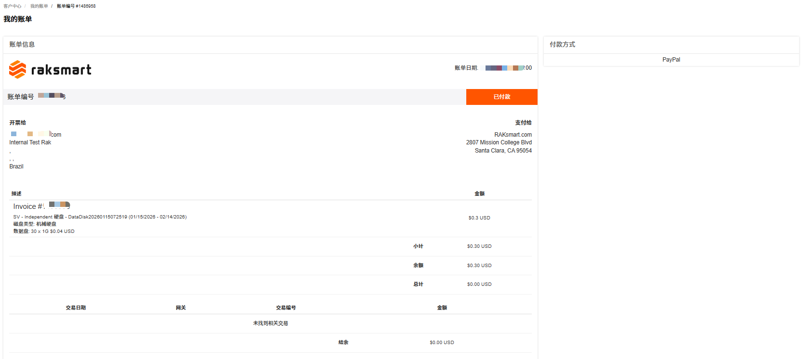
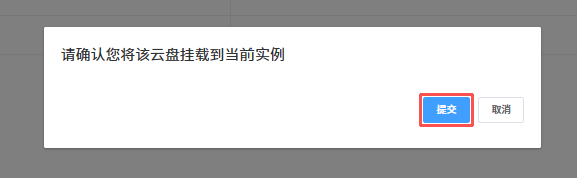

### 购买独立云盘

独立云盘可用作 VPS 的数据盘，当 VPS 的存储容量不够时，可以将已购买的独立云盘挂载到 VPS，或升级独立云盘来扩充存储容量。本文主要介绍通过 Raksmart 控制台购买全新的独立云盘。

#### 使用限制

独立云盘只能挂载到同一区域、同一可用区内的 VPS 实例，无法跨区域或跨可用区挂载。

#### 操作步骤

1. 登录 [Raksmart 控制台](https://billing.raksmart.com/whmcs/clientarea.php?language=chinese-cn)。

2. 在官网顶部导航右侧，单击**控制台**，进入控制台客户中心页面。

   

3. 单击**购买中心**，进入**购物车**页面。

   

4. 单击 **VPS** -> **独立云盘**，进入**配置** - **购物车**页面。

   

5. 根据业务需求完成配置选择，单击**继续**。

   

6. 完成费用结算。

   

---

### 挂载独立云盘

购买并开通独立云盘后，可挂载到指定 VPS。

#### 前提条件

已经购买独立云盘。详细内容介绍可参考[购买独立云盘](#购买独立云盘)。

#### 使用限制

独立云盘只能挂载到同一区域、同一可用区内的 VPS 实例，无法跨区域或跨可用区绑定。

#### 操作步骤

1. 在 VPS **管理产品**页面，单击**独立云盘**面板。

   

2. 选择一个独立云盘单击**挂载**。

   

3. 在确认提示页面，单击**提交**。

   

4. 成功挂载独立云盘后，系统提示如下状态。

   

---

### 卸载独立云盘

卸载独立云盘是指在控制台将独立云盘与 VPS 解除挂载关系，卸载只是断开连接，不会删除云盘里的数据。

1. 在 VPS **管理产品**页面，单击**独立云盘**面板。

   

2. 如果此面板下有多个独立云盘，选择一个单击**卸载**。

   

3. 在确认提示页面，单击**提交**。

   

4. 成功卸载独立云盘后，系统提示如下状态。云盘会进入 “挂载” 状态，之后可以重新挂载到同地域的其他VPS上。

   
