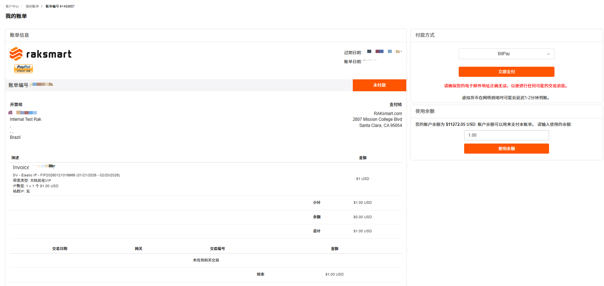
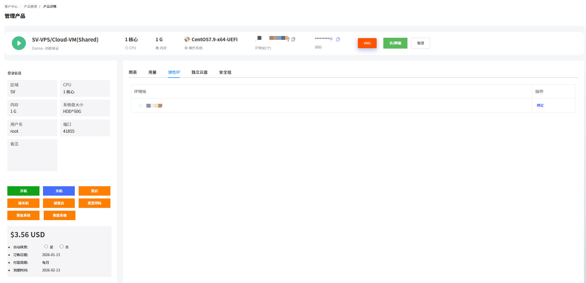
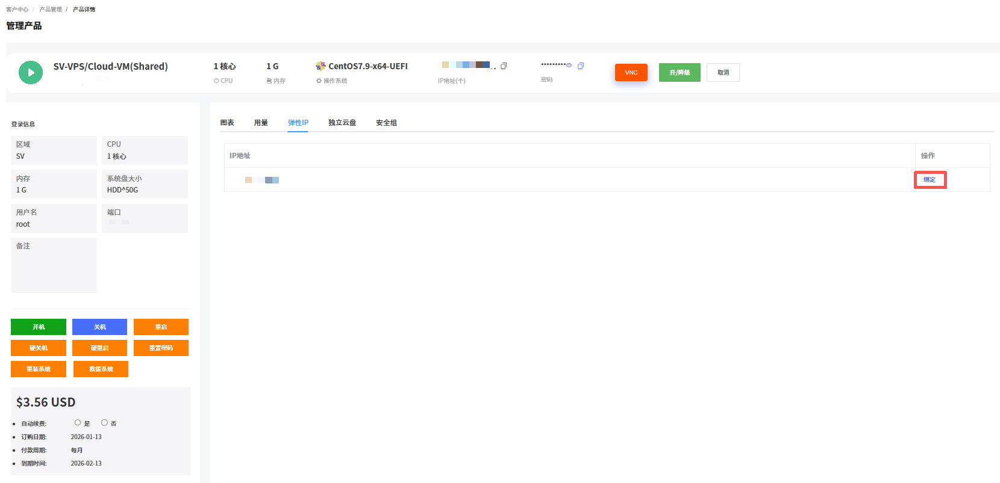
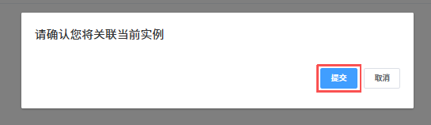
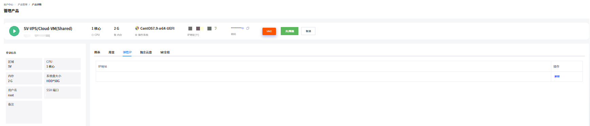

弹性 IP 是可独立申请、动态绑定 / 解绑、可保留的公网 IP 地址。可以在不同实例间灵活迁移，不随服务器的创建、释放而改变。您在下单 VPS 时可以根据业务需要选购公网 IP，如果后续您需要更多的公网 IP，可以购买和绑定弹性 IP。

- 一个弹性 IP 只能绑定到一个云资源上使用。
- 因网络架构和资源管理规则限制，弹性 IP 的可用区和线路类型 必须与 VPS 实例的可用区和线路类型保持一致才可绑定。

---

### 购买弹性 IP

本文主要介绍通过 Raksmart 控制台购买弹性 IP。

1. 登录 [Raksmart 控制台](https://billing.raksmart.com/whmcs/clientarea.php?language=chinese-cn)。

2. 单击**购买中心**，进入**购物车**页面。

   

3. 单击 **VPS** -> **弹性 IP**，进入**配置** - **购物车**页面。

   

4. 根据业务需求完成区域、可用区、磁盘类型等信息配置，单击**继续**。

   

5. 完成费用结算。

   

---

### 绑定弹性 IP

本文主要介绍通过 Raksmart 控制台绑定弹性 IP。

#### 前提条件

已经购买弹性 IP，详细内容介绍可参考[购买弹性 IP](#购买弹性-ip)。

#### 使用限制

弹性 IP 只能绑定到同一区域、同一可用区内的 VPS 实例，且线路类型需相同，无法跨区域或跨可用区绑定。

#### 操作步骤

1. 在 VPS **管理产品**页面，单击**弹性 IP** 面板。

   

2. 如果此面板下有多个弹性 IP，选择一个单击**绑定**。

   

3. 在确认提示页面，单击**提交**。

   

4. 成功绑定弹性 IP 后系统提示如下状态。

   

---

### 解绑弹性 IP

解绑弹性 IP 是在控制台将弹性 IP 与 VPS 解除关联。

1. 在 VPS **管理产品**页面，单击**弹性 IP** 面板。

   

2. 如果此面板下有多个弹性 IP，选择一个单击**解绑**。

   

3. 在确认提示页面，单击**提交**。

   

4. 解绑后弹性 IP 转为 “绑定” 状态，可重新绑定其他资源或解绑。

   
