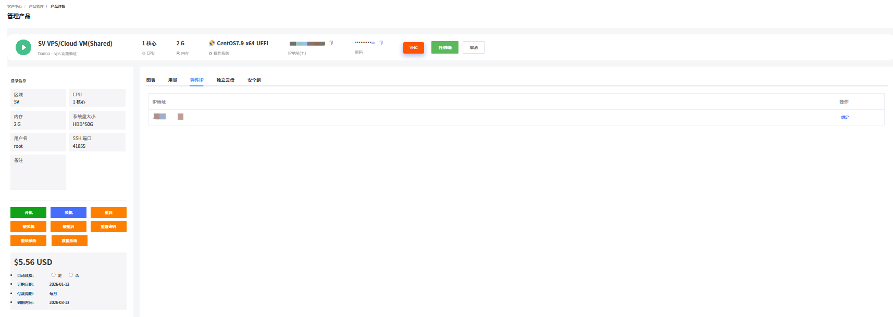
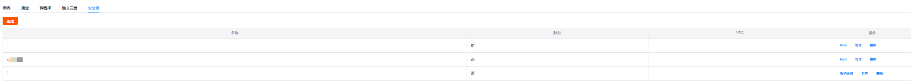

支持查看 VPS 的基础信息、图表、用量、弹性 IP、独立云盘和安全组。

1. 登录 [RakSmart 控制台](https://billing.raksmart.com/whmcs/clientarea.php?language=chinese-cn)。

2. 在控制台左侧导航**产品管理**区域，单击 **VPS**，进入**我的产品与服务**页面。

   

3. （可选）若当前列表没有找到想要查看的 VPS ，支持通过地区或状态进行筛选，或者通过搜索框搜索。

   

4. 选择一台需要查看的 VPS ，单击**产品/服务**名称，进入**管理产品**页面。

   

5. 您可查看如下 VPS 的基础信息和功能操作入口。

   

   <table width="100%">
           <tr style="text-align: left;">
             <th width="20%">项目</th>
             <th width="80%">说明</th>
           </tr>
           <tr>
             <td>基础信息</td>
             <td>- 产品/服务名称：SV-VPS/Cloud-VM(Shared)，这是一台共享型 VPS 实例； 
         - 区域：SV； 
         - 硬件规格：1 核心 CPU，2G 内存； 
         - 系统盘配置：HDD50G； 
         - 操作系统镜像：CentOS7.9-x64-UEFI； 
         - 公网 IP 地址：xxx.200.39.167 	
         - SSH 登录信息：默认用户名 root、连接端口 41855。 
         - 功能模块：有开机、关机、重启等操作按钮； 
         - 当前费用：$5.56 USD； 
         - 计费周期：包含下单日期（2026-01-13）和到期日期（2026-03-13），计费模式为按月付费。</td>
           </tr>
           <tr>
             <td>功能展示页签</td>
             <td>提供了 “图表、用量、弹性 IP、独立云盘、安全组” 等功能入口，可进一步查看网络、存储、安全等扩展信息。</td>
           </tr>
         </table>

---

### 查看图表

在 VPS **管理产品**页面，单击**图表**，可查看 CUP 使用量、硬盘IO、内存用量和网卡用量。支持通过时间筛选。

---

### 查看用量

在 VPS **管理产品**页面，单击**用量**面板，可查看 VPS 的带宽使用情况。支持通过时间筛选。

---

### 弹性 IP

在 VPS **管理产品**页面，单击**弹性IP**面板，可查看绑定在 VPS 上的弹性 IP 地址和账户名下的未绑定状态的弹性 IP 。关于弹性 IP 的详细介绍可参考[弹性 IP](./elastic-ip.md)。

---

### 独立云盘

在 VPS **管理产品**页面，单击**独立云盘**面板，可查看VPS 上已挂载的独立云盘和账户名下的未挂载状态的独立云盘信息。关于独立云盘的详细介绍可参考[独立云盘](./cloud-disk.md)。

---

### 安全组

在 VPS **管理产品**页面，单击**安全组**面板，可查看和管理安全组。关于安全组的详细介绍可参考[安全组](./security-groups.md)。

