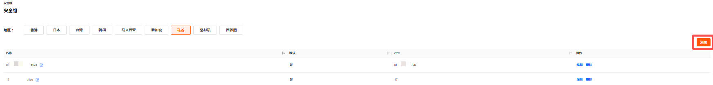
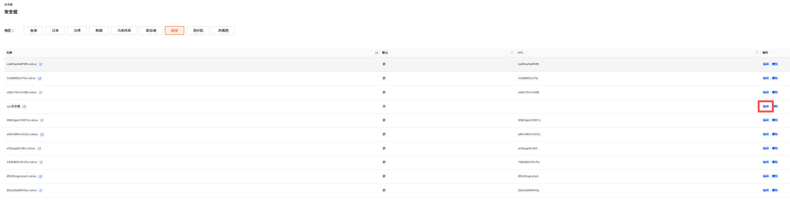
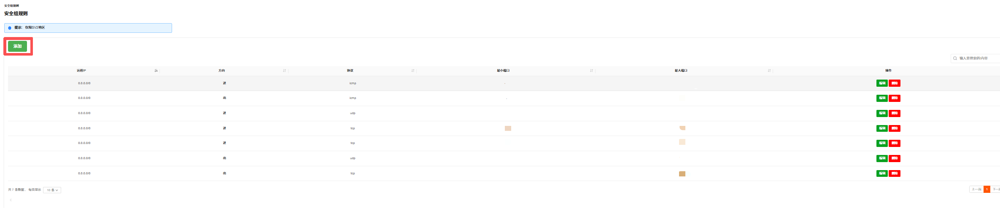
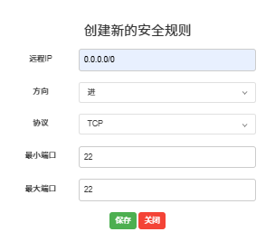
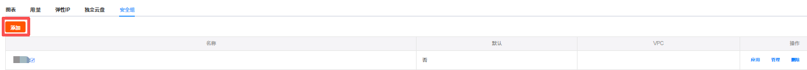
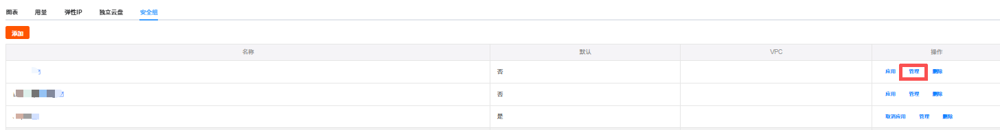
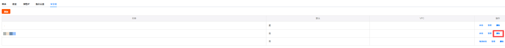

安全组是一种虚拟防火墙，具备数据包过滤功能，用于设置 VPS 实例的网络访问控制，是重要的网络安全隔离手段。

您在购买并开通 VPS 后，系统会自动为您创建默认安全组并关联至该实例。除了默认安全组，您还可以根据业务需求创建自定义安全组并关联至实例。

---

### 安全组管理面板

本文介绍如何在安全组管理面板对安全组进行操作。

#### 添加安全组

1. 登录 [Raksmart 控制台](https://billing.raksmart.com/whmcs/clientarea.php?language=chinese-cn)。

2. 在左侧导航单击 **VPS**，进入**我的产品与服务** - **VPS**面板。

   

3. 在**分类**选项里，单击**安全组**，进入**安全组**页面。

   

4. 单击**添加**。

   

5. 在创建新的安全组页面，自定义安全组**名称**，例如 “vps 安全组”；选择是否使用**默认**安全组。

   

6. 单击**保存**。

#### 添加安全组规则

如果需要对安全组中的安全规则进行调整，可以修改已有的安全组规则，也可以自定义安全组规则。

1. 在安全组列表中，找到已添加的安全组，例如 “vps 安全组”，单击右侧的**编辑**按钮。进入**安全组规则**页面。

   

2. 单击**添加**，进入**创建新的安全组规则**页面。也可单击右侧**编辑**按钮对现有规则进行调整。

   

3. 填写合适的**远程 IP**、**方向**、**协议**、**最小端口**和**最大端口**，并单击**保存**。

   

---

### VPS 安全组面板相关操作

本文介绍如何在 VPS 操作界面对安全组进行管理。

#### 添加安全组

您可以在 VPS 管理页面安全组面板添加新的安全组。

1. 在VPS的**管理产品**页面，单击**安全组**面板。

2. 单击**添加**按钮。

   

3. 在创建新的安全组页面，输入安全组名称和选择是否使用默认安全组。

   

4. 单击**保存**。

#### 应用安全组

安全组可以应用到 VPS 服务器上。

1. 在VPS的**管理产品**页面，单击**安全组**面板。

2. 选择目标安全组，单击**应用**。

   

3. 在提示页面中单击**确认应用**。

   

4. 成功应用后页面提示如下信息。

   

#### 取消应用安全组

当您需要更换安全组，需先取消当前安全组，再绑定新安全组。

> **注意**
>
> 取消应用安全组后，若未及时绑定新安全组，服务器的网络访问可能会受影响，建议提前准备好新的安全组配置。

1. 在**安全组**面板，单击**取消应用**。

   

2. 在取消应用确认页面，单击**是**。

#### 编辑安全组规则

1. 在**安全组**面板，单击**管理**，进入编辑安全组页面。

   

2. 可以对该安全组下的具体安全规则进行添加、编辑和删除。详细内容可参考管理安全组。

   

#### 删除安全组

若您不再需要某个安全组，可以对其进行删除。

1. 在**安全组**面板，选择需要删除的安全组，在右侧操作列单击**删除**。

   

2. 在确认页面单击**是**。

   
