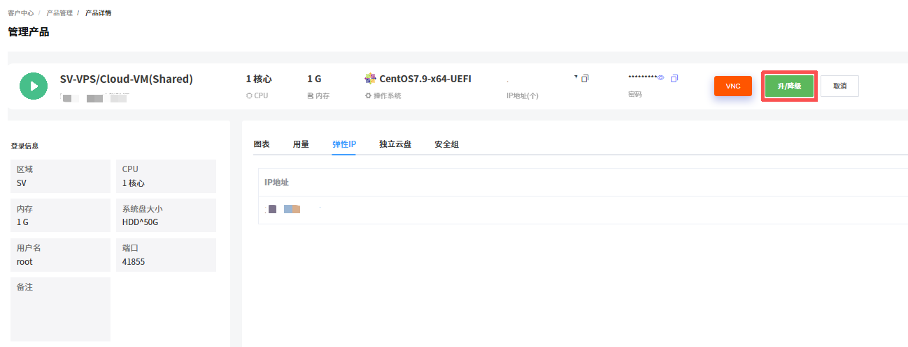
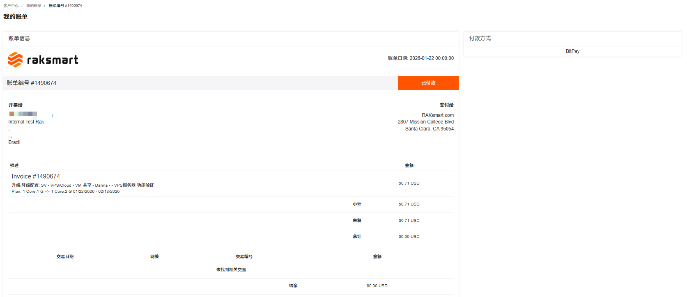

升/降级是指调整VPS的配置规格，如 CPU 核数、内存容量、硬盘大小、IP数量、带宽等。

---

### 操作步骤

1. 登录 [Raksmart 控制台](https://billing.raksmart.com/whmcs/clientarea.php?language=chinese-cn)。

2. 在左侧导航**产品管理**区域，单击 **VPS**，进入**我的产品与服务**页面。

   

3. （可选）若当前列表没有找到想要查看的 VPS ，支持通过地区或状态进行筛选，或者通过搜索框搜索。

   

4. 选择一台需要升降级的 VPS ，单击**产品/服务**名称，进入**管理产品**页面。

   

5. 在 VPS **管理产品**页面，单击**升/降级**。进入**升级/降级**页面。

   

6. 重新填写或选择需要升降级的配置。例如实例规格由计算型 1G 内存改选为计算型 2G 内存。

   

7. 单击**点击继续**，进入**升级/降级**价格确认页面。确认页面展示哪些配置做了升降级，和对应的价格变化。

   

8. 确认升降级配置和价格没有问题后，单击**点击继续**。选择支付方式或者使用账户余额完成支付。

   

---

### 操作结果

支付成功后，系统将自动完成配置调整。可在产品详情页查看更新后的配置信息，确认是否生效。

---

### 注意事项

对产品进行升级与变配会存在一些限制或影响，请留意操作界面的提示，或查看该产品的相关文档了解详情。

1. 不同产品升级与变配时可能会存在限制。
   例如：实例的网络类型不允许改变；硬盘容量只允许升级，不支持降级。
2. 升级与变配可能会对您的资源费用、生效时间、计费方式产生影响。
   例如，升级时，可能需要您为当前计费周期的规格或配置补差价。
3. 部分产品的升级与变配可能会对您的业务造成短暂影响。
   - 提前规划升级时间：建议选择业务低峰期执行升级 / 变配操作（如凌晨、节假日），最大程度降低对核心业务的影响。
   - 备份业务数据与配置：操作前务必完成全量数据备份和关键配置文件导出，避免因升级异常导致数据丢失或配置错乱。
   - 业务恢复后校验：升级完成后，需逐一验证业务功能、网络连通性、数据完整性，确认无异常后再恢复全量业务访问。
   - 问题反馈：若遇任务卡顿、失败等异常，及时通过控制台工单系统或客服渠道反馈。
