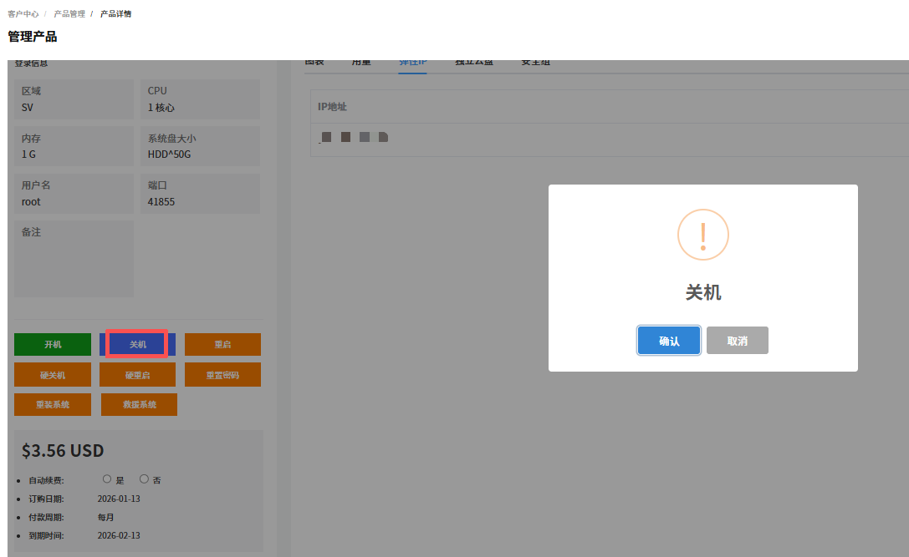
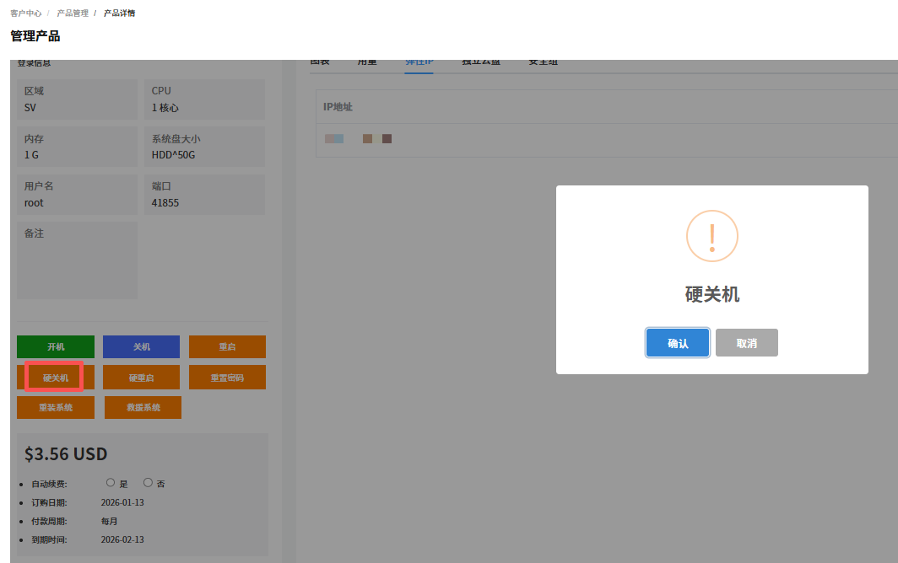
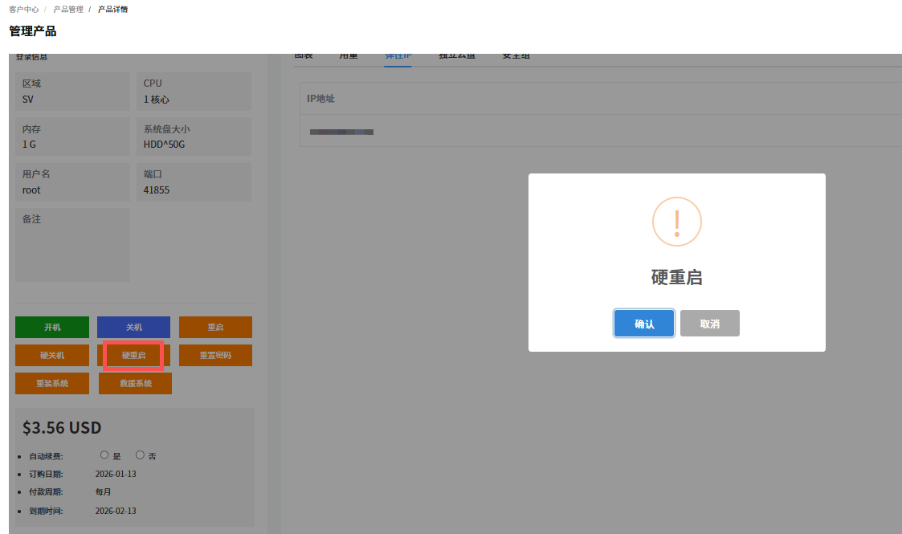
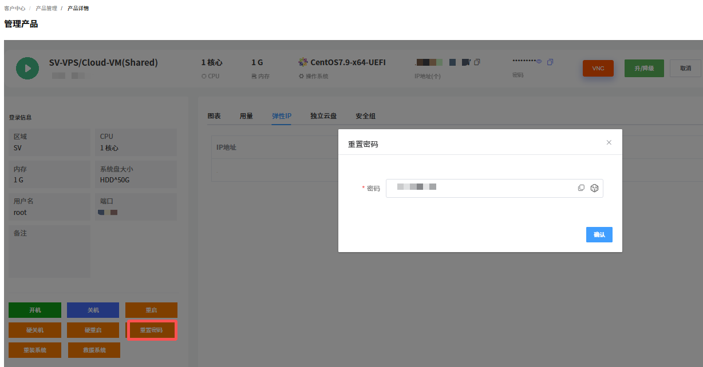
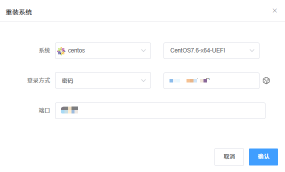
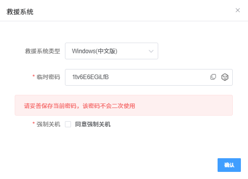

VPS 支持使用 VNC、开机、关机、重启、硬关机、硬重启、重置密码、重装系统和启动救援系统操作。

---

### 开机

开机是指开启运行 VPS。

1. 在 VPS **管理产品**页面，单击**开机**。

   

2. 单击**确认**。

---

### 关机

关机是指关闭运行中的 VPS 。建议先通过远程连接保存数据。

1. 在 VPS **管理产品**页面，单击**关机**。

   

2. 单击**确认**。

---

### 重启

重启是指将运行中的服务器关机并重新开机。适用于系统卡顿、配置生效等场景。

1. 在 VPS **管理产品**页面，单击**重启**。

   

2. 单击**确认**。

---

### 硬关机

硬关机等同于 VPS 直接断电，强制切断主机供电以关闭系统。

> **注意**
>
> - 易导致未保存的业务数据丢失、文件系统损坏。
> - 仅适用于系统卡死、软关机无响应的紧急场景。
> - 操作后建议检查磁盘完整性。

1. 在 VPS **管理产品**页面，单击**硬关机**。

   

2. 单击**确认**。

---

### 硬重启

硬重启是指强制断电后立即通电重启主机，跳过系统正常关机流程，属于紧急重启方式。

1. 在 VPS **管理产品**页面，单击**硬重启**。

   

2. 单击**确认**。

---

### 重置密码

重置密码是指重置 VPS 的系统管理员密码，适用于密码遗忘或权限变更场景。

1. 在 VPS **管理产品**页面，单击**重置密码**。
   

2. 输入修改后的密码，单击**确认**。

---

### 重装系统

重装系统是指重新部署操作系统镜像，将 VPS 系统盘恢复至初始状态，常用于系统故障、更换系统版本或清理环境等场景，操作会格式化系统盘（数据盘通常不受影响，视配置而定）。

> **注意**
>
> 重装会清除系统盘数据，请提前备份。

1. 在 VPS **管理产品**页面，单击**重装系统**。

   

2. 根据提示完成**系统**、**登录方式**和**端口**信息的选择和输入。

   

3. 单击**确认**。

---

### 救援系统

救援系统是指启动救援模式。用于系统故障、密码找回等紧急场景。

1. 在 VPS **管理产品**页面，单击**救援系统**。

   

2. 根据提示完成**救援系统类型**的选择、**临时密码**的设置和保存，选择是否**强制关机**，单击**确认**。

   
