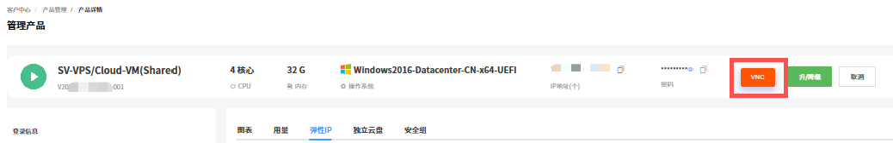
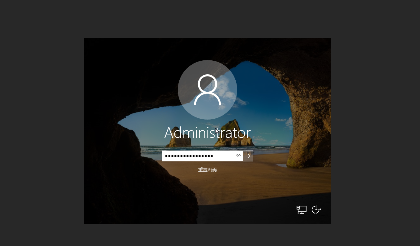
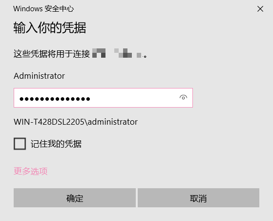
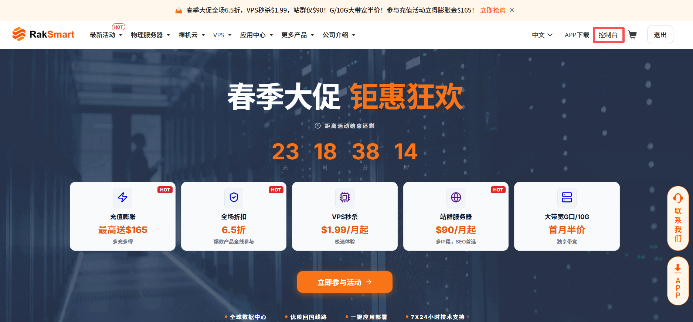
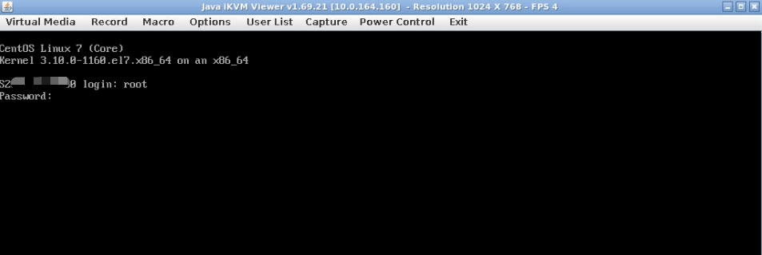
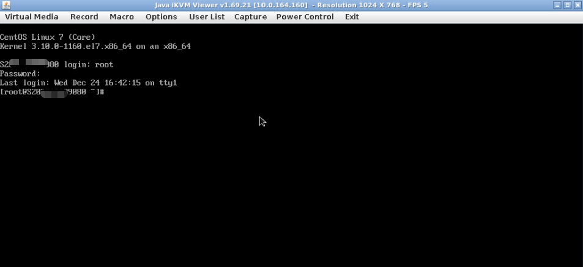
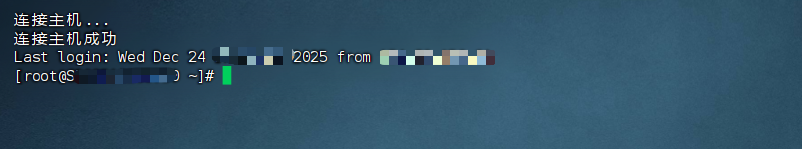

根据购买时选择的 VPS 操作系统类型的不同，您可以选择 Windows 登录方式或 Linux 登录方式。

---

### 前提条件

已购买并开通 VPS 。详细内容可参考[购买 VPS](./purchase.md)。

---

### 登录 Windows VPS

Windows VPS 支持通过控制台 VNC 登录和远程桌面登录。

#### 方式 1：通过控制台 VNC 登录

控制台 VNC 是连接 VPS 的可视化操作界面，可进行系统操作、文件管理等操作。

1. 登录 [RakSmart 控制台](https://billing.raksmart.com/whmcs/clientarea.php?language=chinese-cn)。

2. 在控制台左侧导航**产品管理**区域，单击 **VPS**，进入**我的产品与服务**页面。此页面默认展示当前区域全部已购买的 VPS 。

   

3. 你可以通过地区或状态查找目标VPS 。单击**产品/服务**名称，进入此 VPS 的产品详情页面。

   

4. 单击 **VNC**，进入 VNC 连接面板。

   

5. 在 Windows 系统登录界面，输入服务器密码，完成登录。

   

#### 方式 2：使用远程桌面登录

本例以 Windows 系统自带的远程桌面连接应用作简要说明。

1. 在本地 Windows 电脑上，按 **Win + R** 键打开**运行**对话框，输入 **mstsc**，单击**确定**，进入**远程桌面连接**页面。

   

2. 在**计算机**输入框中，输入 Windows 服务器的公网 IP 地址，如：192.168.1.1。默认的远程桌面端口默认为 3389，如果服务器修改了默认的端口，则需在 IP 加上冒号和本机端口号，如：192.168.1.1:3390。

   

3. 单击**连接**。

4. 在弹出的窗口中，输入服务器的**管理员账号**（通常是 Administrator）和对应的密码，单击**确定**。

   

---

### 登录 Linux VPS

登录 Linux VPS 包含使用控制台 VNC 功能登录和使用 SSH 客户端远程登录两种方式。

#### 方式 1：通过控制台 VNC 功能连接服务器

控制台 VNC 是连接 VPS 的可视化操作界面，可进行系统操作、文件管理等操作。

1. 登录 [RakSmart 控制台](https://billing.raksmart.com/whmcs/clientarea.php?language=chinese-cn)。

2. 在顶部导航右侧，单击**控制台**，进入控制台**客户中心**页面。

   

3. 在左侧导航**产品管理**区域，单击 **VPS**，进入**我的产品与服务**页面。

   

4. 你可以通过**地区**或**状态**查找目标VPS 。单击**产品/服务**名称，进入此 VPS 的**管理产品**页面。

   

5. 单击 **VNC**。

   

6. 在确认运行页面勾选确认信息，单击 **Run**。进入连接命令行界面。

   

7. 在命令行页面输入用户名和密码。用户名默认为 root，密码可查看购买 VPS 时 RakSmart 发送的产品信息邮件。

   

8. 连接服务器成功。

   

#### 方式 2：使用 SSH 客户端远程连接 VPS

此方式是指使用 SSH 客户端工具，在本地设备上通过网络远程访问 VPS ，登录系统进行命令行操作的过程。

##### 前提条件

本地设备已安装 SSH 客户端：

- 本地设备为 Windows 系统时可使用 PuTTY、Xshell；
- 本地设备为 Mac/Linux 系统时可使用自带终端。

##### 操作步骤

1. 打开本地 SSH 客户端工具。

   

2. 在连接配置中填写如下信息。

   <table width="100%">
      <tr style="text-align: left;">
        <th width="20%">配置项</th>
        <th width="80%">说明</th>
      </tr>
      <tr>
        <td>名称</td>
        <td>服务器主机名。</td>
      </tr>
      <tr>
        <td>主机地址</td>
        <td>服务器主 IP。</td>
      </tr>
       <tr>
        <td>端口</td>
        <td>端口：默认 SSH 端口为 22；</td>
      </tr>
   	<tr>
        <td>方法</td>
        <td>支持密码、公钥和 Keyboard Interactive方式，选择其中一种方式。</td>
      </tr>
   	<tr>
        <td>用户名</td>
        <td>root（对应操作系统用户名）。</td>
      </tr><tr>
        <td>密码</td>
        <td>服务器连接密码。可在产品信息邮件中查找对应密码。产品信息邮件会在产品购买开通后由 RakSmart 发送给用户。</td>
      </tr>
    </table>

3. 单击**确定**，远程连接服务器成功如下图所示。

   
