# 购买 RakSmart 产品

本文主要介绍如何通过 RakSmart 官网和控制台购买 RakSmart 产品。

## 了解 RakSmart 产品购买方式

本文介绍购买 RakSmart 产品的三种方式：官网优惠活动入口、官网推荐产品入口和控制台购买中心入口。

---

### 官网优惠活动入口

官网优惠活动入口是 RakSmart 官网推出的产品优惠促销活动页面。

1. 登录 [RakSmart 官网](https://cn.raksmart.com/)。

2. 在顶部导航单击**最新活动**，打开活动下拉列表页面。

   

3. 在**最新活动**区域，单击选择某一个优惠产品。

   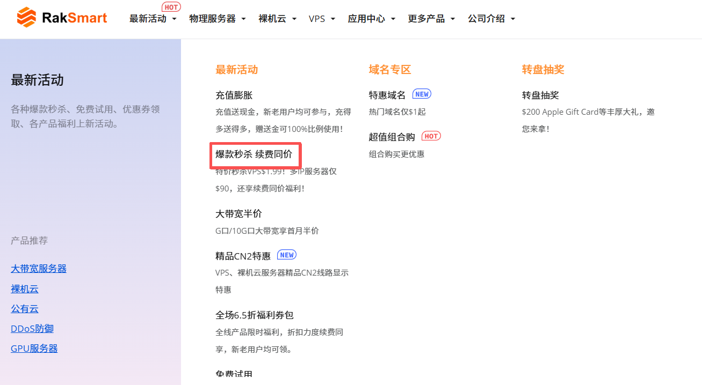

---

### 官网推荐产品入口

官网推荐产品入口可用于选购 RakSmart 基于主流业务场景预设的标准化配置套餐。

1. 登录 [RakSmart 官网](https://cn.raksmart.com/)。

2. 在顶部导航单击某一款产品，进入产品下拉列表。

   

3. 选择某一款产品/服务，进入产品或服务页面。

   

4. 在产品服务页面，单击**立即选购**，进入购物车页面。

   

5. （可选）也可以将产品或服务页面下拉至**推荐产品配置**，单击**立即购买**。

   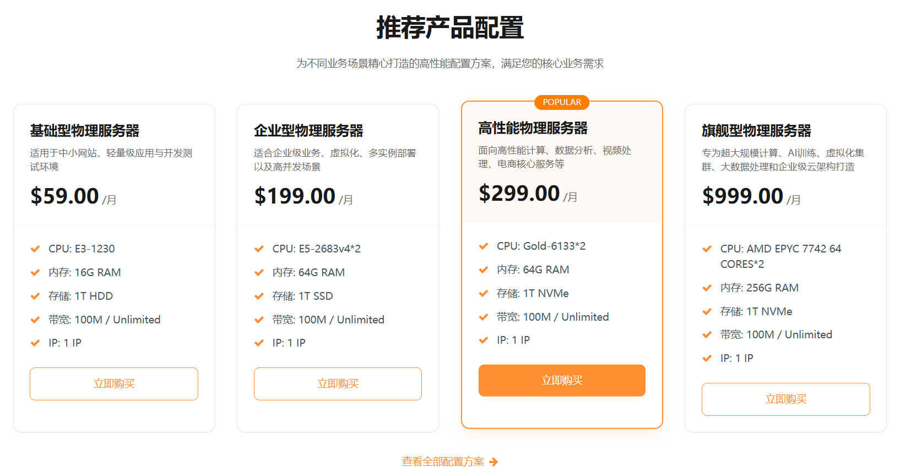

---

### 控制台购买中心入口

RakSmart 控制台购买中心集中提供产品与服务选购、配置、下单、支付等功能。

1. 登录 [RakSmart 控制台](https://cn.raksmart.com/login/index.html)。

2. 在**控制台**左侧导航，单击**购买中心**，进入**购物车**页面。

   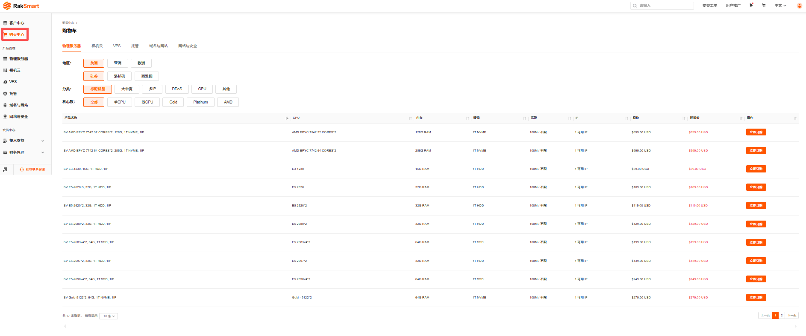

3. 单击某个产品或服务名称，选择地区、分类等配置筛选出适合购买的服务器，单击**立即订购**。

## 购买 RakSmart 产品

您可以分别通过官网产品入口和控制台购买中心入口购买 RakSmart 产品，不同的购买入口支持的产品配置方法和付款流程相同。

---

### 准备工作

1. 注册 RakSmart 账号，详细步骤可参考[注册 RakSmart 账号](注册%20RakSmart%20账号.md)。如果您已开通账号，请忽略此步骤。

2. 为账户充值，确保账户有足够的资金，以免购买产品失败。具体操作，请参考[为 RakSmart 账号充值](钱包管理.md#为%20RakSmart%20账号充值)。

   > **说明**
   >
   > 目前仅 VPS 支持小时计费。小时计费会从账户余额中扣款，为了保证业务连续性，请保持余额充足。

3. 了解 RakSmart 产品三种不同的购买方式：[了解 RakSmart 产品购买方式](购买%20RakSmart%20产品.md#了解%20RakSmart%20产品购买方式)。

---

### 步骤一：登录 RakSmart 官网

登录 [RakSmart 官网](https://cn.raksmart.com/)。您可根据 RakSmart 官网**产品介绍**，了解各产品的功能特性，以及适用的业务场景。

---

### 步骤二：领取优惠权益

在购买产品前，您可以先了解 RakSmart 推出的优惠活动，以更优惠的方式购买产品。

1. 查看优惠权益。

   在顶部导航单击**最新活动**，打开活动下拉列表页面。您可以通过优惠活动和福利专区选择需要购买的产品或服务。RakSmart 官网为新用户提供了各种满减优惠券、优惠活动和优惠产品，个人开发者、企业可享受不同的优惠权益。

   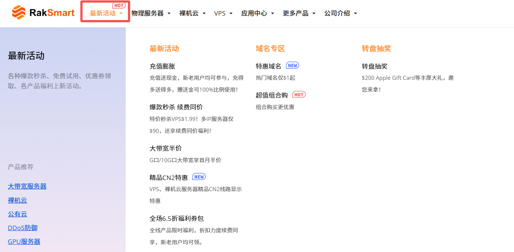

2. 领取优惠权益。

   成功领取权益后，您可前往[控制台](https://billing.raksmart.com/whmcs/clientarea.php?language=chinese-cn)->**我的钱包**查看已领取的权益。
   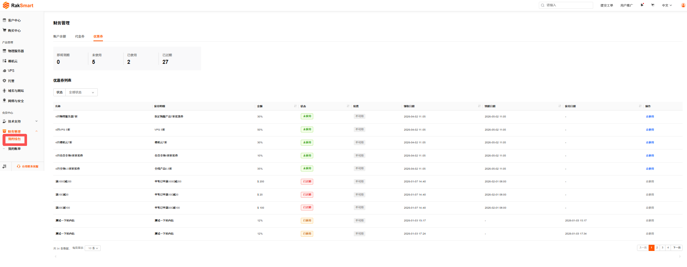

---

### 步骤三：购买 RakSmart 产品

1. 选择[官网优惠活动入口](购买%20RakSmart%20产品.md#官网优惠活动入口)、[官网推荐产品入口](购买%20RakSmart%20产品.md#官网推荐产品入口)或[控制台购买中心入口](购买%20RakSmart%20产品.md#控制台购买中心入口)其中一种购买入口，进入**购物车**页面。
2. 在**购物车**页面，选择所需产品，单击**立即订购**，进入**配置**-**购物车**页面。
   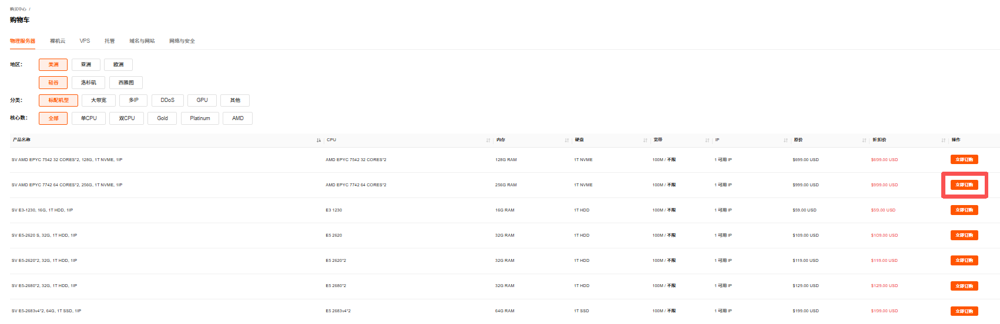

3. 按需完成产品配置。关于配置信息的详细介绍请参考各产品的购买配置说明。

   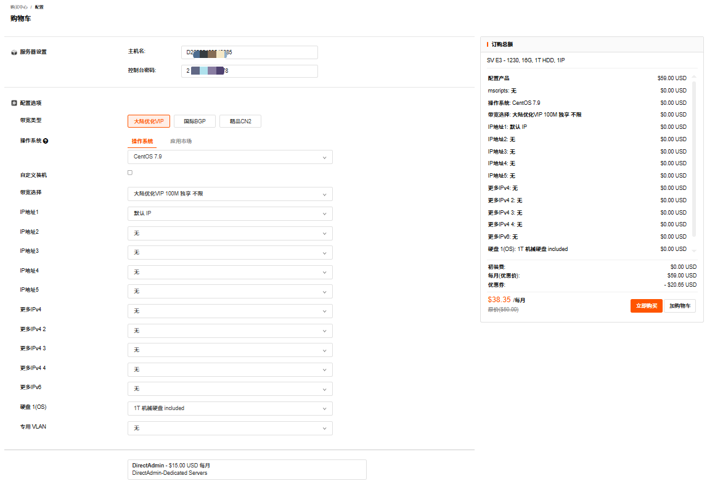

   > 说明
   >
   > - 不同的计费模式（小时计费、月付、季度付、半年付、年付）会在成本效益和资源使用弹性上有所差异，购买产品之前，建议先确定好适合您业务的产品计费模式。更长的付费周期能享受更高的折扣价格。
   > - 目前仅 VPS 支持小时计费。小时计费会从账户余额中扣款，为了保证业务连续性，请保持余额充足。

4. 计算总价。

   如选择的是包年包月模式，购买页面会展示订单总金额；如选择的是按小时付费模式，则显示每小时单价。

   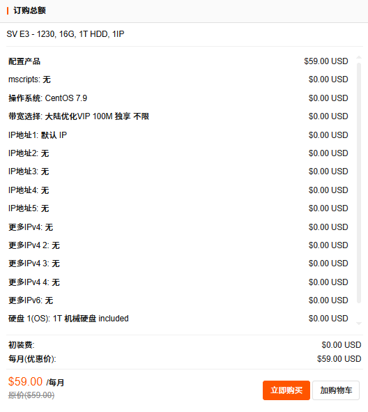

5. 单击**立即购买**。

6. 在**确认产品信息**页面，选择使用优惠券（若有），勾选服务条款并单击**结算**。

   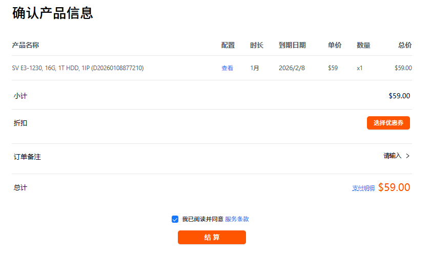

7. 选择付款方式并完成付款。支持通过余额付款，若需要充值请参考[为 RakSmart 账号充值](钱包管理.md#为%20RakSmart%20账号充值)。

   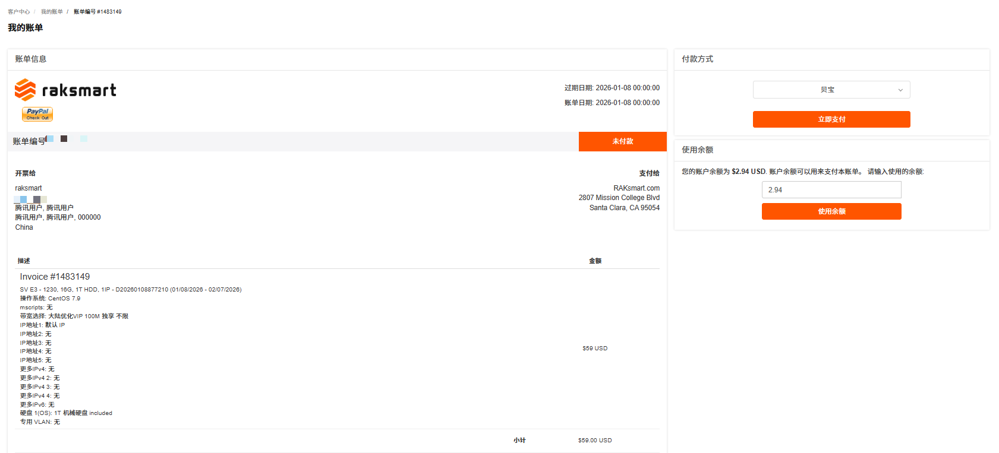

8. （可选）返回控制台产品管理，查看您已购买/开通的产品。

   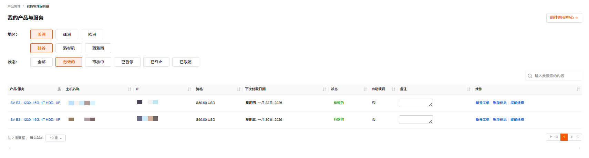

9. 查看邮件。

   购买产品成功后，您将会收到订单信息确认、账单支付确认和产品信息的邮件通知。请注意查收和保存产品相关信息，如物理服务器远程连接用户名和密码。

---

### 相关文档

购买 RakSmart 各产品可参考：

- [购买物理服务器](独服/01、产品介绍/产品介绍.md)；
- [购买裸机云服务器](裸机云/01、产品介绍/产品介绍.md)；
- [购买 VPS](VPS/01、产品介绍/产品介绍.md)。

---

### 后续操作

完成 RakSmart 产品购买后，您可以开始使用 RakSmart 产品了。

- **查看账单费用**

  查看账单明细，参考[账单管理](新手指南/08、账单管理/账单管理)。

- **资源调整**

  调整资源配比，参考[升降级](管理已购买的产品.md#升降级)。
