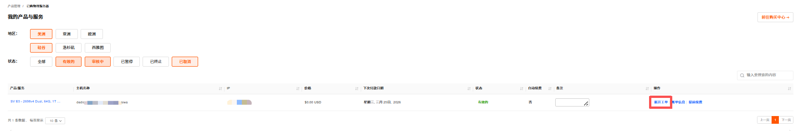
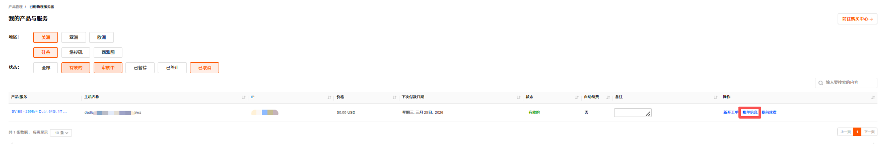
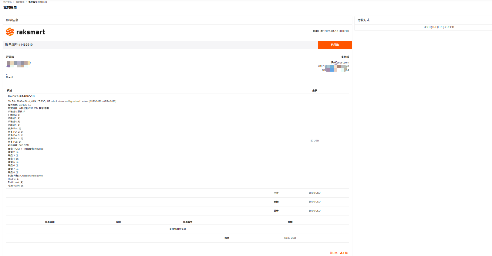
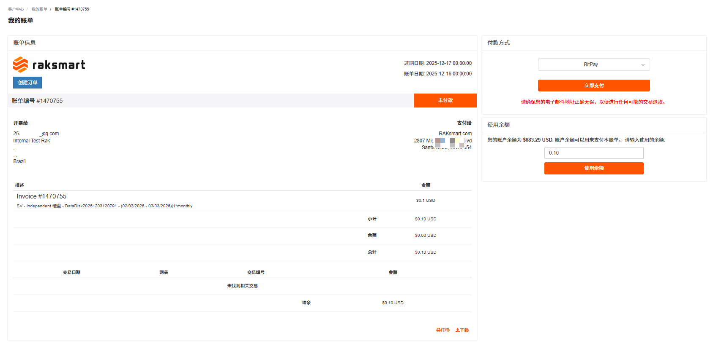
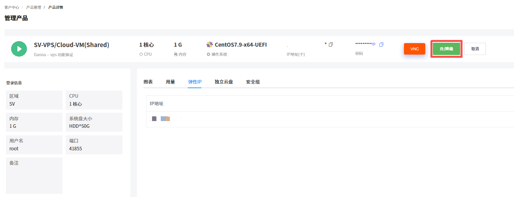
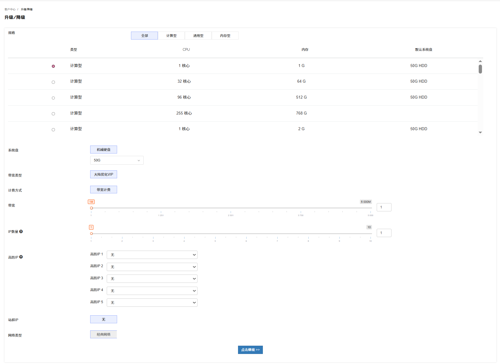
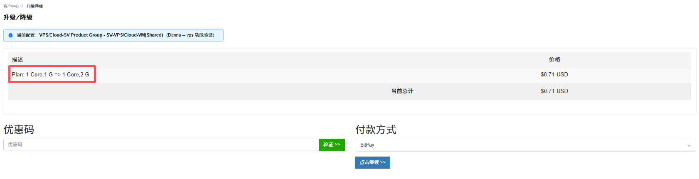
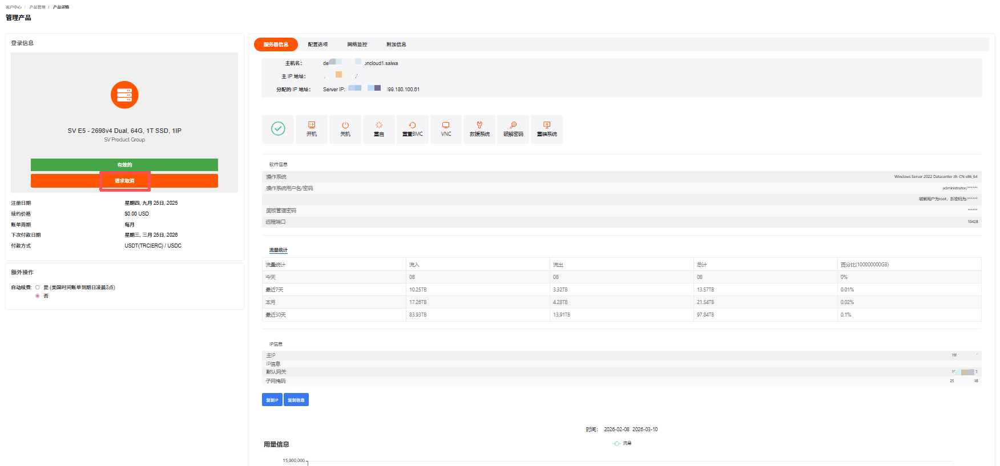
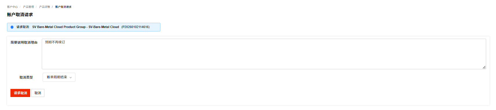

# 管理已购买的产品

## 产品管理

产品管理支持管理已购买的物理服务器、裸机云和 VPS 等产品。

---

### 产品管理入口

1. 登录 [RakSmart 控制台](https://billing.raksmart.com/whmcs/clientarea.php?language=chinese-cn)。

2. 在控制台左侧导航**产品管理**区域，单击目标产品或服务名称，进入**我的产品与服务**页面。 **我的产品与服务**页面支持查看产品/服务详情、新开工单、查看账单和提前续费等功能。

   

---

### 查看产品或服务详情

查看产品/服务详情支持查看不同地区和状态的产品/服务。

1. 在我的产品与服务页面，选择地区和状态，筛选出对应的产品/服务。状态是指产品/服务的使用状态，包括全部、有效的、审核中、已暂停、已终止和已取消。

   

2. 单击**产品/服务**名称，进入**管理产品**详情页面。此页面支持请求取消、开机、关机等操作。关于服务器信息详情介绍和服务器操作可参考各产品或服务的文档。

   

---

### 新开工单

新开工单支持对该产品服务提交问题工单。

1. 在我的产品与服务页面列表右侧，单击**新开工单**，进入**提交工单**页面。

   

2. 根据页面提示输入主题、问题描述等信息。
   

3. 单击提交。

---

### 查看账单信息

查看账单信息支持查看该产品/服务的全部账单记录。

1. 在我的产品与服务页面列表右侧，单击**账单信息**，进入**我的账单**页面。此页面支持查看全部、已付款、未付款、已取消、已退款和已过期的账单；支持通过搜索框搜索账单；支持查看购买此产品的不同日期产生的账单。

   

2. 我的账单页面支持查看服务和查看账单。

   

   a.查看服务：支持查看当前帐单对应的服务。
   单击**查看服务**，进入我的产品与服务页面。

   

   b.查看账单：支持查看当前账单详情。
   单击**查看账单**，进入我的帐单页面。此页面支持查看账单详情信息，可根据需要打印和下载账单。

   

---

### 提前续费

提前续费是指在当前服务有效期还没结束时，主动为其续费来延长使用时间。

> **说明**
>
> 为保障您的产品/服务正常使用，请留意以下续费及产品/服务状态变更规则：
>
> - 产品/服务到期前 10 天，系统将自动生成续费账单，请您及时完成续费操作；
> - 到期未续费的，产品/服务会在到期后的第 2 天被暂停。
>   - 暂停期间完成续费，产品/服务可立即恢复使用；
>   - 若暂停满 4 天仍未续费，产品/服务将被下架。

1. 在我的产品/服务列表右侧操作列，单击**提前续费**，进入**续费管理**页面。**续费管理**页面支持查看当前付款周期和当前产品到期时间。

   

2. 选择不同的续费周期，续费周期支持选择月付、季付、半年付和年付。单击**结账**。

3. 在**我的账单**页面，选择付款方式。若有余额，可以选择使用余额支付。

   

4. 完成付款。

## 升降级

购买 RakSmart 产品后，您可以根据需要，自主对产品的配置进行升级或降级操作。通过升降级，可满足您业务扩张的需求、优化云资源配置、应对业务负载变化 或节省成本等。

不同的产品，支持升降级的资源类型不同，例如产品规格、公网带宽配置、存储容量、资源包规格、云盘类型和资源参数等。本文主要介绍如何通过控制台进行产品升降级。

---

### 操作步骤

以 VPS 为例，如果需要对实例升降级，可前往 VPS 控制台，针对指定配置进行升降级操作。

1. 使用 RakSmart 账号登录 [RakSmart 控制台](https://billing.raksmart.com/whmcs/index.php?rp=/user/security)。

2. 在控制台左侧导航**产品管理**区域，单击需要升降级的产品/服务名称进入**我的产品与服务**页面。

   

3. 单击**产品/服务**名称，进入**管理产品**页面。

   

4. 在**管理产品**页面，单击**升/降级**。进入**升级/降级**页面。

   

5. 重新填写或选择需要升降级的配置。例如实例规格由计算型 1 核心 CPU 改选为计算型 2 核心 CPU。

   

6. 单击**点击继续**，进入**升级/降级**价格确认页面。确认页面展示哪些配置做了升降级，和对应的价格变化。

   

7. 确认升降级配置和价格没有问题后，单击**点击继续**。进入**我的账单**页面。

   

8. 在**我的账单**页面，选择支付方式或者使用余额支付。

9. 付款成功。

   

10. 支付成功后，系统将自动完成配置调整。可在产品详情页查看更新后的配置信息，确认是否生效。

---

### 注意事项

对产品进行升降级会存在一些限制或影响，请留意操作界面的提示，或查看该产品的相关文档了解详情。

1. 不同产品升降级时可能会存在限制。

   例如：实例的网络类型不允许改变；硬盘容量只允许升级，不支持降级。

2. 升级与变配可能会对您的资源费用、生效时间、计费方式产生影响。

   例如，升级时，可能需要您为当前计费周期的规格或配置补差价。

3. 部分产品的升级与变配可能会对您的业务造成短暂影响。
   - 提前规划升级时间：建议选择业务低峰期执行升级 / 变配操作（如凌晨、节假日），最大程度降低对核心业务的影响。
   - 备份业务数据与配置：操作前务必完成全量数据备份和关键配置文件导出，避免因升级异常导致数据丢失或配置错乱。
   - 业务恢复后校验：升级完成后，需逐一验证业务功能、网络连通性、数据完整性，确认无异常后再恢复全量业务访问。
   - 问题反馈：若遇任务卡顿、失败等异常，及时通过控制台工单系统或客服渠道反馈。

## 产品取消和退订

产品取消与退订是用户在产品租用 / 托管服务周期内，主动终止服务协议、停止使用目标资源的操作行为，适用于物理服务器、裸机云、vps等各类租用场景。

---

### 产品取消

RakSmart 产品取消包括到期用户不再续费和立即取消两种情况。

> **说明**
>
> - 生效规则：如选择的是 账单周期结束 后取消 ，则不会立即停止服务，而是在当前账单周期结束后终止服务。例如当前是 1 月订阅，申请取消后可持续使用到 1 月账单周期到期；
> - 费用说明：提交取消后无法再对订单进行续费操作；
> - 数据注意：请在提交取消申请前备份服务器内的所有数据，服务终止后数据会被清理，无法恢复。

1. 登录 [RakSmart 控制台](https://billing.raksmart.com/whmcs/index.php?rp=/user/security)。

2. 在控制台左侧导航**产品管理**区域，单击需要取消服务的产品，进入**我的产品与服务**详情页面。

   

3. 选择需要取消服务的服务器，单击**产品/服务**名称进入**管理产品**页面。
   

4. 单击**请求取消**，进入**账户取消请求**页面。
   

5. **简要说明取消理由**，选择**取消类型**，单击**请求取消**。
   
   - 账单周期结束：指服务器到期用户不再续费，用户取消服务器后不产生退款。
   - 立即：指立即终止服务器的使用，可能产生退款。退款规则的介绍可参考退款规则。
6. 单击**请求取消**，系统提示如下信息；单击**返回**可以回到管理产品页面。

   

7. 若您需要继续使用产品或者撤销取消申请，单击**移除请求**。

   

### 退款规则

- 退款金额计算：按产品剩余使用期限折算退款金额。
  - 月付退款金额 =（支付金额÷30）x 退款天数(30天-已使用天数)- 手续费；
  - 季付、半年付、年付套餐申请退款时，将按月付标准单价核算已使用时长的费用；
  - 若套餐包含赠送的时长 / 资源，且申请退款时赠送部分未使用完毕，需按对应产品的月付标准单价补足赠送部分的差价，再核算剩余款项退款金额。

- 退款到账：根据支付方式的不同退款方式主要分为以下两种
  - 非余额支付：您可选择该支付接口支持的退款方式（如原路退回），款项将按支付平台的处理周期到账。如遇节假日，到账时间可能顺延；
  - 余额支付：退款将退回至您的账户余额，即时到账；不支持提现。

- 数据保留：退订成功后，产品即刻回收且不可恢复。相关数据将被永久删除，无法恢复；

- 特殊说明：若退订产品为套餐类产品（含多个子资源），退款将按套餐整体剩余期限折算，不支持单独退订套餐内某一子资源。
