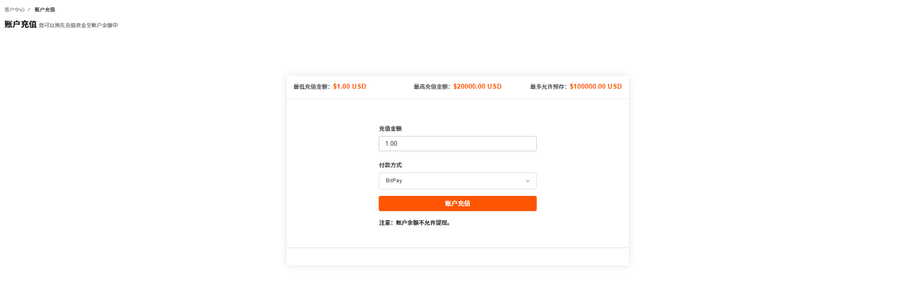
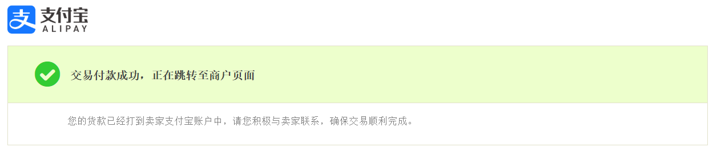
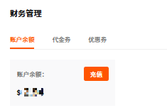
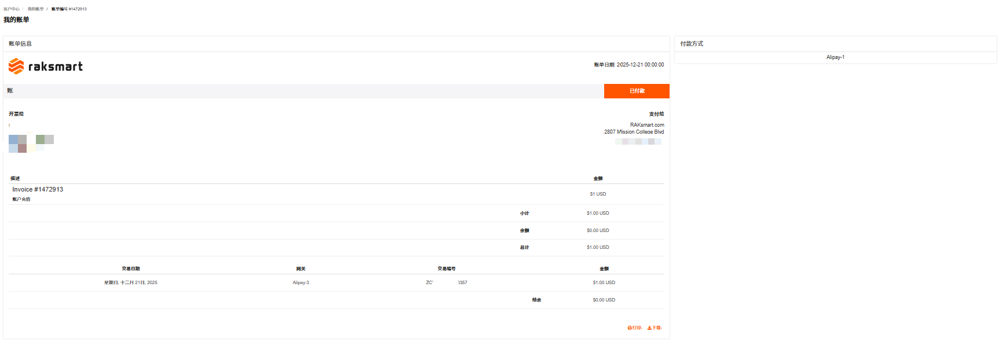
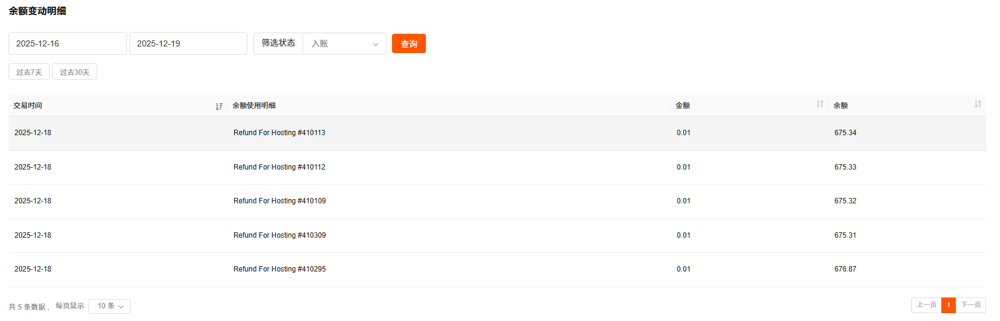
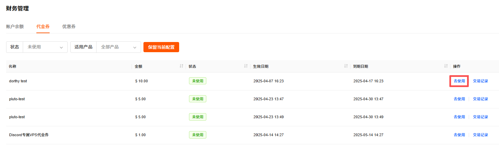
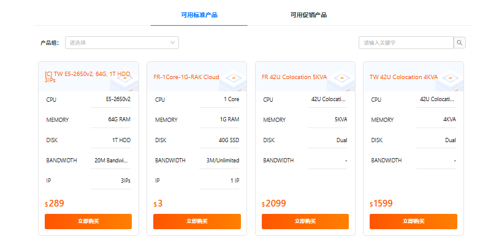
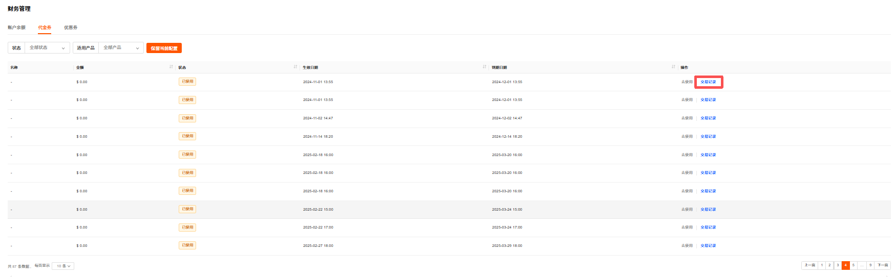
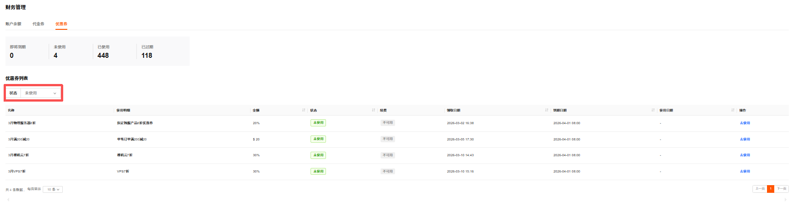
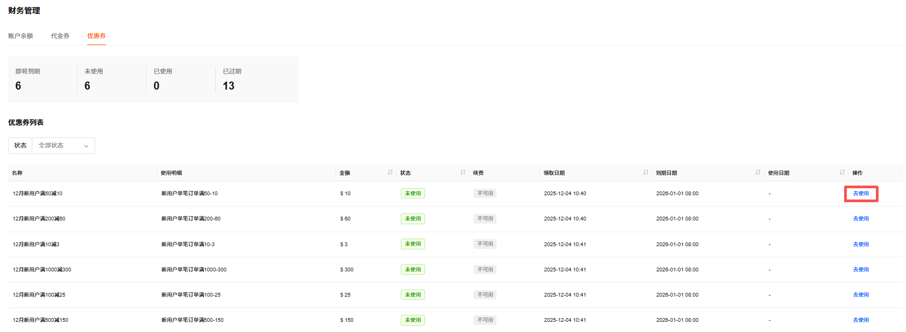

# 钱包管理

我的钱包支持账户余额管理、代金券管理和优惠券管理。

## 账户余额管理

账户余额管理支持查看账户余额、充值和查询余额变动明细。

---

### 查看账户余额

1. 登录 [RakSmart 控制台](https://cn.raksmart.com/login/index.html)。

2. 在左侧导航会员中心区域，单击**财务管理**->**我的钱包**。

   

3. 在**账户余额**页面，可直接查看当前账户余额和余额变动明细。

   

---

### 为 RakSmart 账号充值

为了方便您购买 RakSmart 产品和服务，建议您提前为账号充值。

#### 充值入口

##### 从客户中心入口充值

1. 登录 [RakSmart 控制台](https://cn.raksmart.com/login/index.html)，进入**客户中心**页面。

2. 在**账户信息**区域，单击**充值**，进入**账户充值**页面。

   

3. 输入充值金额并选择付款方式；支持通过 BitPay、贝宝、信用卡、银联、支付宝等在线充值方式进行充值。

   

   > **说明**
   >
   > - 不同的充值金额可选的支付方式不同，您可根据实际充值情况选择充值方式。
   > - 最低充值金额 $1.00 USD，最高充值金额 $20000.00 USD，账户预存上限是 $100000.00 USD。

4. 单击**账户充值**。

##### 从个人资料入口充值

1. 登录 [RakSmart 控制台](https://cn.raksmart.com/login/index.html)，可进入**客户中心**页面。

2. 在个人头像下拉列表，单击**充值**。

   

3. 充值步骤参考[从客户中心入口充值](#从客户中心入口充值)。

#### 预期结果

1. 选择一种付款方式，例如选择支付宝支付。

2. 页面显示付款成功。

   

3. 可以返回控制台查看账户余额或账单信息，如下图所示。
   - 账户余额：

     

   - 账单信息：

     

#### 常见问题

在线充值如遇到未到账的情况，请通过工单系统，发送相关支付截图，我们会第一时间为您处理。

---

### 查看余额变动明细

支持通过交易时间、入账和消费等条件筛选每笔余额变动的时间、明细、金额及变动后余额。

1. 在**余额管理**->**余额变动明细**区域，通过**时间**条件或**筛选状态**条件完成余额查询：
   - 选择**开始日期** / **结束日期**，或快捷选择**过去 7 天** / **过去 30 天**查询余额变动明细；
   - 通过筛选状态筛选，选择**全部** / **入账** / **消费**。
   - 支持同时使用时间和筛选状态条件查询。

2. 单击**查询**，筛选结果如下图所示。

   

## 代金券管理

代金券管理支持查看使用状态和交易记录、使用代金券。

---

### 查看代金券

支持通过状态和适用产品查看代金券。

1. 登录 [RakSmart 控制台](https://cn.raksmart.com/login/index.html)。

2. 在左侧导航产品管理区域，单击**财务管理**->**我的钱包**。

   

3. 在财务管理页面，单击**代金券**，进入**代金券**列表页签。**代金券**列表支持查看代金券名称、金额、状态、生效日期和到期日期。

   

4. 选择**状态**或**适用产品**条件查询，筛选代金券。

   

---

### 使用代金券

1. 在代金券页签，列表右侧单击**去使用**。

   

2. 您可以选择**可用标准产品**或者**可用促销产品**，单击**立即购买**，跳转至对应产品购物车配置页面使用该代金券。
   

---

### 查看交易记录

支持查看代金券的使用状态和明细。

1. 在代金券页签，单击代金券列表中某一代金券操作列的**交易记录**。

   

2. 单击交易记录，可查看该代金券的使用状态和明细。

   

## 优惠券管理

优惠券管理支持通过使用状态查看优惠券、使用优惠券。

---

### 查看优惠券

1. 登录 [RakSmart 控制台](https://cn.raksmart.com/login/index.html)。

2. 在左侧导航产品管理区域，单击**财务管理**->**我的钱包**。

   

3. 在**财务管理**页面，单击**优惠券**，进入**优惠券**列表页面。支持查看优惠券名称、使用明细、金额、状态、续费、领取日期、到期日期和使用日期。

   

4. 在**状态**下拉框选择**全部状态**、**未使用**、**已过期**、**已使用**或者**不可用**，可查看不同使用状态的优惠券。

   
   - 即将到期：临近有效期的优惠券数量。
   - 未使用：当前可使用的优惠券数量。
   - 已使用：已完成抵扣的优惠券数量。
   - 已过期：超出有效期的优惠券数量。

---

### 使用优惠券

> **说明**
>
> 优惠券使用需满足使用条件，如 “新用户订单满 100”，且需在有效期内使用；已使用或过期的优惠券无法再次使用，可通过列表状态区分可用范围。

1. 在**优惠券**页面，选择状态为**未使用**的优惠券，在列表右侧单击**去使用**。

   

2. 在产品选择页面，选择**符合条件的促销产品**或者**符合条件的标准产品**，单击**立即购买**，跳转至对应产品购物车配置页面使用该代金券。

   
