# 账户管理

## 查看账户余额

1. 登录 [RakSmart 控制台](https://cn.raksmart.com/login/index.html)。

2. 在控制台右上角，单击个人头像展开下拉列表。您可直接查看账户余额。

   

3. 您也可以从控制台**财务管理**->**我的钱包**入口查看账户余额。详细内容可参考[钱包管理](钱包管理.md)。

4. 单击**充值**，进入**账户充值**页面可为账户充值。详细内容可参考[为 RakSmart 账号充值](钱包管理.md#为%20RakSmart%20账号充值)。

## 查看账户资料

账户管理可集中管理个人账户的各类信息与权限配置，包括我的资料、用户管理和联系人管理。

---

### 我的资料

平台账户信息模块致力于为用户打造便捷、个性化的账户管理体验，涵盖资料维护、邮件及通知订阅等多维度设置，助力用户高效掌控账户相关内容，及时获取关键信息。包含我的资料、邮件首选项和 Telegram 通知订阅选项等功能。

1.  登录 [RakSmart 控制台](https://billing.raksmart.com/whmcs/index.php?rp=/user/security)。

2.  在个人头像下拉列表单击**我的资料**，进入**我的资料**页面。

    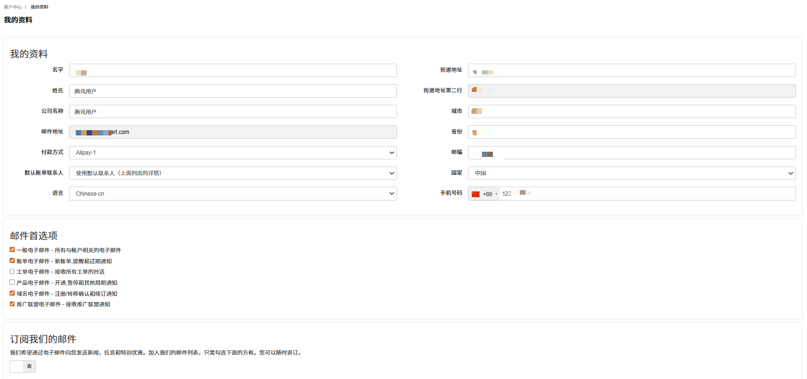

3.  在**我的资料**页面，支持修改个人资料、设置邮件首选项、订阅邮件和配置 Telegram 通知订阅选项。

---

### 设置邮件首选项

平台提供新闻、信息及特别优惠推送服务，用户只需勾选邮件通知类型和订阅即可加入邮件订阅；后续若想退订，也可随时操作，灵活自主管理营销信息接收。

1. 在**我的资料**页面邮件首选项区域，勾选邮件首选项；若不再需要某个选项，可以取消勾选。

   <table width="100%">
      <tr style="text-align: left;">
        <th width="20%">项目</th>
        <th width="80%">描述</th>
      </tr>
      <tr>
        <td>一般电子邮件</td>
        <td>涵盖所有与账户相关的通用邮件，是账户全流程信息传递的基础通道，如账户状态变更告知等。</td>
      </tr>
      <tr>
        <td>账单电子邮件</td>
        <td>聚焦新账单生成、付款提醒及过期通知，助力用户把控财务账单节点，避免逾期风险。</td>
      </tr>
       <tr>
        <td>工单电子邮件</td>
        <td>接收所有工单通知，方便用户同步知晓工单处理进程，参与问题解决沟通，保障服务诉求闭环处理。</td>
      </tr>
      <tr>
        <td>产品电子邮件</td>
        <td>聚焦产品全周期关键节点，向用户推送开通、暂停及其他周期相关通知 。无论是新功能启用、服务阶段性调整，还是周期性业务变更，都能让用户及时知晓产品状态变化，保障对产品使用的清晰掌控。</td>
      </tr>
          <tr>
        <td>域名电子邮件</td>
        <td>围绕域名业务核心流程，发送注册 / 转移确认及续订通知 。从域名初始权属确立、转移过程验证，到临近到期的续订提醒，全链路覆盖域名管理关键环节，助力用户维护域名权益，避免因疏漏导致域名状态异常。</td>
      </tr>
      <tr>
        <td>推广联盟电子邮件</td>
        <td>为参与推广联盟的用户打造专属通道，及时接收推广联盟相关通知，包含推广政策更新、佣金结算动态、合作活动启动等信息，助力用户紧跟联盟业务节奏，高效开展推广工作，提升收益转化。</td>
      </tr>
    </table>

2. 打开**订阅我们的邮件通知**按钮。

3. 单击**保存修改**。

4. 若不再需要订阅邮件通知，在**订阅我们的邮件通知**区域单击**否**按钮，然后单击单击**保存修改**。

5. 完成邮件首选项设置后，页面提示如下图。

   

---

### 设置 Telegram 通知订阅选项

此功能用于绑定 Telegram 账号，来接收该平台的业务提醒，如订单、续费等。

1. 在 Telegram 通知订阅选项区域，输入**用户名**和 **Chat ID**。

2. 勾选 Telegram 通知订阅选项。

   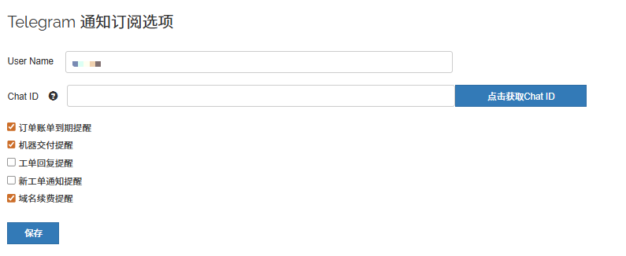

   <table width="100%">
         <tr style="text-align: left;">
           <th width="20%">项目</th>
           <th width="80%">描述</th>
         </tr>
         <tr>
           <td>订单账单到期提醒</td>
           <td>通过 Telegram 及时推送订单账单到期信息，强化财务节点提醒，辅助用户合理安排资金。</td>
         </tr>
         <tr>
           <td>机器交付提醒</td>
           <td>针对涉及机器交付场景，提前告知用户交付动态。</td>
         </tr>
          <tr>
           <td>工单回复提醒</td>
           <td>当工单有新回复时，Telegram 推送提醒，让用户第一时间跟进问题处理，提升沟通效率。</td>
         </tr>
         <tr>
           <td>新工单通知提醒</td>
           <td>当你提交的工单（如技术咨询、故障申报）有新的回复或状态更新时，系统会通过 Telegram 向你发送提醒。</td>
         </tr>
             <tr>
           <td>域名续费提醒</td>
           <td>当你账户下的域名即将到期时，系统会在到期前（通常提前数天）向你推送续费提醒。</td>
         </tr>
       </table>

3. 单击**保存**。

---

### 用户管理

RakSmart 的用户管理模块主要用于管理账户下的关联用户，包含**用户管理**和**邀请新用户**两个核心功能。详细内容可参考[为普通用户授权](#为普通用户授权)。

---

### 联系人

在平台的账户体系中，主账户拥有丰富的管理权限，其中添加子账户并设置权限的功能， 能满足企业或团队多样化的管理需求。主账户可灵活分配各项操作权限，既保障了账户数据的安全，又提高了管理效率和协作的便利性。详细内容可参考[配置联系人和邮件通知](#配置联系人和邮件通知)。

## 用户身份与权限

本文介绍您在访问 RakSmart 资源前，需了解的通用用户身份分类、各身份核心特性、适用场景及对应的权限范围，帮助您更合理地进行账户权限管理与资源访问控制。关于如何配置用户身份权限可参考[为普通用户授权](#为普通用户授权)。

---

### 用户身份类型

RakSmart 将用户身份分为两种类型：所有者权限用户和普通权限用户。

<table width="100%">
         <tr style="text-align: left;">
           <th width="20%">维度</th>
           <th width="40%">所有者权限用户</th>
           <th width="40%">普通权限用户</th>
         </tr>
         <tr>
           <td>角色定位</td>
           <td>账户核心主体，是最高权限 + 责任归属者。</td>
           <td>所有者创建的附属角色，仅获部分授权的协作账号。</td>
         </tr>
         <tr>
           <td>权限范围</td>
           <td>- 默认拥有账户所有功能操作权。 - 可创建/修改/回收其他用户权限。</td>
           <td>- 仅拥有所有者分配的部分权限。 - 无超授权范围的操作权限。</td>
         </tr>
          <tr>
           <td>账户属性</td>
           <td>- 独立账户所有权。 - 承担账户法律、财务责任。</td>
            <td>- 无独立账户所有权，依附主账户。 - 权限完全由所有者管控。</td>
         </tr>
         <tr>
           <td>适用场景</td>
           <td>- 企业 IT 管理员/个人站长（统筹管理）。 - 单人独立使用账户。</td>
           <td>- 企业分工（运维 / 财务等角色）。 - 外包/临时协作（授权指定资源）。</td>
         </tr>
             <tr>
           <td>注意事项</td>
           <td>- 严格保密账号信息。 - 避免共享账号，建议创建普通用户协作。</td>
           <td>- 需联系所有者修改账号信息。 - 遵循 “最小必要原则” 分配权限，避免过度授权。</td>
  				 </tr>
       </table>

---

### 用户权限类型

权限是指不同用户身份对具体资源的访问能力，即在某种条件下允许或拒绝对某些资源执行某些操作。

<table width="100%">
         <tr style="text-align: left;">
           <th width="20%">实体用户身份</th>
           <th width="15%">权限标识</th>
           <th width="25%">默认权限</th>
           <th width="10%">是否需要授权</th>
           <th width="30%">授权说明</th>
         </tr>
         <tr>
           <td>所有者权限用户</td>
           <td>带“所有者标签”。</td>
           <td>默认拥有账户的“完全管理权限”，可操作所有功能、管理用户。</td>
           <td>否</td>
           <td>账号默认拥有完全控制权，无需额外授权；所有资源的创建、删除及核心配置变更，均需通过所有者身份触发。</td>
         </tr>
         <tr>
           <td>普通权限用户</td>
           <td>无“所有者”标签。</td>
           <td>仅拥有账户所有者分配的权限项。</td>
           <td>是</td>
           <td>账户所有者通过“管理权限”功能分配/修改/回收相关权限。</td>
         </tr>
       </table>

## 为普通用户授权

如果想要将资源分配给企业中不同的员工或者应用程序使用，为了避免分享自己的账号密码，您可以使用所有者用户的用户管理功能，给员工或应用程序的普通用户授予权限。

> **说明**
>
> 建议您遵循最小化原则，按需授予普通用户角色必要的权限。

---

### 用户管理

用户管理模块通过管理权限和移除访问功能修改用户权限。

#### 管理权限

管理权限通过选择或取消选择权限项，完成对用户的权限调整。

1. 登录 [RakSmart 控制台](https://cn.raksmart.com/login/index.html)。

2. 在个人资料列表单击**用户管理**，进入**用户管理**页面。

   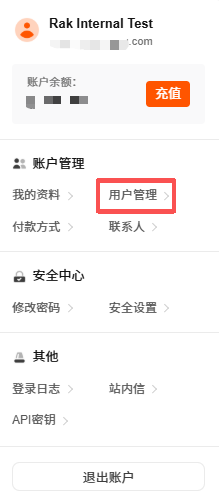

3. 在用户管理列表，找到不带有”所有者“标签的普通用户。单击**管理权限**，进入**管理权限**页面。

   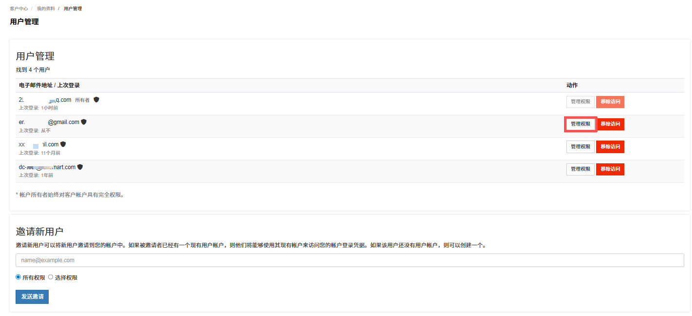

4. 在**管理权限**页面列表里，勾选或者取消勾选权限项，完成对用户的权限调整。

   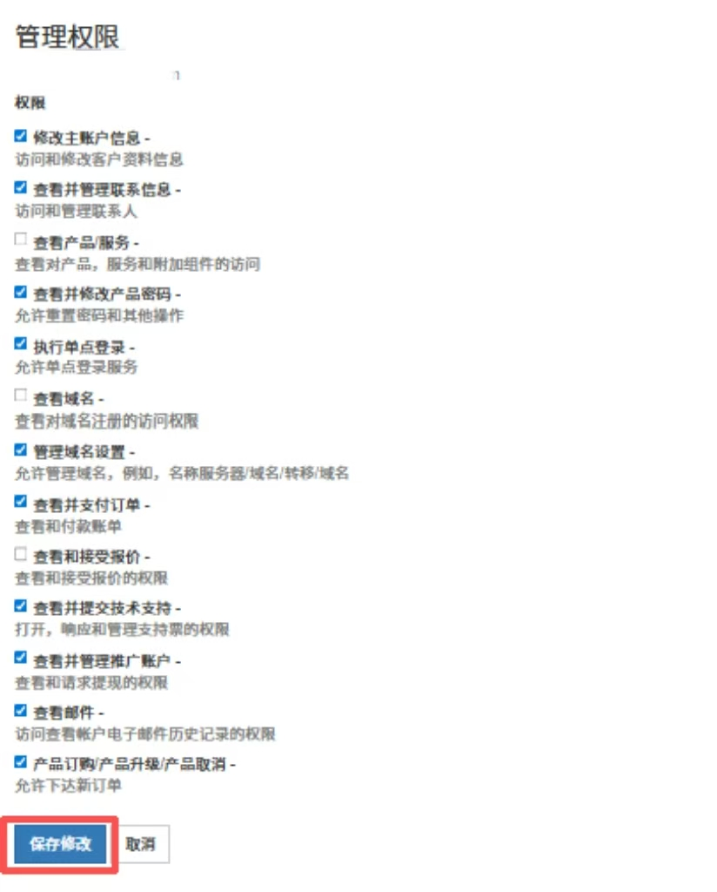

   > **说明**
   >
   > 可从以下维度精细化分配普通用户的权限配置。
   >
   > - **账户信息类**：修改账户信息、管理联系人信息等；
   > - **产品管理类**：查看 / 修改产品、管理域名 / 服务标签等；
   > - **订单操作类**：执行订单登录、查看 / 下新订单等；
   > - **财务类**：查看 / 支付账单、管理信用额度等；
   > - **售后类**：查看 / 提交工单、管理技术支持权限等。

5. 单击**保存修改**。

#### 移除访问

移除访问用于用户访问权限的删除。

1. 在用户管理页面用户管理列表，单击**移除访问**。

   

2. 在移除访问确认页面单击**确认**。

   > **权限说明**
   >
   > 标注 “**所有者**” 的用户为所有权限用户，这类用户对账户具备完全管理权限。

---

### 邀请新用户

邀请新用户是将新用户邀请到您的帐户中。如果被邀请者已经有一个帐户，那么他们可以使用现有帐户作为访问您的帐户的登录凭据。如果此用户还没有帐户，则可以创建一个，注册用户可参考[注册 RakSmart 账号](注册%20RakSmart%20账号.md)。

#### 邀请规则

通过输入电子邮箱邀请新用户。如果被邀请者已有 RakSmart 账户，则会直接关联到当前账户；若无账户，则会自动创建新账户。

#### 操作步骤

1. 在用户管理页面**邀请新用户**区域，填写新用户邮箱。

   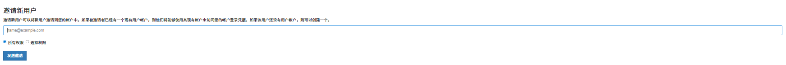

2. 为新用户选择**所有权限**或者通过**选择权限**按钮选择需要的权限。

   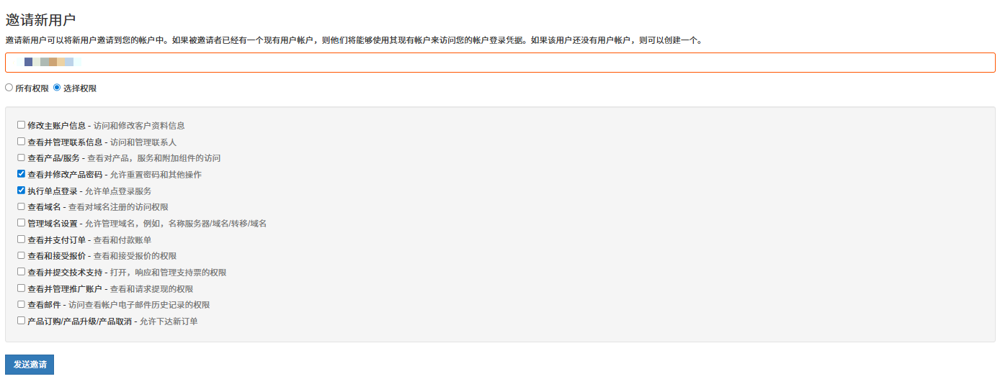

3. 单击**发送邀请**。

4. 页面显示”**邀请发送成功**“。

   

5. 被邀请者需要登录已注册 RakSmart 子账号的邮箱，确认被邀请信息。单击**接受邀请**。

   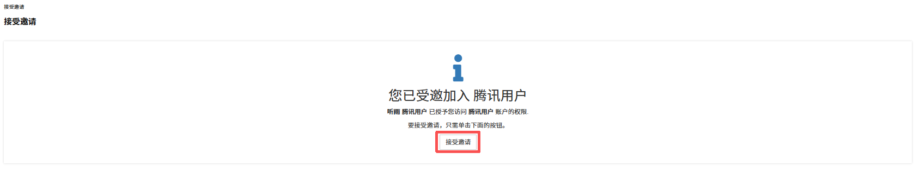

#### 操作结果

1. 在**接受邀请**页面填写子账户登录密码（若有），若之前没有使用邮箱创建 RakSmart 子账号，则选择注册账号。

   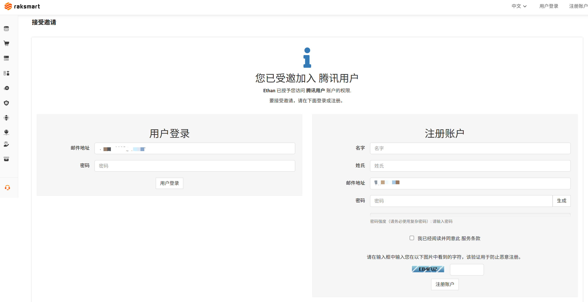

2. 在 RakSmart 登录页面输入已注册的子账号邮箱和密码，完成登录。

## 配置联系人和邮件通知

可添加多个联系人信息、修改联系方式、配置联系人接收通知（如账单提醒、服务到期通知）和删除联系人。

---

### 添加联系人

支持添加多个联系人信息。

1. 登录 [RakSmart 控制台](https://cn.raksmart.com/login/index.html)。

2. 在控制台右上角个人资料下拉列表，单击**联系人**。进入**联系人**页面。

   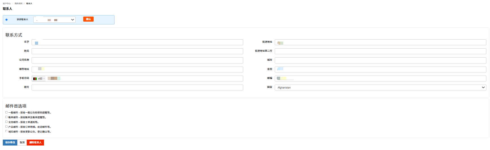

3. 在选择联系人下拉框中，单击**新建联系人**。

   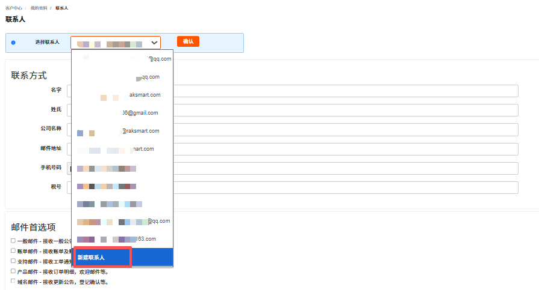

4. 在**新建联系人**区域根据提示输入联系人的信息，如名字、姓氏、公司名称、邮件地址等。
   

5. 若需要配置邮件通知，在邮件首选项区域勾选需要发送给联系人的通知邮件类型。

6. 单击**保存修改**。

7. 系统”**提示联系人创建成功**“。
   

---

### 修改联系人

支持修改联系人信息和邮件通知类型。

1. 在选择联系人下拉框中选择需要修改信息的联系人，单击**确认**。

2. 在联系方式区域，支持修改联系人的联系方式。如名字、姓氏、公司名称、邮件地址等信息。
   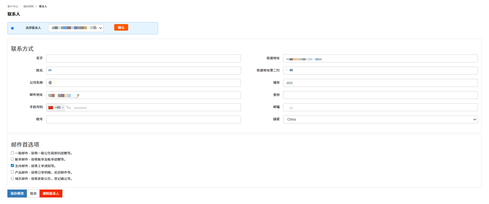

3. （可选）修改邮件首选项配置。

4. 单击**保存修改**。

5. 系统提示”**更新联系人成功**“。

   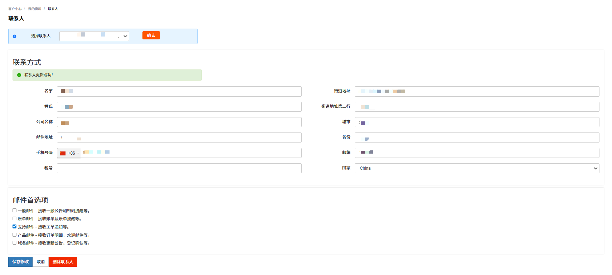

---

### 删除联系人

1. 在选择联系人下拉框中选择需要删除的联系人，单击**确认**。

2. 单击**删除联系人**。

   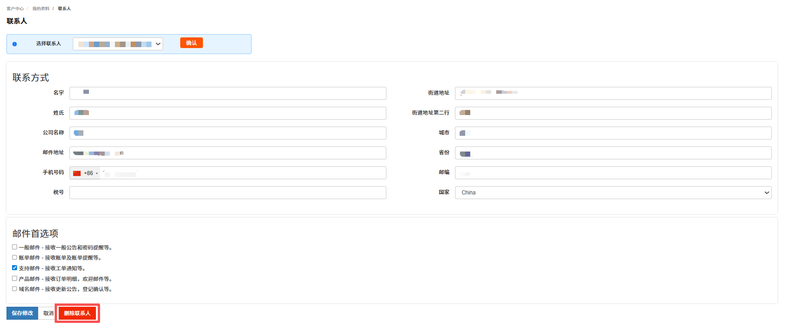

3. 在删除确认页面单击**删除**。

4. 系统提示删除联系人成功。

   

## 配置付款方式

为满足用户便捷、安全的支付需求，RakSmart 提供信用卡付款方式管理功能。您可通过该功能添加、维护信用卡信息，帮助您完成交易支付。

1. 在控制台个人头像下拉列表，单击**付款方式**，进入付款方式页面。

   

2. 在**付款方式**页面，单击**添加新信用卡**，进入**添加新付款方式**页面。

   

3. 在**添加新付款方式**页面，参考页面提示输入信息。

   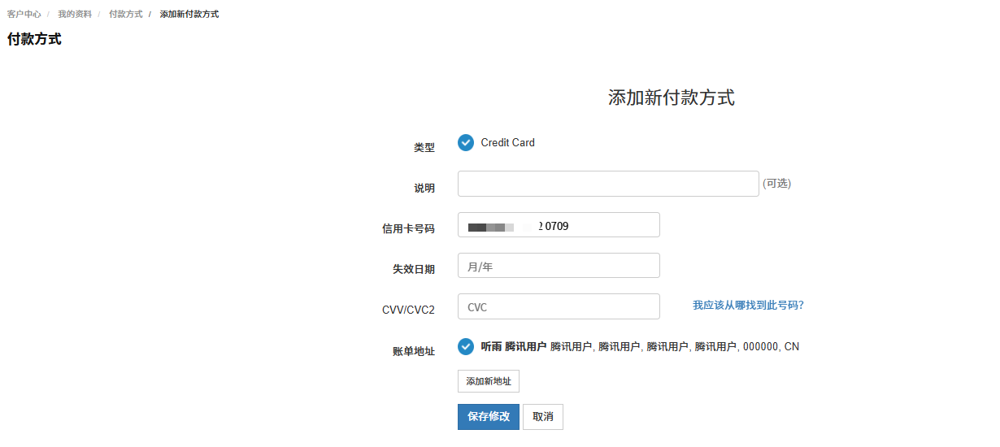

   <table width="100%">
      <tr style="text-align: left;">
        <th width="18%">项目</th>
        <th width="82%">描述</th>
      </tr>
      <tr>
        <td>类型</td>
        <td>系统默认勾选 <strong>Credit Card</strong>，明确选择信用卡作为付款方式。</td>
      </tr>
      <tr>
        <td>填写说明（可选）</td>
        <td>您可根据自身需求，在说明栏填写对该信用卡的备注信息，方便后续识别与管理。</td>
      </tr>
       <tr>
        <td>输入信用卡号码</td>
        <td>准确填写信用卡卡号，若系统提示 “输入的卡号似乎无效，请再试一次”，请仔细核对卡号是否正确，确认无误后重新尝试输入。</td>
      </tr>
      <tr>
        <td>设置失效日期</td>
        <td>按照 “月 / 年” 格式，填写信用卡的失效日期，确保日期准确无误。</td>
      </tr>
         <tr>
        <td>填写 CVV/CVC2</td>
        <td>在对应栏位准确填写信用卡的 CVV/CVC2 码，若对该码位置存疑，可点击<strong>我应该从哪找到此号码？</strong>获取指引。</td>
      </tr>
      <tr>
        <td>选择账单地址</td>
        <td>可直接勾选已有账单地址，若需新增，点击<strong>添加新地址</strong>完成地址录入后选择。</td>
      </tr>
    </table>

4. 完成配置填写后，单击**保存修改**。

5. 添加信用卡成功。 您可按需对已添加的信用卡进行设置、修改信息和删除操作。

   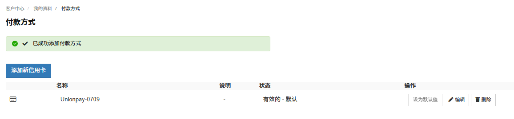

   a.设为默认值：若用户有多张有效信用卡，可点击该按钮将指定信用卡设置为默认付款方式，后续交易将优先使用此卡支付，简化支付流程。

   b.编辑：单击**编辑**，可进入信用卡信息编辑页面，对失效日期、账单地址等信息进行修改维护，确保支付信息准确有效。

   c.删除：若用户不再使用某张信用卡，单击**删除**即可移除该信用卡信息。

## 账号安全设置

为保护您的 RakSmart 账号安全，建议至少完成一项安全设置：

- 设置复杂度高的登录密码并定期修改。
- 开启两步认证。两步认证是登录密码之外的第二层安全保护，也是简单有效的安全防护措施。开启两步认证后，再次登录 RakSmart 时，除输入登录密码外，系统还会提示您输入验证设备生成的校验码。

---

### 修改登录密码

1. 登录 [RakSmart 控制台](https://billing.raksmart.com/whmcs/index.php?rp=/user/security)。

2. 在控制台右上角个人头像下拉列表中，单击**修改密码**，进入**修改密码**页面。

   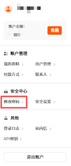

3. 在**修改密码**页面，根据提示和要求修改您的登录密码。也可点击**生成密码**按钮，系统将自动生成一个高强度密码供您使用。

   

   > **重要**
   >
   > 为确保密码安全性，平台建议设置高强度密码。建议：同时使用大小写字符、至少使用一个符号，如 #、$、!、%、& 等，不要使用连续字符。

4. 在**确认新密码**输入框中再次填写新设置的密码，以确保两次输入的密码一致，避免因输入错误导致密码设置失败。

5. 单击**保存修改**。

---

### 注意事项

- 密码安全性：请务必设置符合平台要求的高强度密码，避免使用过于简单或容易被猜测的密码，如生日、连续数字等，以保障账户安全。

- 密码一致性：在输入新密码和确认新密码时，请注意仔细核对，确保两次输入完全一致，以免因密码不一致导致修改失败。

- 密码保管：新密码设置完成后，请妥善保管，勿向他人泄露。平台将采取安全技术措施保障用户账户安全，但用户自身也需提高安全意识，防止密码被盗用。

- 定期修改：为进一步提升账户安全性，建议用户定期修改密码，如每 3 个月或 6 个月更换一次，降低密码被破解的风险。

---

### 开启两步验证

两步验证为用户登录提供了额外的一层保护。一旦启用并配置该功能，每次用户登录时，除了需要输入用户名和密码外，还需提供两步验证代码，如安全码、时间令牌，或从 Google Authenticator、Duo 等专门的身份验证应用程序获取的动态代码。通过这种双重验证方式，极大地增加了账户被非法入侵的难度，显著提升账户安全性。

#### 前提条件

操作前，请在移动设备端下载并安装 Google Authenticator 或 Duo 等应用程序。

#### 操作步骤

1. 登录 [raksmart 控制台](https://billing.raksmart.com/whmcs/index.php?rp=/user/security)。

2. 在控制台右上角个人头像在下拉列表中，单击**安全设置**，进入**安全设置**页面。

   

3. 在**安全设置**页面**两步验证**配置框中，单击**点击这里启用**。

   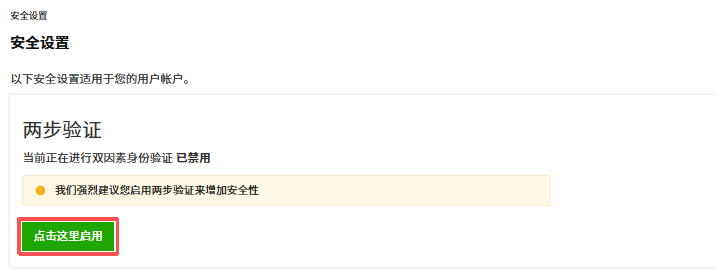

   > **说明**
   >
   > 若您之前没有设置两步验证，两步验证的状态显示**已禁用**。

4. 在**启用两步验证**确认页面，单击**开始**。

   

5. 移动端登录 Google Authenticator，会显示当前 RakSmart 账号的 6 位校验码。

   > **说明**
   >
   > 校验码每 30 秒更新一次。

6. 在绑定二次验证口令页面，输入上述校验码后单击**提交**。

   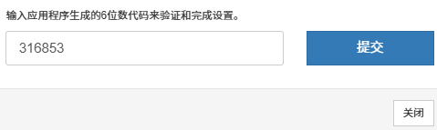

7. 若身份验证页面提示“绑定成功”，则说明两步验证已成功开启。

   

## 其他设置

其他设置包括查看登录日志、站内信和设置 API 密钥。

---

### 登录日志

1. 在个人头像下拉菜单，单击**登录日志**，进入**登录日志**页面。

   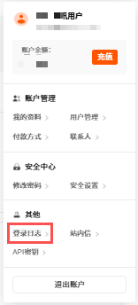

2. 在**登录日志**页面，展示账户的登录历史信息，包括登录时间、登录 IP、登录设备等，便于核查账户的安全访问情况。支持通过时间查询日志。
   

---

### 站内信

站内信是指系统内部的消息通知功能。

1. 在个人头像下拉菜单，单击**站内信**，进入**站内信**页面。

   

2. 在**站内信**页面，展示系统消息内容、接收时间和消息类型。支持通过消息类型和消息状态查询。

   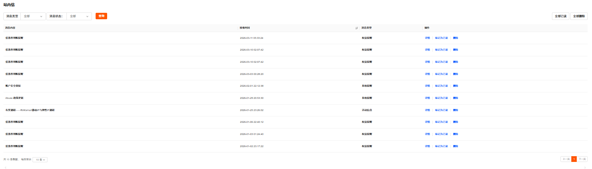

   <table width="100%">
      <tr style="text-align: left;">
        <th width="18%">项目</th>
        <th width="82%">描述</th>
      </tr>
      <tr>
        <td>消息内容</td>
        <td>展示站内信的具体文字信息，如通知、提醒、指引等内容，是消息的核心内容部分。</td>
      </tr>
       <tr>
        <td>接收时间</td>
        <td>记录用户收到这条站内信的具体日期和时间，格式一般为 “年 - 月 - 日 时：分: 秒”。</td>
      </tr>
      <tr>
        <td>消息类型</td>
        <td>对站内信进行分类的标签，如 “权益提醒”“操作指引”“系统通知” 等，便于筛选查询。</td>
      </tr>
    </table>

---

### API 密钥

用于生成或管理账户的 API 密钥。

1. 在个人头像下拉菜单，单击**API密钥**，进入`api_key.title`页面。

   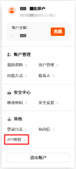

2. 在`api_key.title`页面，生成或管理账户的 API 密钥，用于通过 API 接口对接 RakSmart 服务（如自动化管理云资源），需妥善保管密钥信息。

   
