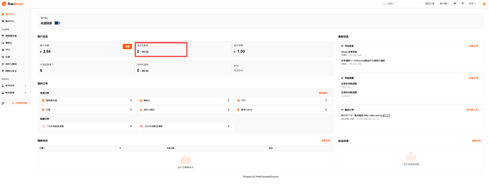
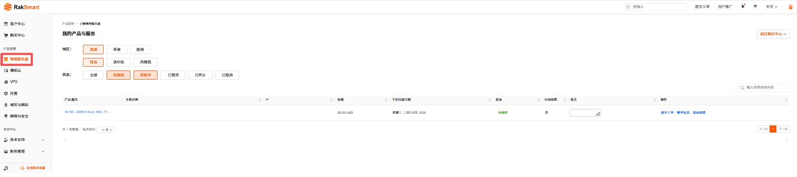
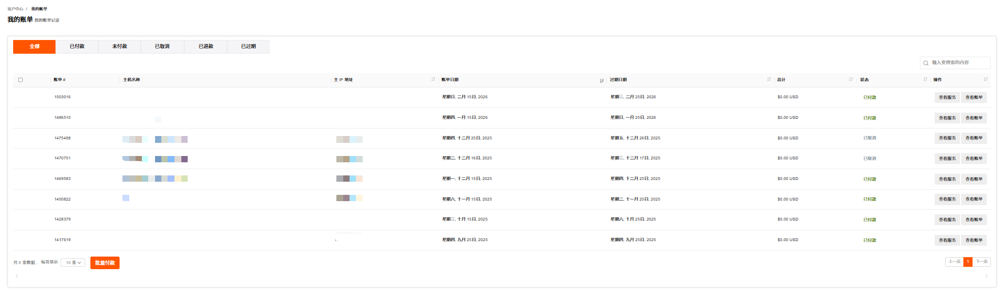
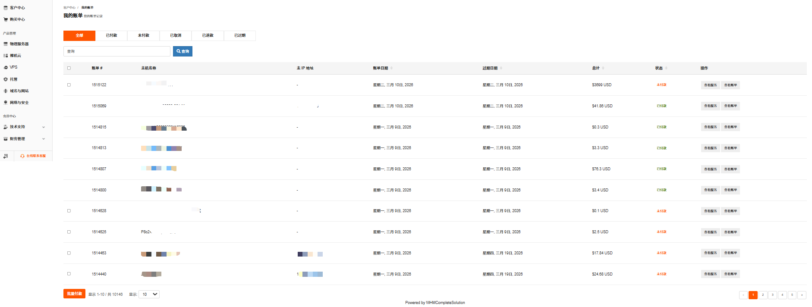

# 账单管理

账单包含了指定周期内，您在 RakSmart 的消费情况，包括费用明细、未结清余额、账单周期等信息，帮您清晰地了解各项费用的构成、计费逻辑和支付状态。账单可导出为 PDF 格式文件。

我的账单支持查看不同状态的账单列表和账单管理。

## 操作入口

### 方式 1：从客户中心入口查看

1.  登录 [RakSmart 控制台](https://cn.raksmart.com/login/index.html)，进入客户中心页面。

2.  在客户中心页面的**账户信息**区域，单击**未支付账单**可以进入我的账单页面。

    

---

### 方式 2：从产品管理入口查看

1.  登录 [RakSmart 控制台](https://cn.raksmart.com/login/index.html)。

2.  在控制台左侧导航**产品管理**区域，单击某一个产品或服务，进入**我的产品与服务**页面。

    

3.  在列表右侧单击**账单信息**进入**我的账单**页面。

    

---

### 方式 3：从财务管理入口查看

1. 登录 [RakSmart 控制台](https://cn.raksmart.com/login/index.html)。

2. 在控制台左侧导航，单击**财务管理**->**我的账单**，进入**我的账单**页面。此页面默认展示全部产品/服务账单，您可以查看账单号、主机名称、主 IP 地址、账单日期、过期日期等信息，进行批量付款和查看服务等操作。

   

## 账单管理

### 查看账单

1.  登录 [RakSmart 控制台](https://cn.raksmart.com/login/index.html)。

2.  在控制台左侧导航，单击**财务管理** -> **我的账单**，进入**我的账单**页面。账单列表顶部提供账单状态标签，可快速查看对应类型的账单。

    
    - **全部**：展示所有状态的账单（默认选中）；
    - **已付款**：仅显示已完成支付的账单；
    - **未付款**：仅显示待支付的账单；
    - **已取消**：仅显示已取消的账单；
    - **已退款**：仅显示已完成退款的账单；
    - **已过期**：仅显示已过期的账单。

3.  在**我的账单**页面右上角的**搜索框**，输入账单号、主机名称等关键词可精准查找账单。

### 查看服务

在账单列表某一行右侧单击**查看服务**，可查看对应主机/产品的服务详情页面。

### 查看账单

在账单列表某一行右侧单击**查看账单**，可查看该账单的详细内容，如费用明细、支付方式等。

### 批量付款

勾选未付款的账单，单击**批量付款**，可对未付款的账单的合并付款。

