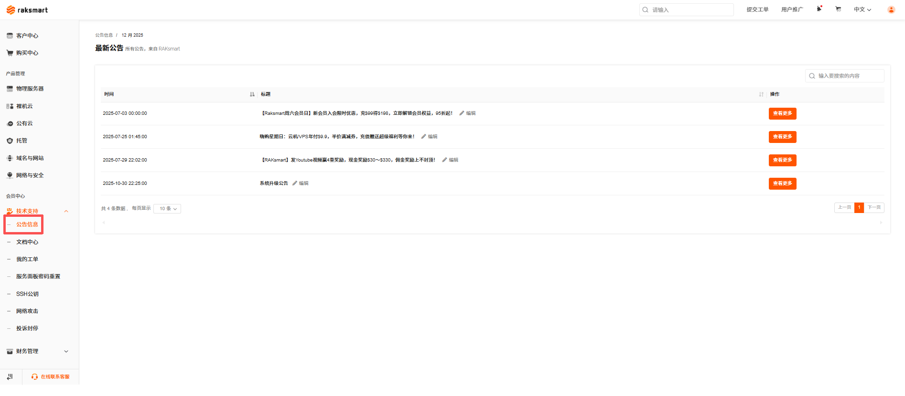
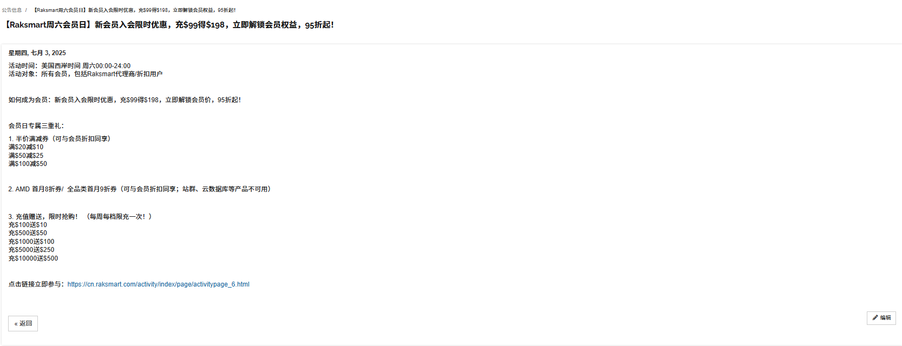
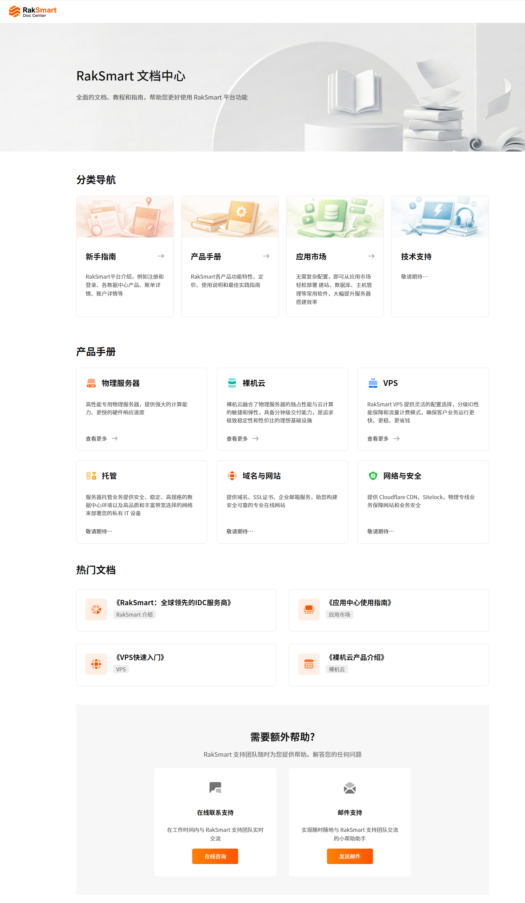
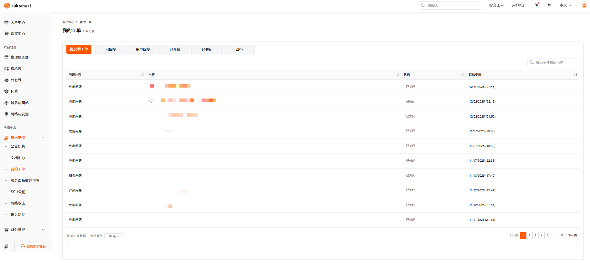
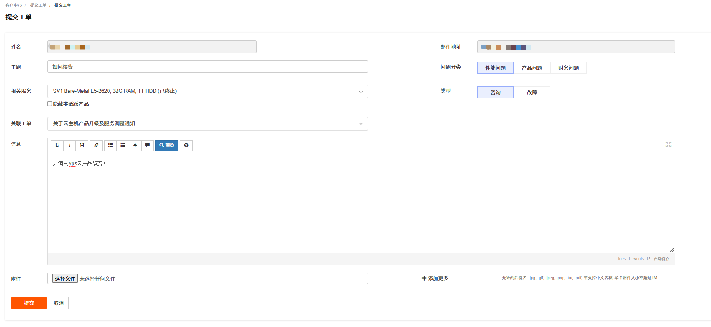
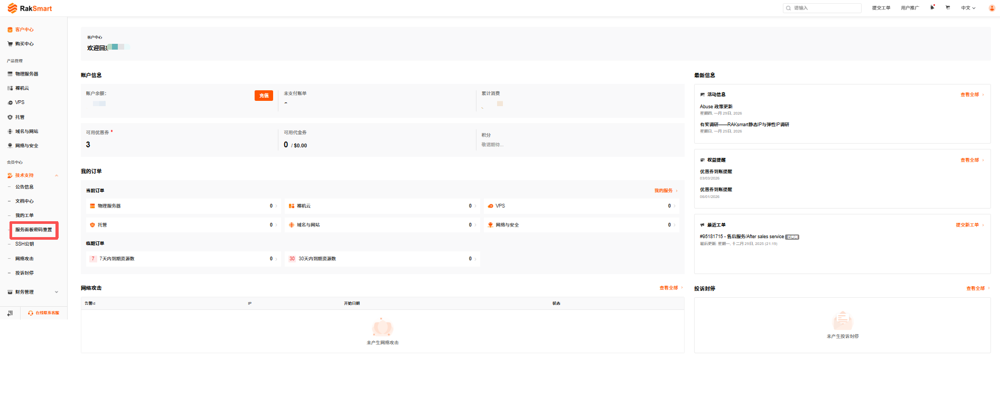
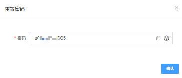
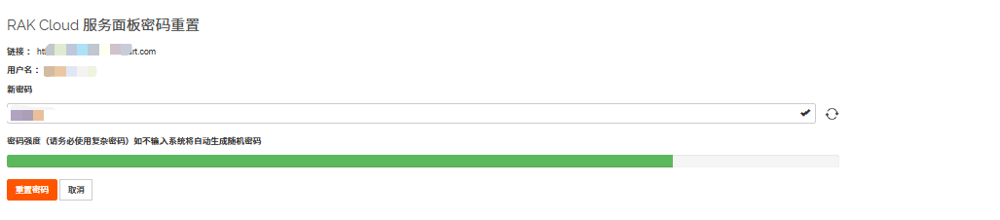
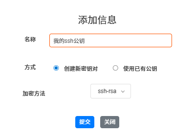

# 技术支持

支持查看公告信息、文档中心、我的工单、服务面板密码重置、设置SSH公钥和查看投诉封停列表。

## 公告信息

1. 登录 [RakSmart 控制台](https://cn.raksmart.com/login/index.html)。

2. 在控制台左侧导航单击**技术支持**，进入**技术支持**下拉列表。

3. 在技术支持下拉列表里单击**公告信息**，进入**最新公告**页面。最新公告页面展示公告时间和标题。

   

4. 在公告列表右侧操作列，单击查看更多。进入公告信息详情页面。

   

## 文档中心

1. 在控制台左侧导航单击**技术支持**，进入**技术支持**下拉列表。

2. 单击**文档中心**，进入**文档中心**页面。文档中心页面支持查看分类导航、产品手册、热门文档和获取支持模块。

   

- 分类导航以卡片形式整合了文档的四大核心方向，帮助用户快速定位内容。
- 产品手册包含 RakSmart 全系列产品的完整知识库，按产品分类聚合了从入门到进阶的全流程文档，是用户使用产品的核心参考依据。
- 热门文档按用户访问热度排序，展示最常用、最实用的文档，帮用户快速获取高价值内容，减少检索成本。
- 获取支持为用户提供文档外的在线支持和邮件支持方案。

## 我的工单

在技术支持下拉列表里单击**我的工单**，进入**我的工单**页面。我的工单页面支持查看已回复、用户回复、已开启、已关闭和回答的工单信息；支持提交新工单。工单信息按照问题分类、主题、状态和最后更新时间展示。

---

### 提交新工单

1. 在我的工单列表左上角单击**提交新工单**。进入**提交工单**页面。

   

2. 在提交工单页面，根据提示输入问题相关信息。

3. **单击提交**。

## 服务面板密码重置

本文档用于指导 RakSmart 用户在会员中心完成 DCIM 服务面板与 RAK Cloud 服务面板的密码重置操作，确保用户能够安全、高效地管理面板访问权限。

---

### DCIM 服务面板密码重置

DCIM 服务面板（Data Center Infrastructure Management Service Panel）是 RakSmart 为物理服务器用户提供的数据中心基础设施管理控制台，用于远程管理和监控物理服务器的硬件状态、网络配置及运维操作。本文主要介绍如何在 RakSmart 控制台重置 DCIM 服务面板密码。

1. 登录 [RakSmart 控制台](https://cn.raksmart.com/login/index.html)。

2. 在左侧导航栏中，单击**技术支持** -> **服务面板密码重置**，进入**服务面板密码重置**页面。

   

3. 你可以通过以下两种方式完成 DCIM 服务面板密码重置。

   

   a. 方式一：在**新密码**输入框中，输入符合复杂度要求的新密码。

   b. 方式二：单击**新密码**输入框右侧的刷新图标，系统将自动生成高强度随机密码。

4. 单击**重置密码**。

5. 系统提示如下信息即完成 DCIM 服务面板密码更新。

   

---

### RAK Cloud 服务面板密码重置

RAK Cloud 服务面板是 RakSmart 为云服务器用户提供的云资源管理控制台，用于自助管理/监控 云服务器、云存储、云网络等弹性云资源，支持系统重装、网络配置、快照管理等云服务全生命周期操作。本文主要介绍如何在 RakSmart 控制台重置 RAK Cloud 服务面板密码。

1. 登录 [RakSmart 控制台](https://cn.raksmart.com/login/index.html)。

2. 在左侧导航栏中，单击**技术支持** -> **服务面板密码重置**，进入**服务面板密码重置**页面。

   

3. 你可以通过以下两种方式完成 RAK Cloud 服务面板密码重置。

   

   a. 方式一：在**新密码**输入框中，输入符合复杂度要求的新密码。
   b. 方式二：单击**新密码**输入框右侧的刷新图标，系统将自动生成高强度随机密码。

4. 单击**重置密码**。

5. 系统提示如下信息即完成 RAK Cloud 服务面板密码更新。

   

## 设置 SSH 公钥

支持配置 SSH 公钥。

1. 在技术支持下拉列表里单击**SSH公钥**，进入**SSH公钥**页面。

   

2. 单击**添加**。进入**添加信息**页面。

   

3. 根据页面提示输入信息。支持通过创建新密钥对和使用已有公钥两种方式创建密钥。

## 查看投诉封停

在技术支持下拉列表里单击**投诉封停**，进入**我的封停列表**页面。列表展示封停IP、封停时间和封停状态。支持搜索封停内容和查看封停详情信息。

## 联系我们

若您在使用过程中遇到任何问题，可通过以下方式联系 RakSmart 官方支持。

---

### 在线客服

1. 打开 [RakSmart 官网](https://cn.raksmart.com/)。
2. 在官网右下角单击**联系我们**，您可以通过以下三种方式获得支持。
   - 选择**在线沟通**，会有客服人员实时解答您的疑问。
   - 选择**电邮**，发送问题至官方客服邮箱。邮件主题建议注明 “问题类型 + 产品 ID”，方便快速处理。
   - 选择**电话**，拨打客服电话，工作时间内可直接致电咨询。

---

### 技术支持

1. 登录 [RakSmart 控制台](https://cn.raksmart.com/login/index.html)。
2. 单击**技术支持** -> **我的工单**，提交问题描述及相关截图，技术人员会实时回复。
   

---

### 官方地址

通过 [RakSmart 官网](https://cn.raksmart.com/)查看 RakSmart 全球办公地址及联系方式，如需商务合作可预约洽谈。
