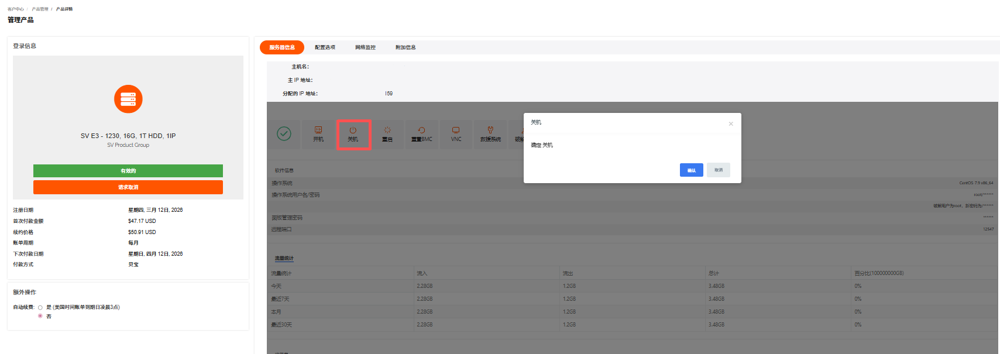
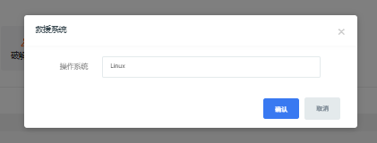
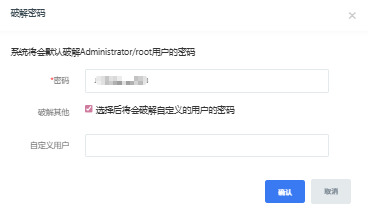
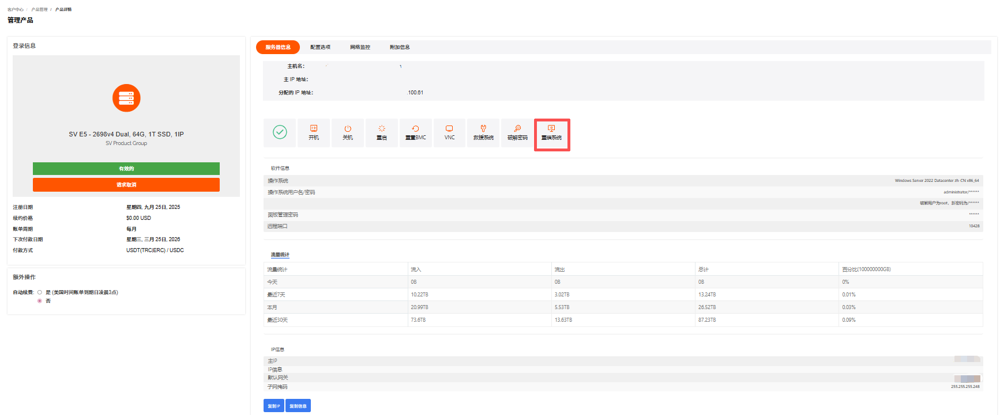
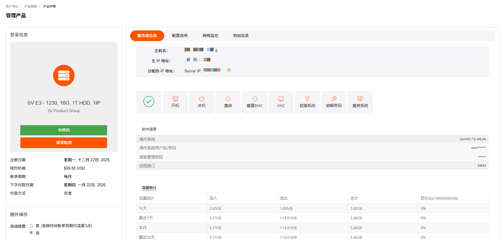
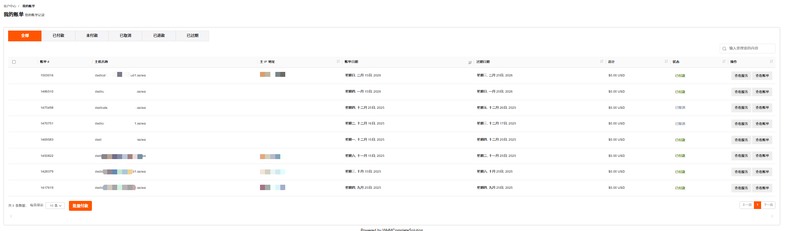
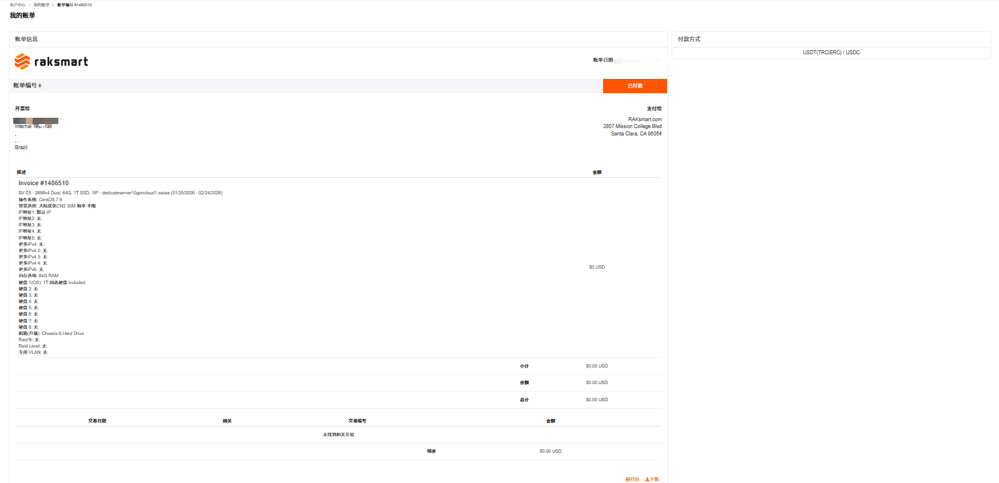

# 管理物理服务器

管理物理服务器支持查看已购物理服务器、查看服务器详细信息。

## 查看已购的物理服务器

查看已购服务器列表支持通过地区或状态查看。

1. 登录 [RakSmart 控制台](https://billing.raksmart.com/whmcs/clientarea.php?language=chinese-cn)。

2. 在控制台左侧导航**产品管理**区域，单击**物理服务**器，进入**我的产品与服务**页面。

   

3. 若当前列表没有找到想要查看的服务器，可以选择地区或状态进行筛选。

4. 你可以在服务器列表，查看如下信息。

   <table width="100%">
        <tr style="text-align: left;">
          <th width="20%">参数</th>
          <th width="80%">说明</th>
        </tr>
        <tr>
          <td>产品 / 服务</td>
          <td>指用户订购的 RakSmart 具体产品类型，如独立服务器、裸机云服务器、VPS、托管服务等。</td>
        </tr>
        <tr>
          <td>主机名称</td>
          <td>用于标识单台主机的自定义或系统分配名称，便于用户管理和区分多台设备。 </td>
        </tr>
         <tr>
          <td>IP</td>
          <td>主机对应的网络互联协议地址，是主机接入网络的唯一标识。</td>
        </tr>
         <tr>
          <td>价格</td>
          <td>该主机产品的计费金额，对应订单的实际结算费用。</td>
        </tr>
         <tr>
          <td>下次付款日期</td>
          <td>按照计费周期，下一次需要支付费用的日期，到期未付款会影响主机正常使用。</td>
        </tr>
   		 <tr>
          <td>状态</td>
          <td>当前的订单状态，常见值有运行中、已过期、暂停、待开通等。</td>
        </tr>
   		 <tr>
          <td>自动续费</td>
          <td>主机的续费模式标识，取值为开启 / 关闭；开启后到期将自动从账户余额扣款续费。</td>
        </tr>
      </table>

## 查看服务器详细信息

支持查看物理服务器的基础信息、配置选项、网络监控信息和附加信息。

---

### 查看服务器基础信息

1. 在控制台左侧导航**产品管理**区域，单击**物理服务器**，进入**我的产品与服务**页面。

   

2. 选择一台需要查看的物理服务器，单击**产品/服务**名称，进入**管理产品**详情页面。支持通过地区和状态筛选出对应的产品和服务。

   

3. 在物理服务器**管理产品**页面，可直接查看服务器核心信息：
   - 基本信息：主机名、主 IP 地址、附加 IP 地址等标识信息。
   - 产品信息：服务器型号（如 SV-E3-1230_16G，1THDD，1IP）。
   - 服务周期：
     - 订购日期 / 到期日期。
     - 费用（如 $59.00 USD）。
     - 下次续费日期、付款方式等。

---

### 查看配置选项

在物理服务器**管理产品**页面，单击**配置选项**，可查看服务器系统配置信息。

---

### 网络监控

在物理服务器**管理产品**页面，单击**网络监控**面板，可查看服务器的网络使用情况：

---

### 附加信息

可查看服务器的网络相关附加信息。

---

### 后续操作

使用物理服务器请参考[执行服务器操作](#执行服务器操作)。

## 执行服务器操作

在物理服务器**管理产品**页面，支持开机、关机、重启、重置 BMC、使用 VNC、救援系统、破解密码和重装系统等操作。

---

### 开机

物理服务器开机是指启动已关机的服务器。

1. 在物理服务器管理产品->管理面板，单击**开机**。

   

2. 在**开机**确认页面单击**确认**。

---

### 关机

物理服务器关机是指关闭运行中的服务器。建议先通过远程连接保存数据。

1. 在物理服务器管理产品->管理面板，单击**关机**。

   

2. 在**关机**确认页面单击**确认**。

---

### 重启

物理服务器重启是指将运行中的服务器关机并重新开机。适用于系统卡顿、配置生效等场景。

1. 在物理服务器管理产品->管理面板，单击**重启**。

   

2. 在**重启**确认页面单击**确认**。

---

### 重置 BMC

重置 BMC 是指重置物理服务器管理控制器，解决远程管理相关故障。

1. 在物理服务器管理产品->管理面板，单击**重置BMC**。

   

2. 在**重置 BMC**确认页面单击**确认**。

---

### 使用 VNC

使用 VNC 是指通过 VNC 远程连接物理服务器控制台。无需网络配置，直接访问系统界面。关于如何连接物理服务器的方法可参考[登录物理服务器](独服/02、快速入门/快速入门.md#登录物理服务器)。

---

### 救援系统

救援系统是指启动救援模式。用于系统故障、密码找回等紧急场景。

1. 在物理服务器**管理产品**页面，单击**救援系统**。

   

2. 选择**操作系统**，单击**确认**。

   

---

### 破解密码

破解密码是指重置物理服务器系统登录密码。

1. 在物理服务器**管理产品**页面，单击**破解密码**。

   

2. 在**破解密码**页面，系统将会默认破解 Administrator/root 用户的密码，单击**确认**。

   

3. （可选）在**破解密码**页面，勾选**选择后将会破解自定义的用户的密码**，输入**自定义用户**，单击**确认**。

   

---

### 重装系统

重装系统是指重新部署操作系统镜像，将物理服务器系统盘恢复至初始状态，常用于系统故障、更换系统版本或清理环境等场景，操作会格式化系统盘（数据盘通常不受影响，视配置而定）。

> **注意**
>
> 重装会清除系统盘数据，请提前备份。

1. 在物理服务器管理产品->管理面板，单击**重装系统**。

   

2. 在**重装系统**页面，根据提示完成操作系统、密码、端口等信息的选择和输入。

   

3. 单击**确认重装**。

## 物理服务器取消

RakSmart 物理服务器取消指用户主动终止当前物理服务器的服务。服务器取消包括服务器到期用户不再续费和立即取消两种情况。退款规则的介绍可参考[产品取消和退订](管理已购买的产品.md#产品取消和退订)。

- 生效规则：如选择的是 账单周期结束 后取消 ，则不会立即停止服务，而是在当前账单周期结束后终止服务。例如当前是 1 月订阅，申请取消后可持续使用到 1 月账单周期到期；

- 费用说明：提交取消后无法再对订单进行续费操作；

- 数据注意：请在提交取消申请前备份服务器内的所有数据，服务终止后数据会被清理，无法恢复。

1. 登录 [RakSmart 控制台](https://billing.raksmart.com/whmcs/index.php?rp=/user/security)，进入**客户中心**页面。

   

2. 在客户中心页面左侧导航**产品管理**区域，单击**物理服务器**，进入**我的产品与服务**页面。

   

3. 找到需要取消服务的物理服务器，单击**产品/服务**名称进入产品详情**管理产品**页面。

   

4. 单击**请求取消**，进入**账户请求取消**页面。

   

5. 输入**简要说明取消理由**，选择取消类型。
   - 账单周期结束：指服务器到期用户不再续费，用户取消服务器后不产生退款。
   - 立即：指立即终止服务器的使用，可能产生退款。退款规则的介绍可参考服务器退订。

6. 单击**请求取消**，系统提示如下信息；单击**返回**可以回到管理产品页面。

   

7. （可选）若您需要继续使用产品或者撤销取消申请，单击**移除请求**。

   

## 账单与续费管理

### 查看账单信息

查看账单信息支持查看物理服务器的全部账单记录。

1. 登录 [Raksmart 控制台](https://billing.raksmart.com/whmcs/clientarea.php?language=chinese-cn)。

2. 在左侧导航**产品管理**区域，单击**物理服务器**，进入**我的产品与服务**页面。

   

3. （可选）若当前列表没有找到想要查看的物理服务器，支持通过地区或状态进行筛选，或者通过搜索框搜索。

   

4. 找到需要查看账单信息的物理服务器，单击**账单信息**。

5. 在**我的账单**页面，支持查看全部、已付款、未付款、已取消、已退款和已过期的账单；支持通过搜索框搜索账单；支持查看服务、查看账单和批量付款。

   

   a. 查看服务

   支持查看当前帐单对应的服务。单击**查看服务**，进入我的产品与服务页面。

   

   b. 查看账单  
   支持查看当前账单详情。单击**查看账单**，进入我的帐单页面。此页面支持查看账单详情信息，可根据需要打印和下载账单。

   

---

### 提前续费

提前续费是指在当前服务有效期还没结束时，主动为其续费来延长使用时间。

> **说明**
>
> 为保障您的产品/服务正常使用，请留意以下续费及产品/服务状态变更规则：
>
> - 产品/服务到期前 10 天，系统将自动生成续费账单，请您及时完成续费操作；
> - 到期未续费的，产品/服务会在到期后的第 2 天被暂停。
>   - 暂停期间完成续费，产品/服务可立即恢复使用；
>   - 若暂停满 4 天仍未续费，产品/服务将被下架。

1. 在**我的产品/服务**列表右侧操作列，单击**提前续费**，进入**续费管理**页面。**续费管理**页面支持查看当前付款周期和当前产品到期时间。

   

2. 选择不同的续费周期。续费周期支持选择月付、季付、半年付和年付。

3. 单击结账，进入**我的账单**页面。

   

4. 在**我的账单**页面，选择付款方式或者使用余额支付。

5. 完成付款。

   

## 新开工单

新开工单支持对物理服务器提交问题工单。

1. 在**我的产品与服务**页面列表右侧，单击**新开工单**，进入**提交工单**页面。

   

2. 根据页面提示输入主题、问题描述等信息。

3. 单击**提交**。
