# 快速入门

## 购买裸机云

本文介绍如何通过 RakSmart 官网产品入口和控制台入口购买裸机云服务器。

---

### 准备工作

1. 注册 RakSmart 账号，详细步骤可参考[注册 RakSmart 账号](注册%20RakSmart%20账号.md)。

2. 了解 Raksmart 产品和配置项、计费周期、付款方式等信息，参考[购买 RakSmart 产品](购买%20RakSmart%20产品.md)。

---

### 通过官网产品入口购买

您可以直接通过 RakSmart 官网产品入口购买推荐的裸机云服务器。

1. 使用注册的 RakSmart 账号登录 [RakSmart 官网](https://cn.raksmart.com/)。

2. 将鼠标悬停在顶部导航**裸机云**，打开下拉列表。

   

3. 选择一个裸机云产品类型，进入产品页面。

   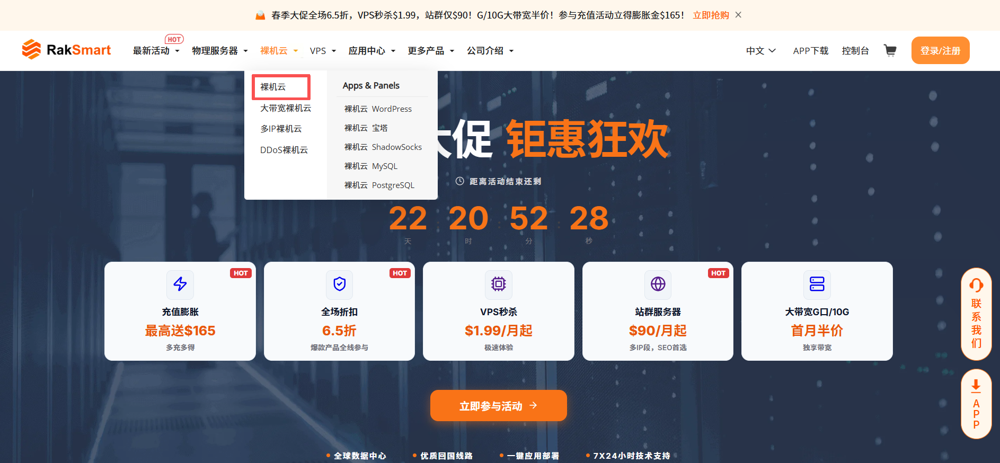

4. 单击**立即订购**。

   

5. 在产品清单页面，选择购买裸机云服务器的地区、配置，单击**现在订购**。

   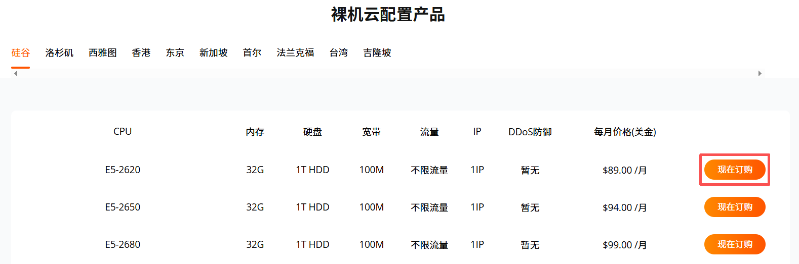

6. 在**配置** - **购物**车页面，参考如下信息完成自定义产品配置。各配置项详细说明，请参考[配置项及付款流程说明](#配置项及付款流程说明)。

   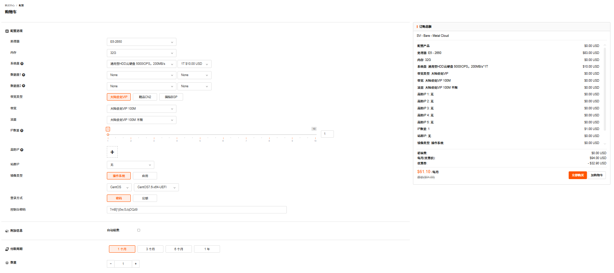

7. （可选）您也可以在上述 **裸机云的产品页面**，选择一个推荐产品配置，单击**立即购买**。

   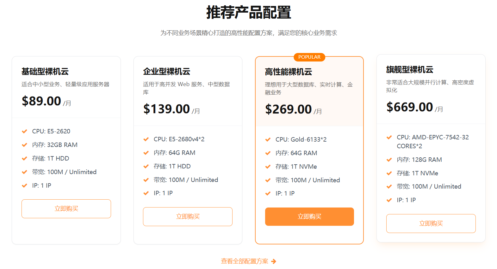

---

### 通过控制台入口购买

本文主要介绍通过 RakSmart 控制台购买中心入口购买裸机云服务器。

1. 使用注册的 RakSmart 账号登录 [RakSmart 官网](https://cn.raksmart.com/login/index.html)。

   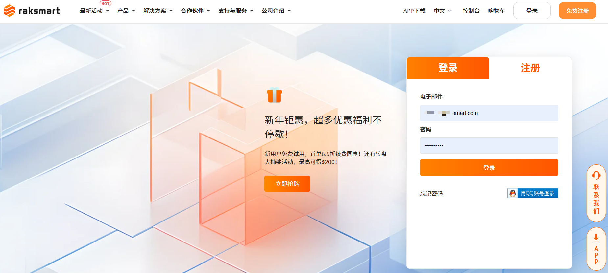

2. 在官网顶部导航右侧，单击**控制台**，进入控制台客户中心页面。

   

3. 单击**购买中心**，进入**购物车**页面。

   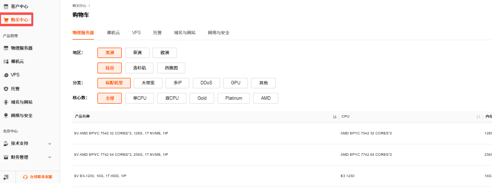

4. 单击**裸机云**，参考如下信息选择地区、分类、核心数等配置。

   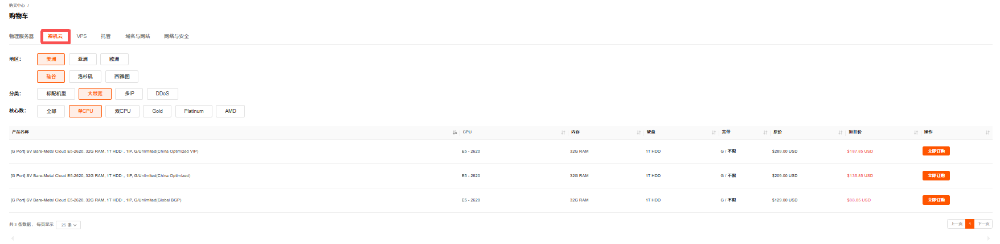

   <table width="100%">
     <tr style="text-align: left;">
       <th width="20%">配置项</th>
       <th width="80%">说明</th>
     </tr>
     <tr>
       <td>地区</td>
       <td>裸机云服务器部署的可用区。目前支持的区域和可用区有美洲的硅谷、洛杉矶、西雅图，亚洲的
   香港、台湾、东京等区和欧洲的法兰克福。关于区域和可用区的详细介绍可参考 区域和可用区。 </td>
     </tr>
     <tr>
       <td>分类</td>
       <td>裸机云服务器的功能和配置类型，主要包括按如下分类： - 标配机型：基础标准配置，满足常规业务，如网站部署、轻量应用运行的基础算力与资源需求； - 站群多 IP：配备更多独立 IP，适配多网站、多域名并行部署的业务场景； - 大带宽：提供高带宽资源，适配视频流媒体、数据传输等高网络吞吐需求的业务； - 高防：集成抗攻击防护能力，适配易受网络攻击的业务（如电商平台、游戏服务器）； </td>
     </tr>
      <tr>
       <td>核心数</td>
        <td>裸机云服务器的核心配置选项， 支持通过核心数选择单 CPU / 双 CPU；也支持通过 Gold、Platinum 和 AMD 等 CPU 型号选择。</td>
     </tr>
   </table>

5. 选择产品类型，单击**立即订购**，进入**配置** - **购物车**页面。各配置项详细说明，请参考[配置项及付款流程说明](#配置项及付款流程说明)。

   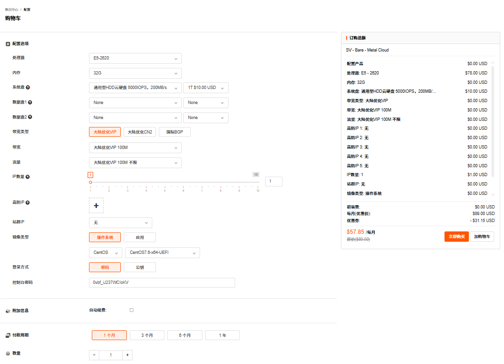

---

### 配置项及付款流程说明

1. 配置选项设置

   请参考如下信息完成配置选项填写。

   <table width="100%">
            <tr style="text-align: left;">
              <th width="20%">配置项</th>
              <th width="80%">说明</th>
            </tr>
            <tr>
              <td>处理器</td>
              <td>指裸机云服务器的 CPU 型号，如“E5-2620”，决定了服务器的计算能力，是支撑业务运行、处理请求的核心硬件。</td>
            </tr>
            <tr>
              <td>内存</td>
              <td>指裸机云服务器的内存容量。用于临时存储运行中的程序与数据，容量越大，可同时承载的服务和并发请求越多。</td>
            </tr>
             <tr>
              <td>系统盘</td>
              <td>用于安装操作系统及核心运行环境的磁盘，是服务器启动和运行的基础存储介质。</td>
            </tr>
             <tr>
              <td>数据盘1</td>
              <td>额外挂载的独立存储磁盘，可用于存放业务数据、日志、文件等，与系统盘分离可避免系统故障影响数据，也能按需扩容。</td>
            </tr>
            <tr>
              <td>数据盘2</td>
              <td>同数据盘1。</td>
            </tr>
            <tr>
              <td>带宽类型</td>
              <td>服务器接入的公网线路类型，包含大陆优化 VIP、精品 CN2 和国际 BGP，分别针对中国访问优化、跨境访问等不同场景。</td>
            </tr>
             <tr>
               <tr>
              <td>带宽</td>
              <td>网络线路在单位时间内能够传输的数据总量。带宽数值越大表示传输能力越强，即在单位时间内传输的数据量越多。</td>
            </tr>
            <tr>
              <td>流量</td>
              <td>服务器公网传输的数据总量限制，如“大陆优化 VIP 100M 不限”，“不限”表示不限制月度流量，适合大流量业务场景。</td>
            </tr>
            <tr>
              <td>IP数量</td>
              <td>分配给服务器的公网 IP 地址数量，支持单 IP 或多 IP 配置。</td>
            </tr>
            <tr>
              <td>高防IP</td>
              <td>具备 DDoS 攻击防护能力的公网 IP，可过滤恶意流量，保障服务器在遭受网络攻击时仍能正常对外提供服务。</td>
            </tr>
            <tr>
              <td>站群IP</td>
              <td>一组独立的公网 IP 地址，适合搭建多站点业务，可避免单 IP 风险，提升多站点的搜索引擎友好度。</td>
            </tr>
            <tr>
              <td>镜像类型</td>
              <td>包含了裸机云服务器所需的基本操作系统、应用数据的特殊文件。 
      - 操作系统：服务器管理硬件资源和运行应用的软件平台的系统环境。可选类型包括： - Linux 系统：- CentOS、 Ubuntu、Debian、Rocky、Almalinux； - Windows 系统：Windows Server Datacenter 版本。
       - 应用镜像：操作系统 + 应用（例如宝塔） + 运行环境。 </td>
            </tr>
            <tr>
              <td>登录方式</td>
              <td>支持密码登录及更安全的密钥登录。</td>
            </tr>
            <tr>
              <td>控制台密码</td>
              <td>用于登录裸机云服务器系统的密码。</td>
            </tr>
         </table>

2. 选择附加信息

   根据您的业务需求，选择是否开启自动续费的开关。若开启系统将自动从您的账户余额扣款续费；否则到期后服务将暂停。

3. 选择付款周期

   选择服务的购买时长，支持月付、季度付、半年付和年付。

4. 选择数量

   选择购买服务器的数量。

5. 完成配置填写后，在右侧订购总额区域单击**立即购买**。

   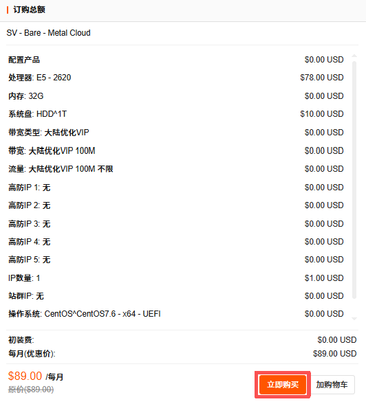

6. 在**确认产品信息**页面支持选择优惠券（若有），根据需要输入**订单备注**信息；确认没有问题后，勾选**我已阅读并同意**服务条款，单击**结算**。

   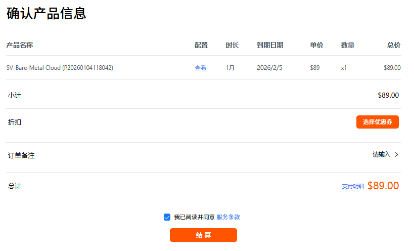

7. 在**支付**页面，选择某一种付款方式支付或者使用余额支付。

   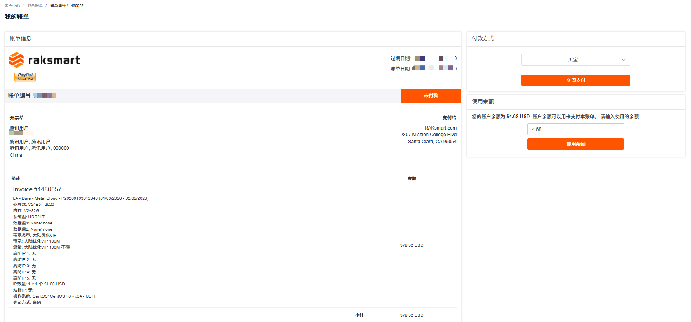

8. 支付完成后如下图所示。

   

---

### 操作结果

1. 在控制台左侧导航**产品管理**区域单击**裸机云**，进入**我的产品与服务**页面。此页面支持通过**地区**或**状态**筛选，或通过搜索框查找目标服务器信息。

   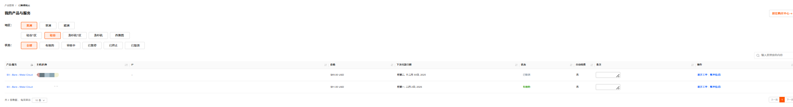

2. 当服务器的状态由**审核中**变为**有效的**时，即证明此服务器已开通。

---

### 后续步骤

购买并开通裸机云服务器后，您可以开始使用。详细内容请参见[登录裸机云](#登录裸机云)。

## 登录裸机云

根据购买服务器操作系统类型的不同，可将裸机云服务器分为 Windows 裸机云服务器和 Linux 裸机云服务器。购买并激活服务器后，您可以选择以下方式登录服务器。

---

### 前提条件

已购买并开通裸机云服务器。详细内容可参考[购买裸机云](#购买裸机云)。

---

### 登录 Windows 裸机云

Windows 裸机云服务器支持通过 VNC 登录和远程桌面登录。

#### 方式 1：通过控制台 VNC 登录

VNC 远程控制窗口是连接裸机云服务器的可视化操作界面，可进行系统操作、文件管理等。

1. 登录 [RakSmart 控制台](https://billing.raksmart.com/whmcs/clientarea.php?language=chinese-cn)。

2. 在控制台左侧导航**产品管理**区域，单击**裸机云服务器**，进入**我的产品与服务**页面。此页面默认展示全部已购买的裸机云服务。

   

3. 在**我的产品与服务**页面，你可以通过地区或状态查找裸机云服务器。

   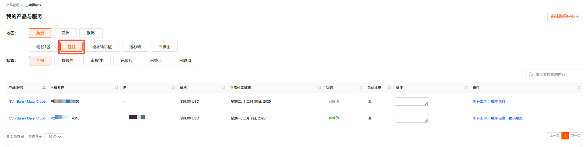

4. 选择状态为**有效的**裸机云服务器，单击**产品/服务**名称，进入此服务器的产品详情页面。

   

5. 在裸机云服务器**管理产品** -> **管理**面板，单击 **VNC**，进入 VNC 连接面板。

   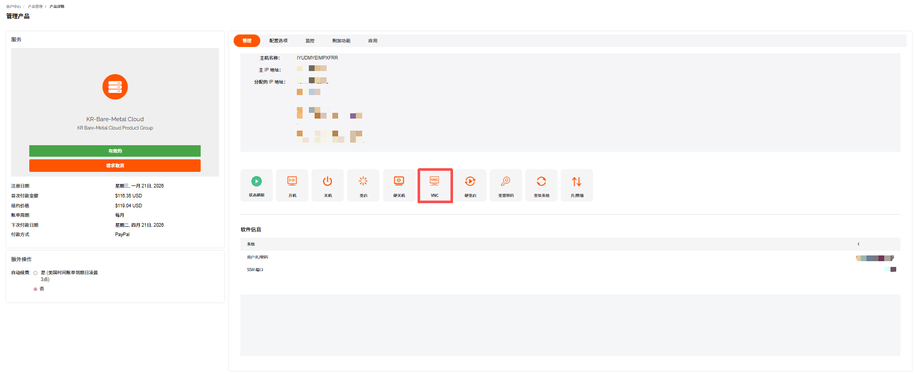

6. 在 Windows 系统登录界面，输入服务器密码，完成登录。

   

#### 方式 2：使用远程桌面登录

本例以 Windows 系统自带的远程桌面连接应用作简要说明。

1. 在本地 Windows 电脑上，按 `Win + R` 键打开**运行**对话框，输入 `mstsc`，单击**确认**，进入**远程桌面连接**页面。

   

2. 在**计算机**输入框中，输入 Windows 服务器的公网 IP 地址，如：192.168.1.1。默认的远程桌面端口默认为 3389，如果服务器修改了默认的端口，则需在 IP 加上冒号和本机端口号，如：192.168.1.1:3390。

   

3. 单击**连接**。

4. 在弹出的窗口中，输入服务器的**管理员账号**（通常是 Administrator）和对应的密码，单击**确定**。

   

---

### 登录 Linux 裸机云

#### 方式 1：通过控制台 VNC 登录

VNC 远程控制窗口是连接裸机云服务器的可视化操作界面，可进行系统操作、文件管理等操作。

1. 登录 [Raksmart 控制台](https://billing.raksmart.com/whmcs/clientarea.php?language=chinese-cn)。

2. 在控制台左侧导航**产品管理**区域，单击**裸机云**，进入**我的产品与服务**页面。此页面默认展示全部已购买的裸机云服务器。

   

3. 你可以通过**地区**或**状态**查找裸机云服务器。

   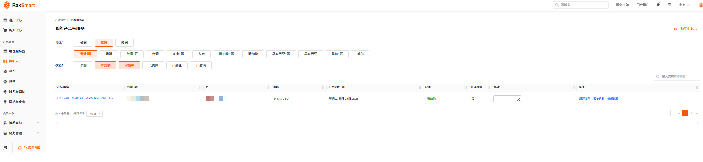

4. 选择状态为**有效的**裸机云服务器，单击**产品/服务**名称，进入此服务器的**管理产品** -> **管理**页面。

5. 单击 **VNC**，进入 VNC 连接面板。详细的连接步骤可参考上述登录 Windows 裸机云服务器 - 通过控制台 VNC 登录。

   

#### 方式 2：使用 SSH 客户端远程登录

通过 SSH 远程连接服务器是指使用 SSH 工具，在本地设备上通过网络远程访问服务器，登录系统进行命令行操作的过程。

##### 前提条件

本地设备已安装 SSH 客户端：

- Windows 可使用 PuTTY、Xshell；
- Mac/Linux 可用自带终端。

##### 操作步骤

1. 打开本地 SSH 客户端工具。

   

2. 在连接配置中填写如下信息。
   - 名称：服务器主机名。
   - 主机地址：服务器主 IP；
   - 端口：默认 SSH 端口为 22；
   - 方法：支持密码、公钥和Keyboard Interactive方式，选择其中一种方式；
   - 用户名：root（对应操作系统用户名）。
   - 密码：服务器连接密码。

   > **说明**
   >
   > 可在产品信息邮件中查找对应密码。产品信息邮件会在产品购买开通后由 RakSmart 发送给用户。

3. 单击**确定**，远程连接服务器成功如下图所示。

