# 管理裸机云

管理裸机云服务器支持查看已购裸机云和服务器详细信息。

## 查看已购的裸机云

支持通过地区或状态查看已购的裸机云服务器。

1. 登录 [RakSmart 控制台](https://billing.raksmart.com/whmcs/clientarea.php?language=chinese-cn)。

2. 在控制台左侧导航**产品管理**区域，单击**裸机云**，进入**我的产品与服务**页面。

   

3. （可选）若当前列表没有找到想要查看的裸机云服务器，可以选择地区或状态进行筛选。

   

   你可以在服务器列表，查看如下信息。

   <table width="100%">
        <tr style="text-align: left;">
          <th width="20%">参数</th>
          <th width="80%">说明</th>
        </tr>
        <tr>
          <td>产品 / 服务</td>
          <td>指用户订购的 RakSmart 具体产品类型，如独立服务器、裸机云服务器、VPS、托管服务等。</td>
        </tr>
        <tr>
          <td>主机名称</td>
          <td>用于标识单台主机的自定义或系统分配名称，便于用户管理和区分多台设备。 </td>
        </tr>
         <tr>
          <td>IP</td>
          <td>主机对应的网络互联协议地址，是主机接入网络的唯一标识。</td>
        </tr>
         <tr>
          <td>价格</td>
          <td>该主机产品的计费金额，对应订单的实际结算费用。</td>
        </tr>
         <tr>
          <td>下次付款日期</td>
          <td>按照计费周期，下一次需要支付费用的日期，到期未付款会影响主机正常使用。</td>
        </tr>
   		 <tr>
          <td>状态</td>
          <td>当前的订单状态，常见值有运行中、已过期、暂停、待开通等。</td>
        </tr>
   		 <tr>
          <td>自动续费</td>
          <td>主机的续费模式标识，取值为开启 / 关闭；开启后到期将自动从账户余额扣款续费。</td>
        </tr>
      </table>

## 查看裸机云详细信息

支持查看裸机云服务器的基础信息、配置选项、网络监控信息和附加信息。

---

### 查看裸机云基础信息

1. 在控制台左侧导航**产品管理**区域，单击**裸机云**服务器，进入**我的产品与服务**页面。
   

2. 选择一台需要查看的裸机云服务器，单击**产品/服务**名称，进入**管理产品**详情页面。支持通过地区和状态筛选出对应的产品和服务。

   

3. 在裸机云服务器**管理产品**页面，可直接查看服务器核心信息。

   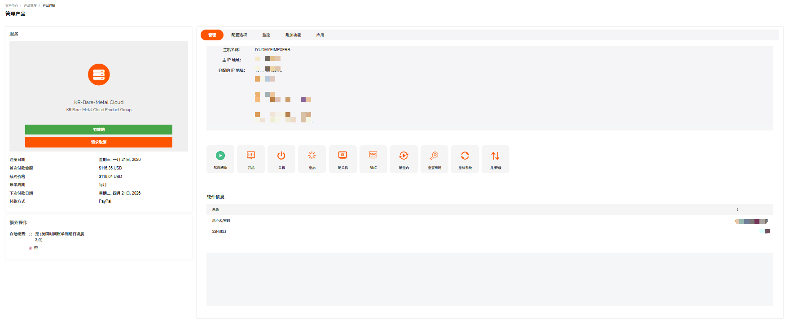
   - 基本信息：主机名、主 IP 地址、附加 IP 地址等标识信息。
   - 产品信息：服务器型号（如 SV-Bare-Metal Cloud）。
   - 服务周期：
     - 订购日期 / 到期日期。
     - 费用（如 $59.00 USD）。
     - 下次续费日期、付款方式等。

---

### 查看配置选项

在裸机云**管理产品**页面，单击**配置选项**，可查看服务器系统配置信息。

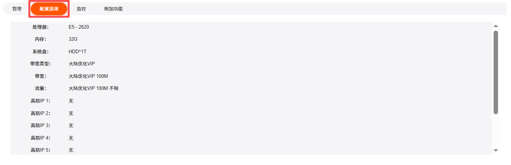

---

### 监控

在裸机云**管理产品**页面，单击**监控**面板，可查看服务器的网络使用情况。支持通过时间筛选。

---

### 附加功能

可查看裸机云的安全组附加信息。详细内容可参考[管理安全组](#管理安全组)。

---

### 后续操作

使用裸机云服务器请参考[执行服务器操作](#执行服务器操作)。

## 执行服务器操作

在裸机云服务器**管理产品**页面，支持开机、关机、重启等操作。

---

### 开机

服务器开机是指启动已关机的服务器。

1. 在裸机云**管理产品** -> **管理**面板，单击**开机**。

   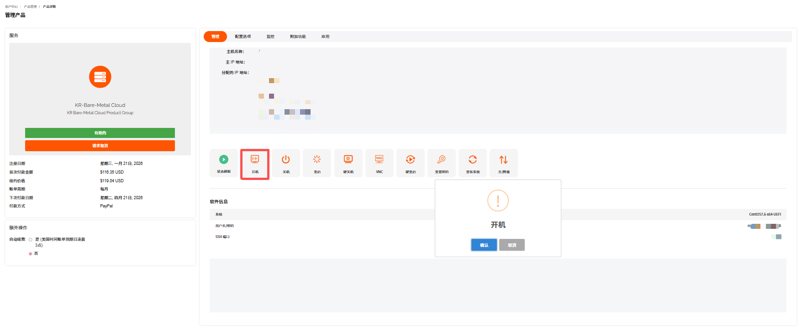

2. 在开机确认页面单击**确认**。

---

### 关机

服务器关机是指关闭运行中的服务器。建议先通过远程连接保存数据。

1. 在裸机云**管理产品** -> **管理**面板，单击**关机**。

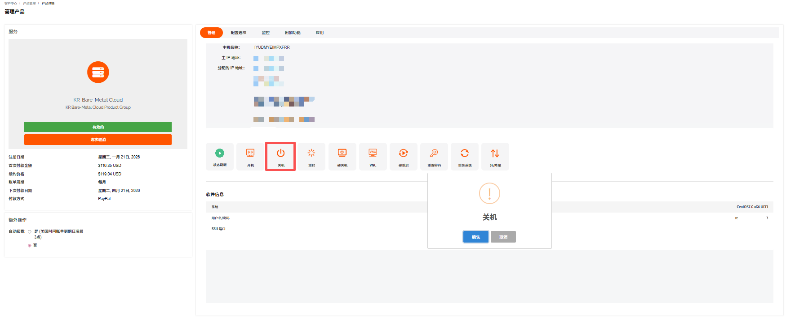

2. 在关机确认页面单击**确认**。

---

### 重启

服务器重启是指将运行中的服务器关机并重新开机。适用于系统卡顿、配置生效等场景。

1. 在裸机云**管理产品** -> **管理**面板，单击**重启**。

   

2. 在重启确认页面单击**确认**。

---

### 硬关机

硬关机等同于裸机云服务器直接断电，强制切断主机供电以关闭系统。

1. 在裸机云**管理产品** -> **管理**面板，单击**硬关机**。

   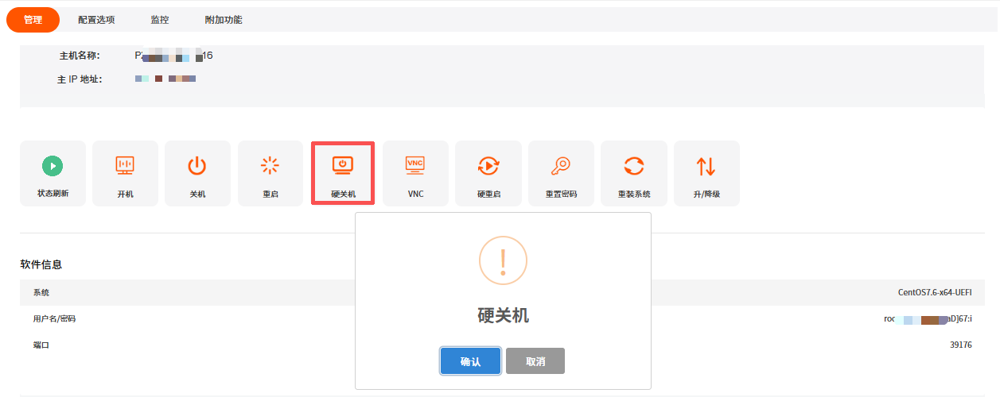

2. 在硬关机确认页面单击**确认**。

   > **注意**
   >
   > - 易导致未保存的业务数据丢失、文件系统损坏。
   > - 仅适用于系统卡死、软关机无响应的紧急场景。
   > - 操作后建议检查磁盘完整性。

---

### 使用 VNC

使用 VNC 是指通过 VNC 远程连接服务器控制台。无需网络配置，直接访问系统界面。关于如何连接裸机云服务器的方法可参考使用裸机云服务器。

---

### 硬重启

硬重启是指强制断电后立即通电重启主机，跳过系统正常关机流程，属于紧急重启方式。

1. 在裸机云**管理产品** -> **管理**面板，单击**硬重启**。

   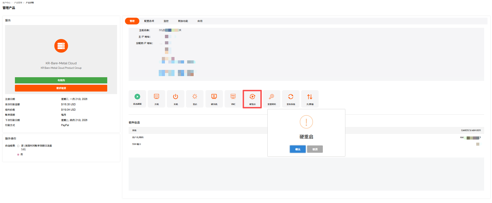

2. 在硬重启确认页面单击**确认**。

---

### 重置密码

重置密码是指重置服务器的系统管理员密码，适用于密码遗忘或权限变更场景。

1. 在裸机云**管理产品** -> **管理**面板，单击**重置密码**。

   

2. 在**重置密码**页面，输入修改后的密码。

   

   > **注意**
   > 当前操作需要实例在关机状态下进行：
   >
   > - 实例将关机中断您的业务，请仔细确认。
   > - 强制关机可能会导致数据丢失或文件系统损坏，您也可以主动关机后再进行操作。

3. 单击**确认**。

---

### 重装系统

重装系统是指重新部署操作系统镜像，将服务器系统盘恢复至初始状态，常用于系统故障、更换系统版本或清理环境等场景，操作会格式化系统盘（数据盘通常不受影响，视配置而定）。

> **注意**
> 重装会清除系统盘数据，请提前备份。

1. 在裸机云**管理产品**->**管理**面板，单击**重装系统**。

   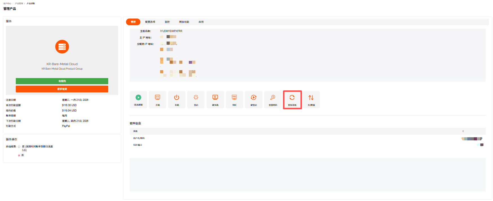

2. 在**重装系统**页面，根据提示完成系统、登录方式和端口信息的选择和输入。

3. 单击**确认**。

## 管理安全组

RakSmart 支持购买裸机云产品后到控制台查看和管理其安全组。关于 RakSmart 安全组的详细介绍可参考 安全组。

---

### 创建安全组

如果您不需要使用裸机云自带的默认安全组，可自行创建并替换为符合业务需求的自定义安全组。

1. 在**我的产品与服务**页面，选择一台需要查看的裸机云服务器，单击**产品/服务**名称，进入**管理产品**详情页面。

   

2. 在裸机云服务器**管理产品**页面，单击**附加功能**面板。

   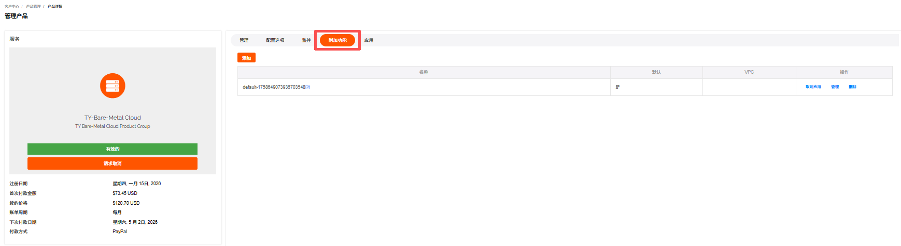

3. 单击**添加**。

4. 在创建新的安全组页面，输入安全组名称和选择是否使用默认安全组。

   

5. 单击**保存**。

---

### 编辑安全组名称

1. 在**管理产品**页面，单击**附加功能**面板。

2. 单击安全组名称后面的**编辑**按钮，进入**编辑安全组名称**页面。

3. 输入要修改的安全组名称，并在默认下拉框中选择是否使用默认安全组。

   

4. 单击**保存**。

---

### 管理安全组

1. 在**附加功能**面板，单击**管理**，进入管理安全组页面。

   

2. 你可以对该安全组下的具体安全规则进行添加、编辑和删除。

   

---

### 取消安全组应用

当您需要更换安全组，需先取消当前安全组，再绑定新安全组。

> **注意**
>
> 取消应用安全组后，若未及时绑定新安全组，服务器的网络访问可能会受影响，建议提前准备好新的安全组配置。

1. 在**附加功能**面板，单击**取消应用**。

   

2. 在取消应用确认页面，单击**是**。

---

## 裸机云升降级

购买 RakSmart 产品后，您可以根据需要，自主对实例的配置进行升级或降级。通过升降级，可满足您业务扩张的需求、优化云资源配置、应对业务负载变化、或节省成本等。
Raksmart 裸机云支持升降级的资源有内存、硬盘、IP数量、带宽流量等。

---

### 操作步骤

1. 在控制台左侧导航**产品管理**区域，单击**裸机云**，进入**我的产品与服务**页面。此页面默认展示全部已购买的裸机云服务器。

   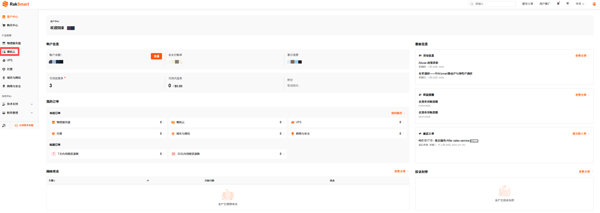

2. 选择状态为**有效的**裸机云服务器，单击**产品/服务**名称，进入此服务器的产品详情页面。

   

3. 单击**升/降级**，进入**升级/降级**页面。

   

4. 选择需要升降级的配置。例如 IP 数量选择由 1 个升级为 3 个。

   

5. 单击**点击继续**，进入**升级/降级**价格确认页面。确认页面展示哪些配置做了升降级，和对应的价格变化。

   

6. 确认升降级配置和价格没有问题后，单击**点击继续**。进入**我的账单**页面。

   

7. 在**我的账单**页面，选择支付方式或者使用余额支付。

8. 付款成功。

   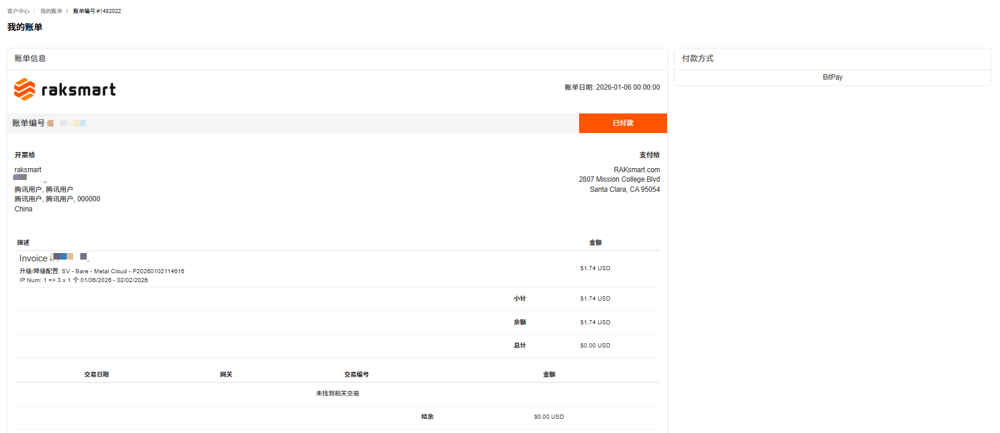

---

### 操作结果

支付成功后，系统将自动完成配置调整。可在产品详情页查看更新后的配置信息，确认是否生效。

---

### 注意事项

对产品进行升级与变配会存在一些限制或影响，请留意操作界面的提示，或查看该产品的相关文档了解详情。

1. 不同产品升降级时可能会存在限制。

   例如：实例的网络类型不允许改变；硬盘容量只允许升级，不支持降级。

2. 升级与变配可能会对您的资源费用、生效时间、计费方式产生影响。

   例如，升级时，可能需要您为当前计费周期的规格或配置补差价。

3. 部分产品的升级与变配可能会对您的业务造成短暂影响。
   - 提前规划升级时间：建议选择业务低峰期执行升级 / 变配操作（如凌晨、节假日），最大程度降低对核心业务的影响。
   - 备份业务数据与配置：操作前务必完成全量数据备份和关键配置文件导出，避免因升级异常导致数据丢失或配置错乱。
   - 业务恢复后校验：升级完成后，需逐一验证业务功能、网络连通性、数据完整性，确认无异常后再恢复全量业务访问。
   - 问题反馈：若遇任务卡顿、失败等异常，及时通过控制台工单系统或客服渠道反馈。

## 裸机云取消

RakSmart 裸机云服务器取消指用户主动终止当前裸机云服务器的服务。服务器取消包括服务器到期用户不再续费和立即取消两种情况。退款规则的介绍可参考[产品取消和退订](管理已购买的产品.md#产品取消和退订)。

- 生效规则：如选择的是 账单周期结束 后取消 ，则不会立即停止服务，而是在当前账单周期结束后终止服务。例如当前是 1 月订阅，申请取消后可持续使用到 1 月账单周期到期；
- 费用说明：提交取消后无法再对订单进行续费操作；
- 数据注意：请在提交取消申请前备份服务器内的所有数据，服务终止后数据会被清理，无法恢复。

1. 登录 [RakSmart 控制台](https://billing.raksmart.com/whmcs/index.php?rp=/user/security)。

2. 在客户中心页面左侧导航**产品管理**区域，单击**裸机云服务器**，进入**我的产品与服务**页面。

   

3. 找到需要取消服务的裸机云服务器，单击**产品/服务**名称进**管理产品**页面。

   

4. 单击**请求取消**，进入**账户取消请求**页面。

   

5. 输入**简要说明取消理由**，选择**取消类型**，单击**请求取消**。

   
   - 账单周期结束：指服务器到期用户不再续费，用户取消服务器后不产生退款。
   - 立即：指立即终止服务器的使用，可能产生退款。退款规则的介绍可参考服务器退订。

6. 系统提示如下信息，单击**返回**可以回到管理产品页面。

   

7. （可选）若您需要继续使用产品或者撤销取消申请，在**管理产品**页面单击**移除请求**。

   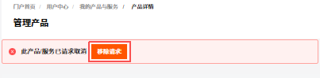

## 账单与续费管理

### 查看账单信息

查看账单信息支持查看裸机云服务器的全部账单记录。

1. 登录 [Raksmart 控制台](https://billing.raksmart.com/whmcs/clientarea.php?language=chinese-cn)。

2. 在左侧导航**产品管理**区域，单击**裸机云**，进入**我的产品与服务**页面。

   

3. 若当前列表没有找到想要查看的裸机云，支持通过地区或状态进行筛选，或者通过搜索框搜索。

   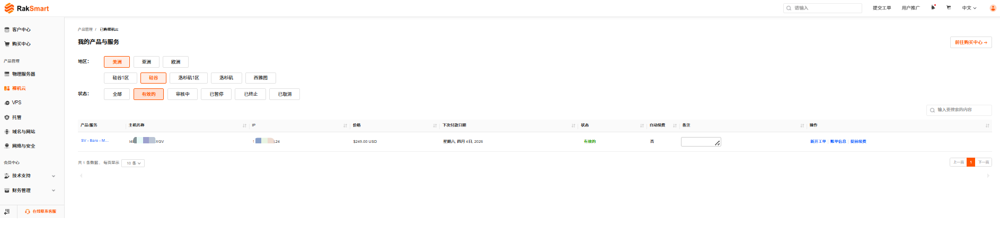

4. 找到需要查看账单信息的裸机云，单击**账单信息**。

5. 在**我的账单**页面，支持查看全部、已付款、未付款、已取消、已退款和已过期的账单；支持通过搜索框搜索账单；支持查看服务、查看账单和批量付款。

   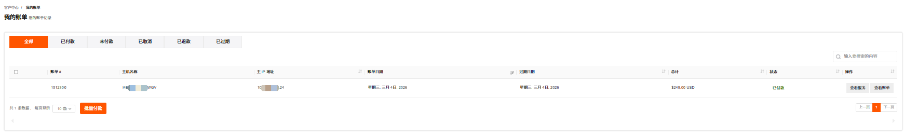

   a. 查看服务
   支持查看当前帐单对应的订单，单击**查看服务**，进入我的产品与服务页面。
   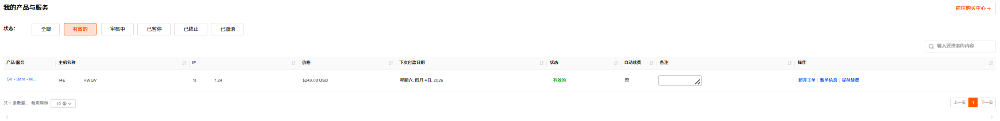

   b. 查看账单
   支持查看当前账单详情，单击**查看账单**，进入我的帐单页面。此页面可查看账单详情信息，可根据需要打印和下载账单。
   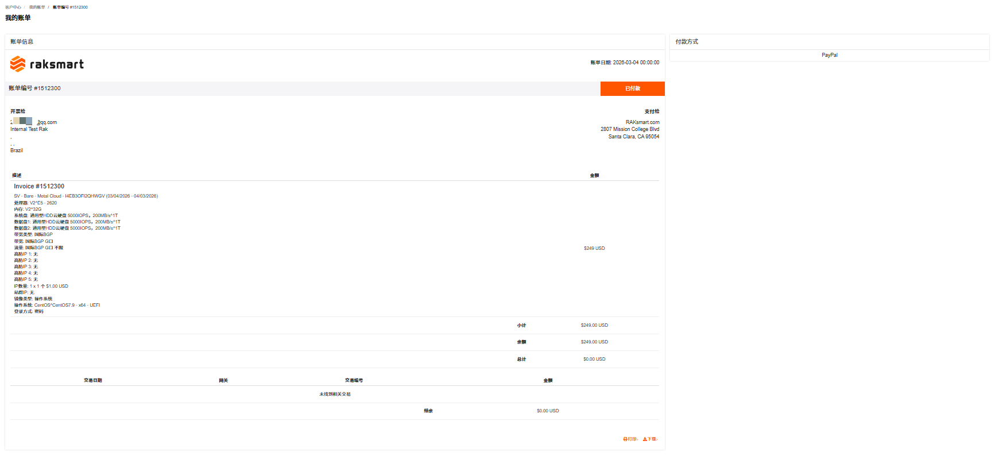

---

### 提前续费

提前续费是指在当前服务有效期还没结束时，主动为其续费来延长使用时间。

> **说明**
>
> 为保障您的产品/服务正常使用，请留意以下续费及产品/服务状态变更规则：
>
> - 产品/服务到期前 10 天，系统将自动生成续费账单，请您及时完成续费操作；
> - 到期未续费的，产品/服务会在到期后的第 2 天被暂停。
>   - 暂停期间完成续费，产品/服务可立即恢复使用；
>   - 若暂停满 4 天仍未续费，产品/服务将被下架。

1. 在**我的产品/服务**列表右侧操作列，单击**提前续费**，进入**续费管理**页面。**续费管理**页面支持查看当前付款周期和当前产品到期时间。

   

2. 选择不同的续费周期。续费周期支持选择月付、季付、半年付和年付。

3. 单击结账，进入**我的账单**页面。

   

4. 在**我的账单**页面，选择付款方式或者使用余额支付。

5. 完成付款。

   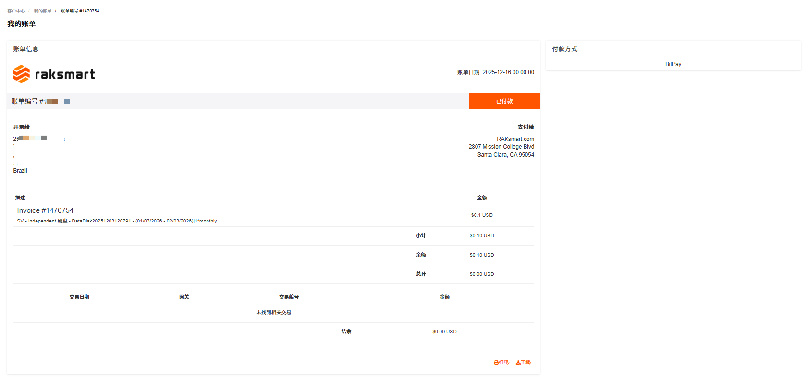

## 新开工单

新开工单支持对当前裸机云服务器提交问题工单。

1. 在**我的产品与服务**页面列表右侧，单击**新开工单**，进入**提交工单**页面。

   

2. 根据页面提示输入主题、问题描述等信息。

3. 单击**提交**。
