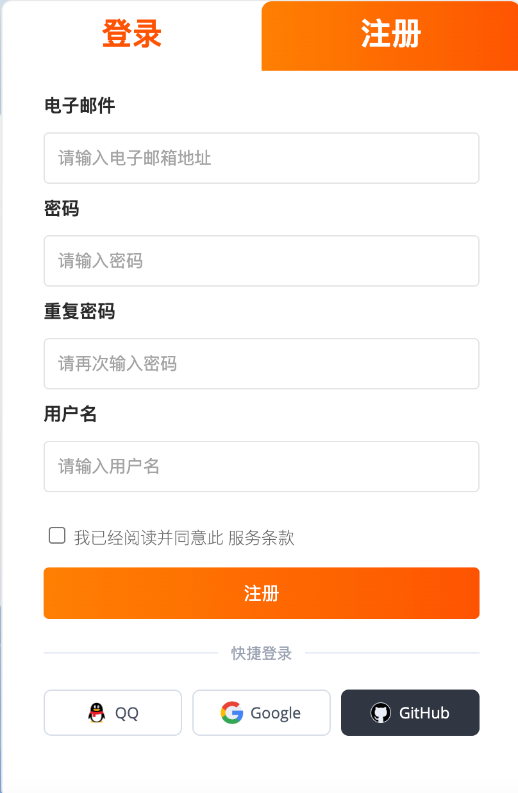
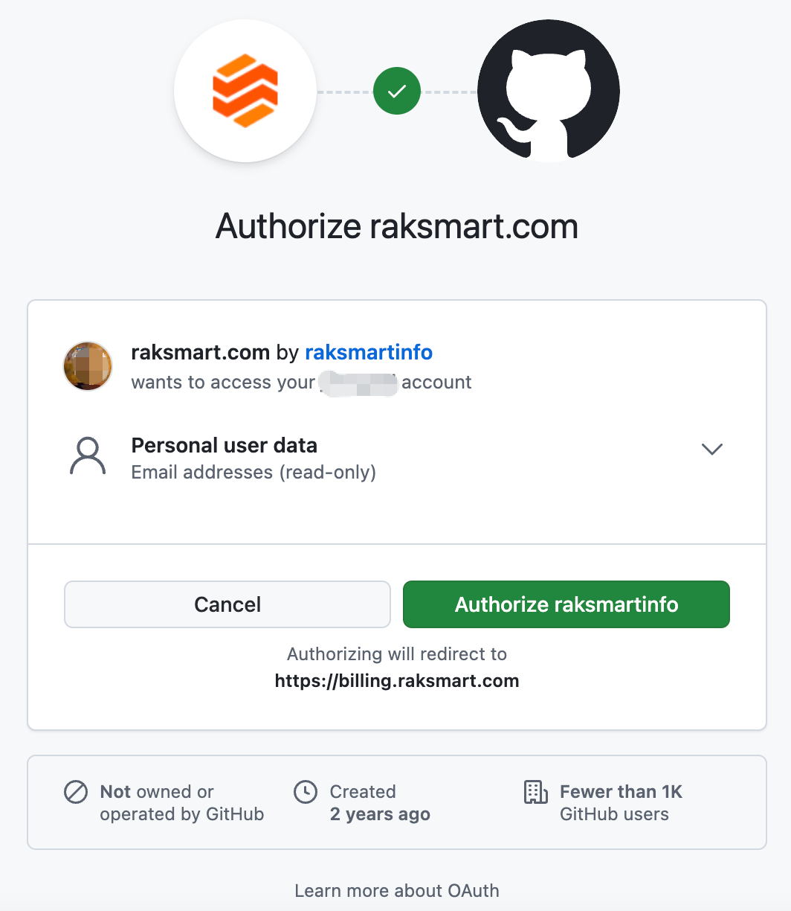
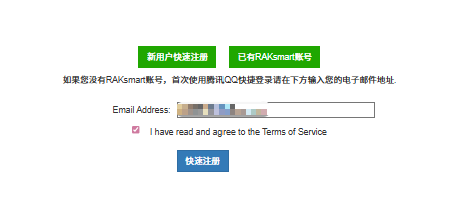

# 注册 RakSmart 账号

在使用 RakSmart 服务前，您需先注册 RakSmart 账号。支持官网首页注册及 QQ 账号快捷注册两种方式。

---

## 通过官网首页注册

您可以通过访问 RakSmart 官方网站，在首页填写注册信息完成账号注册。

---

### 操作步骤

1. 打开 [RakSmart 官网](https://cn.raksmart.com/) 。

2. 在页面右侧单击**登录/注册**。

   

3. 在注册页面，参考如下信息填写。

   
   
| **项目** | **描述**                                                                                                                                                       |
| :------- | :------------------------------------------------------------------------------------------------------------------------------------------------------------- |
| 电子邮件 | 格式为：用户名@域名。用户名只允许包含字母（A-Z、a-z）、数字(0-9)、点号（.）、下划线（\_）或短划线（-），不能以点号或下划线开头或结尾，不允许连续使用点号。     |
| 密码     | \- 长度至少 8 个字符。   \- 必须同时包含字母和数字，禁止包含空格。                                                                                          |
| 重复密码 | 需与 “密码” 栏输入内容完全一致。                                                                                                                               |
| 用户名   | \- 支持中英文与数字组合，中文用户名仅用于展示，不参与登录；   \- 英文用户名需以字母开头，长度为 5-16 位，仅可包含字母（不分大小写）和数字，不支持特殊符号。 |

4. 勾选**我已经阅读并同意此服务条款**，单击**注册**。

5. 如已有 QQ、Google、Github 账号，可以通过对应的账号来直接登录。

6. 举例：通过 Github 登录：

   

---

### 后续操作

- 为了保护您的 RakSmart 账号安全，建议您至少完成一项[账号安全设置](账户管理.md#账号安全设置)：定期修改登录密码或开启两步验证。

- 拥有 RakSmart 账号后，您可以登录 RakSmart 控制台、购买和使用产品。

## 使用 QQ 账号快捷注册

如果您没有 RakSmart 账号，支持通过 QQ 账号完成新用户快速注册。

1. 打开 [RakSmart 官网](https://cn.raksmart.com/) 。

2. 在页面右侧单击**登录/注册**。

   

3. 在登录页面右下角选择**用 QQ 账号登录**。

   
   
4. 在移动端，打开 QQ App，扫描页面上的二维码登录。

5. 在**腾讯 QQ 快捷登录**页面，输入电子邮件地址，勾选“我已阅读并同意服务条款”，单击**快速注册**。

   
