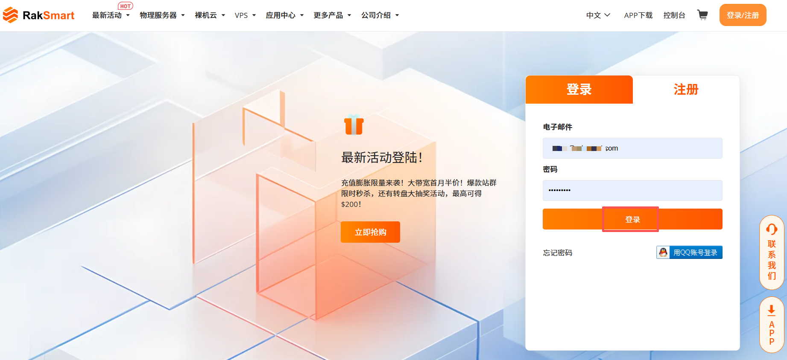
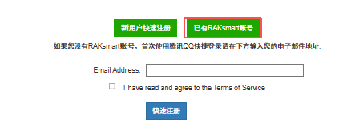
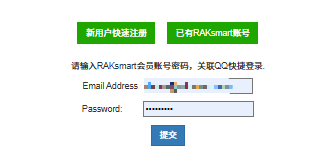
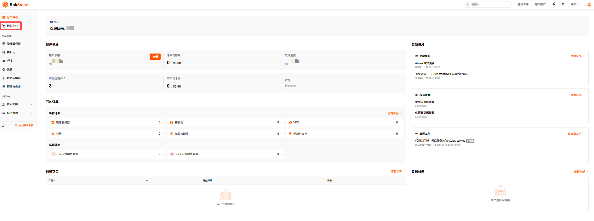
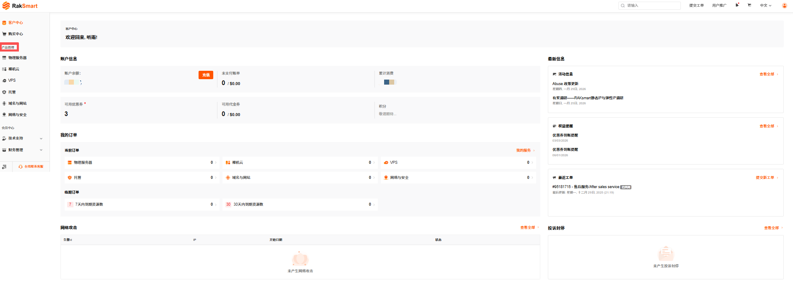
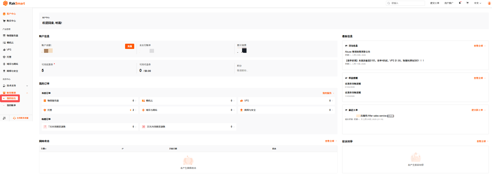

# 了解 RakSmart 控制台
RakSmart 控制台是查看和管理 RakSmart 产品、资源与账户的统一平台，通过图形化界面即可完成资源操作、账户管理。您需要先开通 RakSmart 账号，才能访问控制台并管理相关产品。关于如何开通 RakSmart 账号请参考[注册 RakSmart 账号](注册%20RakSmart%20账号.md)。

## 控制台简介

---

### 控制台组成

RakSmart 控制台主要包含以下核心区域：

<table width="100%">
  <tr style="text-align: left;">
    <th width="18%">项目</th>
    <th width="82%">描述</th>
  </tr>
  <tr>
    <td>顶部导航栏</td>
    <td>提供搜索、语言切换、用户信息等快捷入口，支持快速检索功能或资源。</td>
  </tr>
  <tr>
    <td>控制台首页</td>
    <td>”客户中心“模块，集中展示账户信息、已购产品、安全监控等核心内容，是资源管理的核心入口。</td>
  </tr>
   <tr>
    <td>左侧功能栏</td>
    <td>分类呈现“购买中心”、“产品管理”、“财务管理”等功能模块，支持快速进入对应操作页面。</td>
  </tr>
  <tr>
    <td>右侧信息栏</td>
    <td>展示最新系统通知、工单进度等信息，便于及时获取服务动态。</td>
  </tr>
</table>

---

### 功能与优势

- 一站式管理

  统一承载产品购买、资源监控、账户财务等全流程操作，无需切换多平台。

- 可视化操作

  以图形化界面呈现资源状态、订单数据，降低操作门槛，无需专业技术背景即可上手。

- 全局信息整合

  首页聚合账户余额、订单状态、安全日志等核心数据，便于快速掌握账户整体情况。

- 便捷技术支持

  内置在线客服、工单入口，可快速获取技术协助。

## 登录控制台

平台的用户类型分为所有者用户和普通用户两类。经过授权的普通用户账号和所有者用户账号登录的步骤相同。本节介绍如何登录 RakSmart 控制台。

---

### 准备工作

1. 注册 RakSmart 账号。

   在登录控制台之前，请先[注册 RakSmart 账号](注册%20RakSmart%20账号.md)。如果您已开通 RakSmart 账号，请忽略此步骤。

2. 创建普通用户并授予权限。

   如果想要将资源或权限分配给企业中不同部门的员工使用，为了避免分享自己的账号密码，您可以使用所有者用户的用户管理功能，给员工的普通用户授予权限。详细内容可参考[用户身份与权限说明](账户管理.md#用户身份与权限)和[为普通用户授权](新手指南/07、账户管理/账户管理.md#账户管理##为普通用户授权)。如果您已创建普通用户并授予权限，请忽略此步骤。

---

### 通过官网首页登录

1. 进入 [RakSmart 官网](https://cn.raksmart.com/) 。

2. 在页面右上角单击**控制台**或者**登录/注册**进入登录页面。

   

3. 输入已注册的电子邮件地址及密码，单击**登录**。

   

4. 登录成功后，自动进入控制台**客户中心**页面。

   

---

### 使用 QQ 账号快捷登录

如果您已有 RakSmart 账号，支持使用腾讯 QQ 账号快捷登录。

1. 进入 [RakSmart 官网](https://cn.raksmart.com/) 。

2. 在页面右上角单击**控制台**或者**登录/注册**进入登录页面。

   

3. 在登录页面右下角选择**用 QQ 账号登录**。

   

4. 在移动端，打开 QQ App，扫描页面上的二维码登录。

   

5. 在**腾讯 QQ 快捷登录**页面，单击**已有 RakSmart 账号**。

   

6. 输入电子邮件和密码，单击**提交**。
   

## 控制台总览

控制台首页和分页签包含客户中心、购买中心、产品管理、技术支持和财务管理五部分信息。

---

### 客户中心

客户中心包含账户信息、我的订单和最新信息与通知等模块。

#### 账户信息

账户信息模块支持如下操作：

- 支持充值操作，详细内容可参考[为 RakSmart 账号充值](钱包管理.md#为%20RakSmart%20账号充值)；

- 支持查看**余额/优惠券/代金券**，详细内容可参考[钱包管理](钱包管理.md)；

- 支持查看账单信息，如未支付账单、累计消费等信息。关于账单信息的详细介绍请参考[账单管理](账单管理.md)；

#### 我的订单

我的订单模块支持查看当前订单、临期订单和我的服务。

- **当前订单**：分类展示“物理服务器”、“裸机云”、“VPS” 等服务的订单数量，单击对应服务分类可查看具体订单详情；

- **临期订单**：显示“7 天内到期”、“30 天内到期”的资源数量，单击对应数字可查看即将到期的资源列表，便于及时续费。

- **我的服务**：单击**我的服务**可查看全部产品和服务信息，便于管理产品和服务。关于产品管理的详细介绍可参考[产品管理](管理已购买的产品.md#产品管理)

#### 最新信息与通知

最新信息与通知模块支持查看活动信息、权益提醒、最新工单和投诉封停等信息。

- **活动信息**：查看平台最新促销活动，如当前的 YouTube 视频赚佣金活动；

- **权益提醒**：查看平台最新权益到账提醒，如优惠券到账提醒；

- **最近工单**：查看已提交工单的处理状态，如“已关闭”、“已处理”；

- **投诉封停**：查看 IP 的投诉及处理记录。

---

### 购买中心

在控制台内可直接选购新的产品与服务。

1. 登录 [RakSmart 控制台](https://cn.raksmart.com/login/index.html)。

2. 在左侧导航单击**购买中心**，进入产品和服务**购物车**页面。

   

3. 单击某个产品或服务名称，选择地区、分类等配置筛选出适合购买的服务器。关于如何购买 RakSmart 产品请参考[购买 RakSmart 产品](购买%20RakSmart%20产品.md)。

   

---

### 产品管理

产品管理模块管理已购买的物理服务器、裸机云等产品。

1. 登录 [RakSmart 控制台](https://cn.raksmart.com/login/index.html)。

2. 在左侧导航**产品管理**区域，单击某一个产品或服务名称，进入**我的产品与服务**页面。

   

3. **我的产品与服务**页面支持查看产品/服务详情、新开工单和查看账单信息。
   
   - 查看产品/服务详情：单击**产品/服务**名称，即可打开该产品或服务的产品详情页面。
   - 新开工单：单击**新开工单**，支持对该产品服务提交问题工单。
   - 查看账单信息：单击**账单信息**，查看该产品/服务的账单记录。

---

### 财务管理

财务管理模块支持钱包管理、账单管理。

#### 我的钱包

1. 在控制台左侧导航，单击**财务管理**->**我的钱包**，进入**我的钱包**页面。

   

2. 我的钱包支持账户余额管理、代金券管理和优惠券管理。关于我的钱包的详细介绍可参考[钱包管理](钱包管理.md)。

   

#### 我的账单

1. 在控制台左侧导航，单击**财务管理**->**我的账单**，进入**我的账单**页面。

   

2. 我的账单支持查看不同状态的账单列表和账单管理。关于我的账单的详细介绍可参考[账单管理](账单管理.md)。

   

## 技术支持

若遇到产品使用问题，可通过控制台获取技术支持。关于技术支持模块的详细介绍可参考[技术支持](技术支持.md)。
